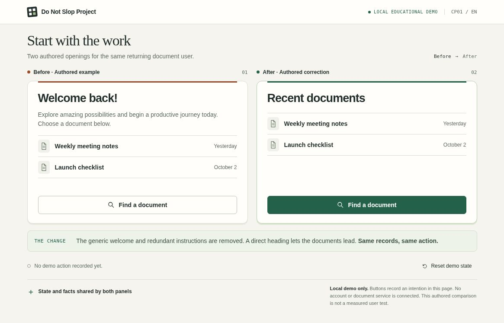
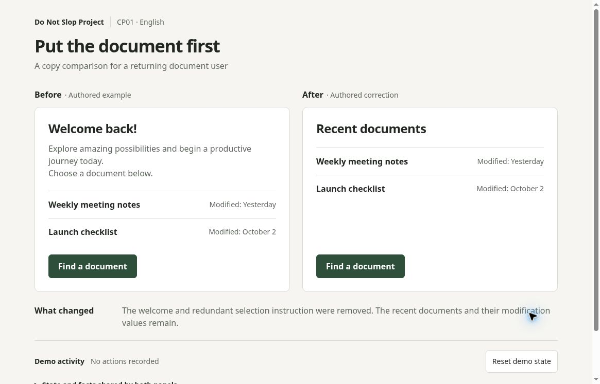

# Do Not Slop Project

## Latest screens: CP01 guided iteration with guide v2

The old English reference beside the actual final guided revision. Click either image for the full capture.

| Old English reference | Actual guided iteration · v2 |
| :---: | :---: |
|  |  |
| [Runnable reference](research/instruction_trial_01/reference/reference-en.html) | [Runnable final source](research/instruction_trial_02/implementation/index.html) |

V2 specifies a compact frame, white/charcoal surfaces, equal blue actions, natural card heights, and an initially visible local-demo boundary. Both authored copy specimens and the same document records remain intact. The palette is a case-specific project proposal responding to the reported design problem, not exact colors dictated by the user. [Reusable AI entrypoint](AGENTS.md), [guide v2](guides/cp01-task-first-v2.md), [portable task brief](research/instruction_trial_02/prompts/CP01-guided-iteration.txt) and [narrow capture](research/instruction_trial_02/screenshots/revision2-narrow.jpg) are included.

This is an additional guided iteration learned from the first pair, not a new controlled ordinary/guided experiment. The reference is an authored English reconstruction, not an ordinary-request model output. [First pass, sole 2px summary-padding repair and verification record](research/instruction_trial_02/README.md) are preserved. User approval and measured usability remain unestablished; native-phone, screen-reader and 200% zoom/reflow checks are unrun. The initial actual pair remains separate below.

## Initial actual screens: English CP01 instruction trial 01

A faithful English reference and two fresh model implementations of the same local copy-comparison task. Click any image for its original capture.

### Shared English reference

### Actual ordinary-request and guided outputs

| A · Ordinary request | B · Project-guided request |
| :---: | :---: |
|  |  |
| [Runnable A source](research/instruction_trial_01/alpha/index.html) | [Runnable B source](research/instruction_trial_01/beta/index.html) |

Both requested `gpt-6.1-sol` with `xhigh` reasoning, used the same English starter and fixture, and made one first pass with no repair. B also received [exact archived v1 project AI instructions](research/instruction_trial_01/AGENTS.v1.md) and the [CP01 task-first guide](guides/cp01-task-first.md). The [exact public task briefs](research/instruction_trial_01/prompts/A-plain.txt) and [guided addition](research/instruction_trial_01/prompts/B-guided.txt), [checks](research/instruction_trial_01/checks/verification-checklist.md), [protocol and limits](research/instruction_trial_01/protocol/PROTOCOL.md), and [run record](research/instruction_trial_01/protocol/run-record.json) are included.

These are actual outputs, not a fabricated winning Before/After pair. The Before/After labels *inside each screen* refer to the authored copy specimens. Both outputs still use green actions and neutral backgrounds; the criticism is not established as fully resolved. A blinded artifact review recorded descriptive subtotals of 10/12 for A and 11/12 for B, with the difference tied to equal action emphasis, not a validated winner. [Review findings](research/instruction_trial_01/protocol/REVIEW_FINDINGS.md) also note more scrolling and a below-fold boundary in B. User approval is pending. No fixed time budget was enforced. One pair does not show measured usability or general effectiveness.

[Narrow A capture](research/instruction_trial_01/screenshots/alpha-narrow.jpg) · [Narrow B capture](research/instruction_trial_01/screenshots/beta-narrow.jpg) · [Trial package](research/instruction_trial_01/README.md)

Research, operational rules and runnable synthetic comparisons for clearer interface layout, task flow and UI copy. Most manuals are written in Korean. Examples separate source observations, authored proposals and unknowns, and preserve content/state when comparing presentations.

The public source includes the English instruction trial and additional guided iteration above, three earlier local demos, nine interactive UI-copy examples, original comparison boards and a bounded review-plugin draft. No reuse license has been selected. The plugin is not installed, adopted or officially approved; code checks do not establish measured usability improvement.

## Read and explore

- [Research overview](research/antislop_research.md), [series structure](research/series_architecture.md) and [index](research/series_index.json)
- [Structured rules](research/rules_catalog.json) and [measurement checklist](research/measurement_checklist.json)
- [Web layout manual](research/web_app_corrections_v2.md), [mobile layout manual](research/mobile_app_corrections_v1.md) and [shopping/information/learning observations](research/web_shopping_information_learning.md)
- [Game controls manual](research/game_controls_corrections_v2.md), [RPG/card research](research/games_rpg_card_research.md) and [source-coverage boundaries](research/games_rpg_card_sourcecoverage.md)
- [Fleet-command research](research/strategy_controls_oct4/strategy_controls_research.ko.md), [booking manual](research/booking_flows_oct4/booking_manual_ko.md) and [booking comparison contract](research/booking_flows_oct4/same_fixture_spec_ko.md)
- [UI-copy manual](research/do_not_slop_copy/manual_ko.md), [nine operational rules](research/do_not_slop_copy/rules.json), [15 sources](research/do_not_slop_copy/sources.json) and [interactive examples](research/do_not_slop_copy/copy_examples.html)
- [Review-visible-design plugin draft.3](plugins/review-visible-design/README.md)

Original boards are in [web visuals](research/web_app_v2/visuals/), [mobile boards](research/mobile_app_v1/boards/) and [booking visuals](research/booking_flows_oct4/visuals/). SVG originals and PNG renders are included. They are authored proposals using synthetic conditions, not redistributed product screenshots.

## Run locally

Python 3 and Node.js are enough. No build step, package install, login, API key or network service is needed.

From the repository root:

    python3 -m http.server 8765 --bind 127.0.0.1

Then open:

- English CP01 reference: http://127.0.0.1:8765/research/instruction_trial_01/reference/reference-en.html
- Actual ordinary-request output: http://127.0.0.1:8765/research/instruction_trial_01/alpha/
- Initial actual guided output: http://127.0.0.1:8765/research/instruction_trial_01/beta/
- Guided iteration with guide v2: http://127.0.0.1:8765/research/instruction_trial_02/implementation/
- Fleet command: http://127.0.0.1:8765/research/strategy_controls_oct4/demo/
- Booking change: http://127.0.0.1:8765/research/booking_flows_oct4/demo/
- Learning layout: http://127.0.0.1:8765/research/comparison_assets/learning_layout/same_fixture_learning.html
- Nine UI-copy examples: http://127.0.0.1:8765/research/do_not_slop_copy/copy_examples.html

The learning and UI-copy HTML files also open directly in a browser. Fleet command loads its adjacent fixture over HTTP. Booking keeps its reviewed fixture one directory above demo/; keep that relationship when copying the source.

All actions are local demonstrations. They do not create actual bookings, accounts, payments, uploads or subscriptions. Refreshing resets in-memory state.

## Check the source

From the repository root:

    node --test research/strategy_controls_oct4/demo/tests.mjs
    node research/booking_flows_oct4/demo/test-model.cjs
    node research/booking_flows_oct4/demo/test-app-wiring.cjs
    python3 research/comparison_assets/learning_layout/tests/test_source.py
    python3 research/do_not_slop_copy/validate.py
    python3 plugins/review-visible-design/validation/validate_package.py
    python3 research/instruction_trial_01/checks/validate_trial.py
    node research/instruction_trial_02/checks/verify-source.mjs
    python3 validation/validate_release.py

The public booking/learning reporters and plugin validator were rebuilt for this source release. Their scope is stated in [verification](docs/VERIFICATION.md). Exact-byte fixtures and runtime helpers were preserved; no fixture hash or evidence requirement was relaxed to obtain a pass.

## Evidence and rights

- [Rights and scope](docs/RIGHTS_AND_SCOPE.md): license pending; third-party rights unknown; external sources remain links and bounded summaries
- [Verification and remaining gates](docs/VERIFICATION.md): executed checks versus browser, input, accessibility, host and usability limits
- [Release provenance](docs/PROVENANCE.json), [preserved input bytes](docs/PRESERVED_INPUTS.sha256.json) and [release file inventory](FILES.sha256.json)

Source coverage is bounded by each manual's cited observations and explicitly listed unknowns. Historical articles and screenshots do not prove a current product's behavior. This release excludes article bodies, raw third-party media/font bytes, original capture archives and uncleared generated art.
