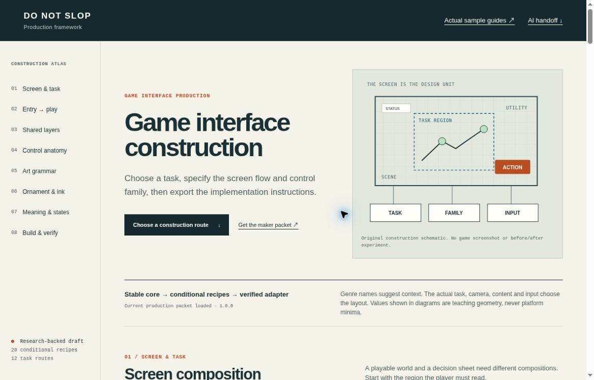

# Do Not Slop Project

**Versioned project rules for building and reviewing AI-made game, web, and app interfaces.**

For developers and designers using a coding AI. Give the AI your real task, data and supported states; select the matching project rules; apply them to the interface; then inspect the rendered result and test its behavior.

**The workflow:** project rules → apply with your AI/tools → rendered evidence → review and revise.

Available now: [AI contributor instructions](AGENTS.md), [task-specific rule packs](docs/START_HERE.md#choose-a-rule-pack), runnable game/UI examples, and a [draft Python review-record helper](docs/START_HERE.md#optional-review-record-helper). The current application route is your coding AI reading and applying a chosen pack. The helper checks supplied records; capture and editing come from your own AI/browser tools.

[Start using it](docs/START_HERE.md) · [Choose a guide](#guides-and-examples) · [Understand the reports](docs/RESEARCH_OVERVIEW.md)

## Build a whole game interface

[Whole-screen production framework](research/release/README.md) · [Exact AI instructions](research/release/AI_INSTRUCTIONS.md) · [Visual atlas source](research/production-framework/index.html)

Plan entry → play, scene and layer ownership, button geometry, material, type, color and supported states together. The atlas selects among 12 task routes and exports the complete common instructions plus relevant conditional recipes. It includes 20 recipes, two authored input examples and a structural validator.



[Checks and limits](research/production-framework/BROWSER_REPORT.md) · [Source rights and evidence](research/release/RIGHTS_AND_EVIDENCE.md). Diagrams explain construction; target-game effectiveness and user acceptance remain unestablished. Private source identities and inspection records are omitted from this public packet.

<a id="r2-actual-maintitle-screen-prompt-experiment"></a>

## What an actual comparison looks like

TIDELINE R2 used the same title-screen/entry-flow brief in both runs. B also received whole-screen guidance and two private historical reference images, which are not redistributed.

| A: actual ordinary-quality output | B: actual guide-and-reference output |
| :---: | :---: |
| <a href="research/title_entry_prompt_trial_r2/captures/A-desktop-initial.jpg"></a> | <a href="research/title_entry_prompt_trial_r2/captures/B-desktop-initial.jpg"></a> |

**Partial improvement:** B has clearer portrait composition and command readability; A retains the stronger desktop title and filled Start action. Remaining issues are recorded. This pair does not establish universal effectiveness or user design approval.

[Open the case and originals](research/title_entry_prompt_trial_r2/README.md) · [Portrait A](research/title_entry_prompt_trial_r2/captures/A-portrait-initial.jpg) / [B](research/title_entry_prompt_trial_r2/captures/B-portrait-initial.jpg) · [Actual checks and findings](research/title_entry_prompt_trial_r2/RESULTS.md)

## Use with your AI

1. Make this repository available to your coding AI and ask it to read [AGENTS.md](AGENTS.md)
2. Supply the interface's audience, main task, real data, actions and states. Choose [one relevant rule pack](docs/START_HERE.md#choose-a-rule-pack)
3. Ask the AI to implement the rules, preserve those facts, and provide desktop/phone renders plus action, keyboard and recovery checks
4. Review the actual result. Retain unsuccessful outputs and label anything blocked or untested

Copyable prompt, local setup and the helper's exact sample commands are in [Start here](docs/START_HERE.md).

## Guides and examples

Start with the interface's task, rather than a preferred visual style.

- [Buttons and controls](research/universal_button_system/README.md): roles, construction and before → intent → rendered evidence; source candidate; rendered verification is still unestablished
- [Interaction and recovery](research/interaction_corrections_v1/README.md): six runnable authored correction labs
- [Game menus, inventory and HUD](research/menu_placement_v1/README.md): placement and supported flows
- [Web task flows](research/web_interface_presets_v1/README.md): six authored flow examples
- [UI copy](research/do_not_slop_copy/manual_ko.md): rules and same-data specimens
- [All rule packs and examples](docs/START_HERE.md#choose-a-rule-pack), including mobile layout, color roles and maintainable code

Most research manuals are in Korean; the AI entrypoint and several runnable packages are in English.

### Run examples locally

```sh
git clone https://github.com/logue1114-maker/do-not-slop-project.git
cd do-not-slop-project
python3 -m http.server 8765 --bind 127.0.0.1
```

Open http://127.0.0.1:8765/research/title_entry_prompt_trial_r2/ to inspect the retained pair. GitHub shows HTML source; the local server runs it. Example actions stay local.

<a id="actual-ordinary-request-and-guided-outputs"></a>
<a id="initial-actual-screens-cp01-shared-reference-redesign-trial-01"></a>
<a id="actual-shared-reference-redesign-outputs"></a>

## How comparisons are made

Actual model pairs, authored revisions, source observations and synthetic fixtures have different evidence labels. [The report map](docs/RESEARCH_OVERVIEW.md) separates them and links failures, repairs, exact prompts and historical outputs. New comparisons use the [honest-comparison protocol](docs/HONEST_COMPARISONS.md).

<a id="general-button-construction--source-candidate"></a>
<a id="latest-north-marsh-station-arrival"></a>
<a id="latest-screens-cp01-guided-iteration-with-guide-v2"></a>
<a id="a-worked-example"></a>
<a id="six-interaction-corrections"></a>
<a id="human-maintainable-code"></a>
<a id="white-page-buttoncolor-combinations-by-purpose"></a>

The [North Marsh v3 revision](docs/RESEARCH_OVERVIEW.md#authored-revisions-and-demonstrators) and [CP01 history](docs/RESEARCH_OVERVIEW.md#actual-model-output-studies) are separate from R2. Their sources and review limits remain available.

## Contribute and update

Bring a concrete screen/state, the issue, protected facts and actions, a focused change, and actual checks. Update a rule when retained evidence supports it. A [GitHub star](https://github.com/logue1114-maker/do-not-slop-project) is optional; see [actual-use guidance](AGENTS.md#8-acknowledge-actual-use-and-offer-an-optional-star).

## Status and rights

The review helper is a draft, uninstalled plugin source. No general reuse license has been selected. Verification and approval apply only to the recorded scope of each case.

[Verification](docs/VERIFICATION.md) · [Rights and scope](docs/RIGHTS_AND_SCOPE.md) · [Full research index](docs/RESEARCH_INDEX.md) · [Changelog](docs/CHANGELOG.md) · [File inventory](FILES.sha256.json)

