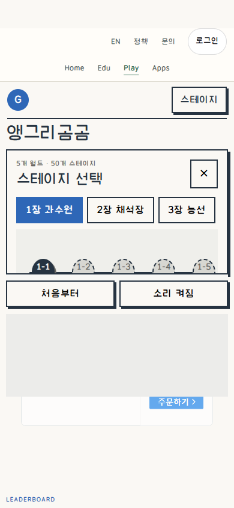
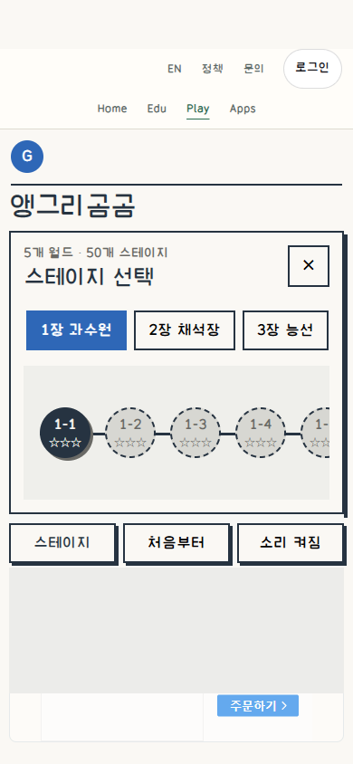
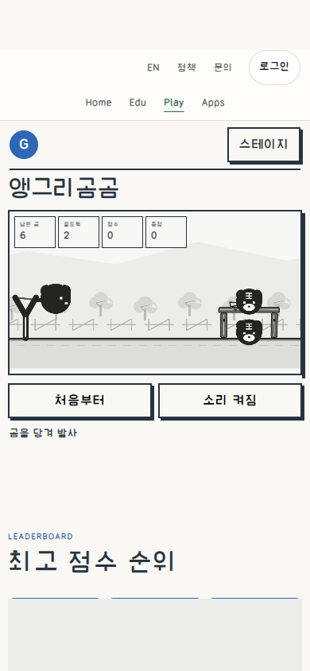
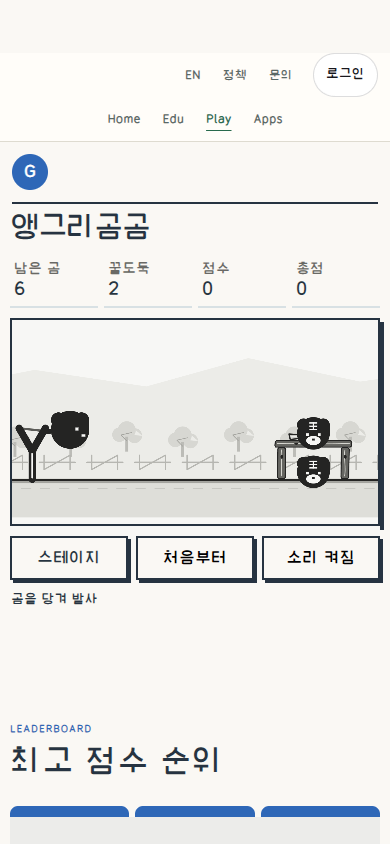
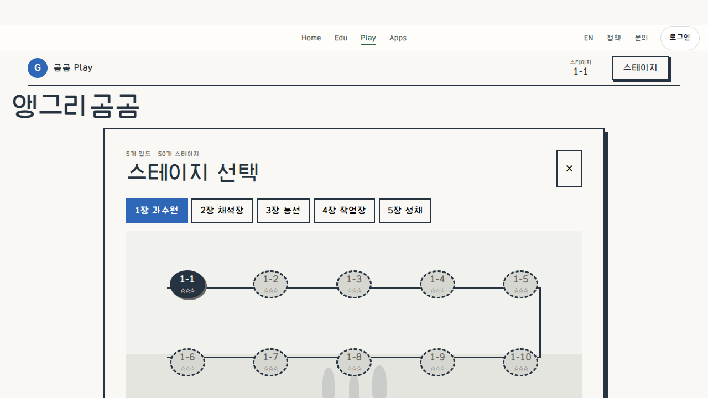
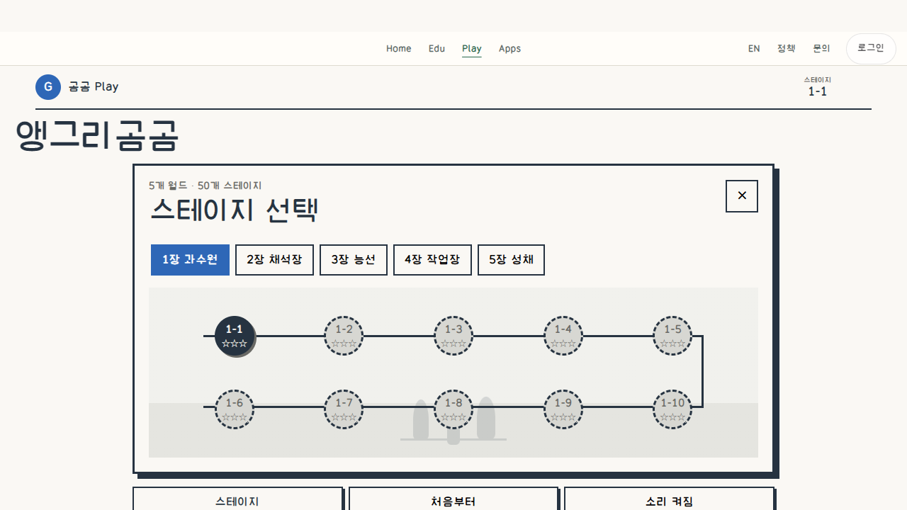
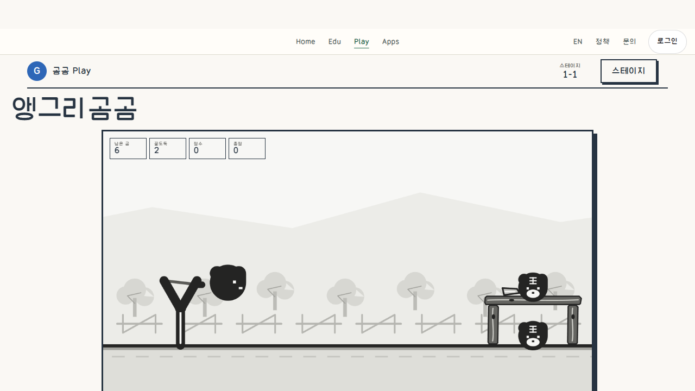
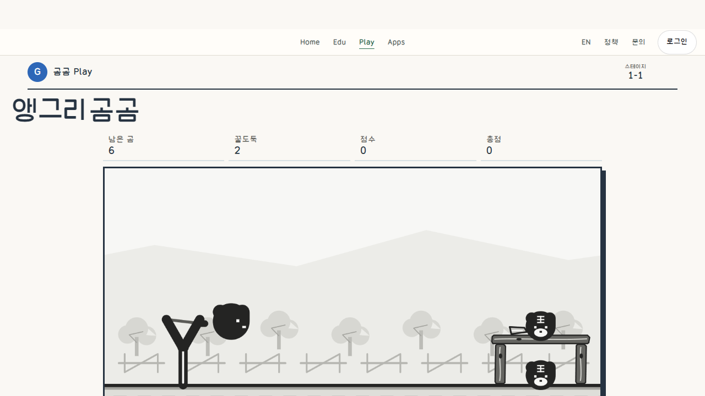
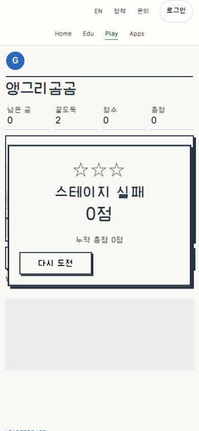
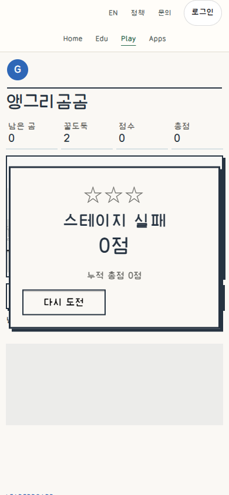

# Angry GomGom: native stage layout and readable HUD

Own-product correction and public evidence, not a controlled model experiment,
task-speed study, physical-touch test or owner visual acceptance. The user asked
for research Git publication. No source, secrets, DB, account/run identifiers,
font binaries or third-party ad creative is included; no reuse license assigned.

## Matched actual public views

| State / CSS viewport, DPR1 | Before | After |
| --- | --- | --- |
| Initial stage selection,390x844 |  |  |
| Stage1 ready,390x844 |  |  |
| Initial stage selection,1280x720 |  |  |
| Stage1 ready,1280x720 |  |  |

Before179d37d0 and After21185ce9. Normal anonymous entry, first stage, score0,
6shots,2living targets, same viewport/DPR/font loading; no state, clock, storage
or physics injection. These are sequential captures, not pixel-identical frames.
Ad and public rank regions use the same neutral screenshot masks before/after;
requests were not blocked. Original unmasked evidence stays local. Manifest
records the exact published screenshot hashes, dimensions and byte sizes.

## Observed defect -> implemented change

- At390 the old204px stage panel clipped the stage map and first button. Stage
  selection now owns natural document height; the game canvas is hidden only
  during stage selection, with an ID-specific rule. Stage targets are56x56.
- HUD labels measured7CSSpx at390 (8 at1280). The existing HUD now precedes the
  game world with14px labels/18px values; camera and scene remain unchanged.
- The existing stage opener lived in a legacy header hidden in landscape. It
  now occupies the command row beside Reset/Sound, retaining its ID/handler.
- Stable outer press targets and inset press/focus replace moving controls.
  The320px third-party ad child no longer exceeds its300px parent.
- Existing monochrome game art,50stages, world locks, language, actions, input,
  replay, physics, records and auth are preserved. Only3static assets shipped;
  Worker/resources/API/DB/writer unchanged, no restart/reset/purge.

These two are After-only states, not Before/After comparisons. Actual native
drag launches exhausted6shots; natural lost state kept the record form hidden.
Retry restored ready/6shots/score0 with a stable held target. No score submitted.

## Guidance actually read

Sites MCP47/material5457b898 unchanged. Same-version complete common guidance
reused; implementation roles50b4fe1d and selected DNS05/14/18 packets read fully.
Fresh Git8f853cf8 unchanged; same-version AGENTS/README/CHANGELOG reused;
universal-button AI instructions and relevant family/type/state/input/evidence
GUIDE sections read. Actual rendered ink, stable native targets, independent
focus, scoped ownership and matched evidence applied. Draft/sample conventions
were not elevated to approved product contracts or mandatory skins/icons.

## Tests and retained failures

Local projections are separate from public proof. Initial QA used a desktop
camera getter for mobile projection; corrected the test mapping, not the game.
An initial CSS rule lost to canvas ID specificity; corrected the scoped selector.
Landscape uncovered the hidden opener and320 exposed the ad-child overflow.
Original failed reports/unshipped candidates were retained rather than erased.

Final actual public390x844,768x900,1280x720,844x390,320x700: stage bounds/last-stage
native scrolling/world locks, sound toggle, fixed hold/release-away, actual drag
launch, Reset, stage close/open, reload/Tab/Enter passed. Page exceptions,
failed requests, console errors and tracked HTTP errors0. All3public SHA match;
normal health200, fresh provider100%, unchanged Worker and18bindings.

The root favicon.ico rasterizes the existing unchanged Play SVG; it fixes the
unmarked Up page's browser icon404 without new branding. Full50-stage campaign,
clear/storage, authenticated OAuth, physical school devices/load, assistive
technology and external visual acceptance remain unverified. No claim that
screenshots or bounds alone prove performance or user preference.
