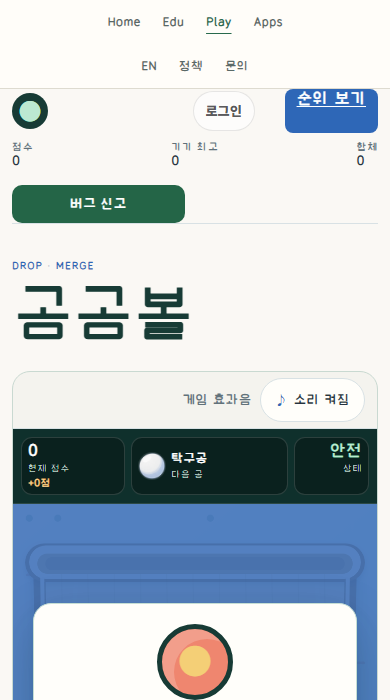
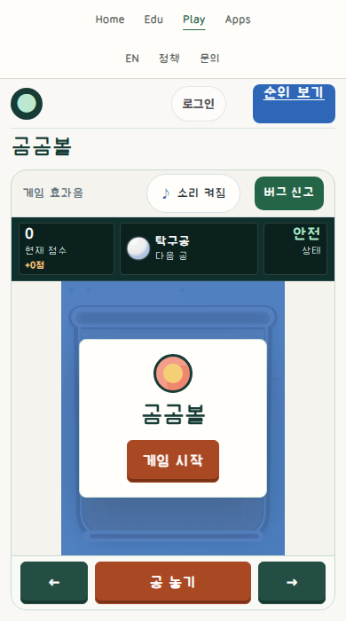

# Ball: the board and repeated controls share the viewport

This is an owner-authorized revision of an existing merge puzzle, not a controlled design experiment or human usability study. The game engine, canvas720×880, physics, RNG, scoring, input semantics, authentication, record verifier and game artwork are unchanged. The change consists of a scoped stylesheet, a projection-only layout script and two HTML asset links.

## Matched actual ready state

| Before | Final projection |
|---|---|
|  |  |

Same actual unstarted instance,390×700 CSS pixels, DPR1, zoom100%, same scroll position and identical backing-canvas bytes. The comparison applies CSS and the DOM layout script; it neither pauses a game clock nor injects game state/seed. It proves the ready-state projection change, not matched moving-game performance. Started gameplay is independently exercised in fresh contexts.

## Instructions actually read

Private Site MCP deployment46, material `f153ff9c3306646fdc60214042797c6714a9bb7eab520ef43cd07f67c8fd4544`, updated2026-10-09T14:17:00.886Z. Common `research/release/AI_INSTRUCTIONS.md` SHA `c70854cd205ec14947ce28b5d01ce12819cc2f3ddf47b09db7e25efb068be042`, conditional DNS-14/DNS-18 and complete general-button instructions/GUIDE were already read for this unchanged version in the preceding bounded slices; they were reused, not repeatedly fetched. Relevant coding search returned no dedicated Ball implementation.

This slice additionally read the full mobile-orientation README SHA `77ccadfb51d524ff62bbc4fe822365d734cfb0d99ace57e55805b2362285f6db` and research SHA `b4fb4da724b5dd7f62d89e167f96451a4b7742f14894aac07e69e2421aa0a40a`, including output-truncation gaps. These are proposed fixture decisions and historical commercial-image observations, not approval for Ball or native-device validation. No linked commercial image was newly viewed or redistributed. Public reference Git `8f853cf89e0045c2dceb1381000bee9c1b6a0da0` is a separate source version, not the private MCP version.

## Before → bounded intent → rendered result

| Axis | Actual issue/protected role | Decision and observed result |
|---|---|---|
| Portrait height | Large header/report row and tall board displace repeated controls | Compact title; move the single existing report command beside sound; reserve actual strip/status heights before proportionally scaling only CSS canvas projection |
| Landscape | A tall portrait board and vertical controls consume a short viewport | Board left, unchanged meters and repeated controls right; every HUD cell stays inside its rail |
| Information | Read-only score/next ball/danger compete with oversized chrome | Keep exact meanings/labels/previews and quiet16px counts/11px captions; preserve all meters without copying a commercial HUD |
| Commands | Generic rounded buttons shift on press | Existing native48px commands,6px corners, green directions versus burnt-orange Start/Drop, shallow inset relief, stationary pressed box, independent3px blue focus and gray unavailable state |
| Result | Narrow play projection makes nickname input almost unusable | Wider result-only stage, wrapping real form, readable input and Retry; normal page/overlay scrolling remains intentional |
| Architecture | Presentation must not own game state | New layout script observes only chrome/status size and computes a CSS height budget; it relocates the existing report element/handlers, never clones it, and does not touch engine/store/API |

No new public copy, fabricated controls, physics change, report submission, forced win/loss or test-query path is used. Extremely short windows retain a readable minimum board and normal page scrolling rather than shrinking input targets.

## Actual checks and retained defects

Six browser sizes1280×900/1280×720/768×900/390×700/390×844/844×390 exercised normal entry, native Enter Start, direction commands, Drop unavailable→ready, scaled-canvas pointer drop, and native report-dialog open/close. Original720×880 backing pixels and aspect ratio remain; portrait required controls fit the first view. Two affected sizes were then rechecked with the final HUD/result fixes. Both used repeated actual drops until the real danger-line loss, followed by native Retry and score0. No seed/clock/result setter or debug gameover query. No nickname/score/report submission.

Retained first attempt: strict `height>180` observer assertion did not match the declared180px minimum; that assertion was corrected rather than rewriting product requirements. Its actual landscape capture also showed that a vertical layout displaced controls. The side rail fixed that independent defect. A later actual image showed a clipped danger cell; its minimum columns were corrected and measured. Another result capture showed the narrow nickname field; the result projection/form were widened. First staged candidate was never activated; final release uses a separately sealed candidate. Earlier images/failure remain under `retained-*`, not overwritten.

Local POST405 uses the existing fallback; public API/readback is recorded in the separate production ledger. Advertisements are blocked only in validation contexts to avoid live ad traffic; failures remain visible. Page-error0 is not network-failure0. Deliberately stacking balls proves existing loss/Retry transitions, not human balance, campaign success or performance improvement.

Unrun: authenticated persistence, physical devices, school concurrency, human usability/acceptance, OS interruptions,200%zoom, full accessibility and pointer-cancel coverage. Six emulated viewports do not imply all-device coverage. Final portrait and short-landscape result uses normal scrolling; no simultaneous full-page fit claim.

## Provenance

Eleven approved project-owned PNGs plus original observation and hash ledger. No engine source, font bytes, reference raster, raw IDs, credentials, accounts or private machine paths. Export rejected a false-positive drive-path match in the retained text `value:\n`; a word-boundary path check corrected this without deleting the failed observation. No new reuse license, protocol change or causal guide-effectiveness claim. The preceding Tetris/Maze/Breakout contributions remain intact.
