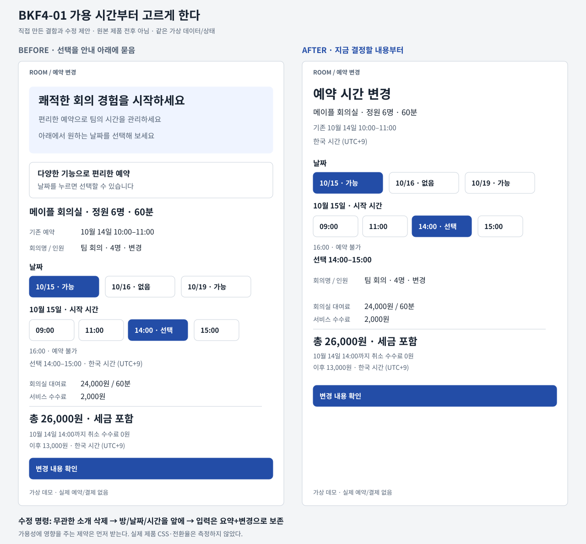
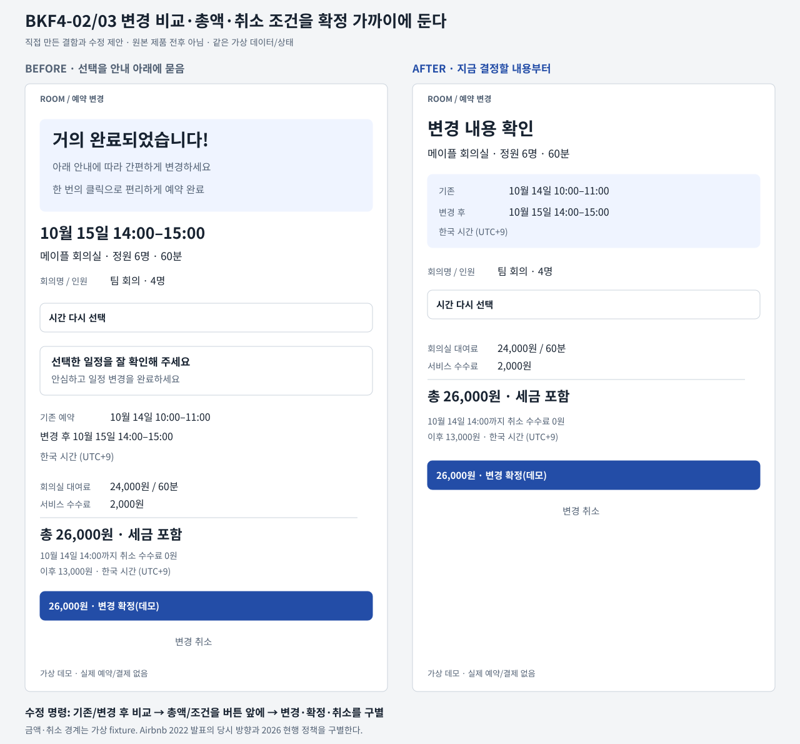

# 예약·변경 UX 수정 매뉴얼

예약 화면의 목적은 사용자가 가능한 자원과 시간을 고르고, 무엇이 바뀌며 어떤 조건으로 확정되는지 아는 것이다. 소개 카드와 설명을 줄이는 것만으로는 부족하다. 가용성·기입값·기존 예약·금액·조건이 전후에 살아 있는지 함께 검사한다.

이 문서는 가상 회의실 BKF4-F01에 적용하는 수정 제안이다. 아래 전후 UI는 직접 만든 결함과 교정안이며 MoeGo·Cal.com·Airbnb의 실제 전후 복제가 아니다. 예약·결제·메일·계정에는 접근하지 않았다. 금액과 취소 정책도 가상값이다.

## 읽는 법

- D: 저자/제품팀이 문서화한 결정 또는 수정
- V: 공개 원본 UI 이미지를 cloud browser에서 직접 관찰
- P: 가상 회의실에 적용한 자체 제안. 원본 연구 결과가 아님
- U: 미실행 또는 미측정

세 갈래 근거, 네 문서다. 개인 디자이너 사례 1개와 first-party release note 2개가 설계·수정 근거다. Airbnb 제품팀의 역사적 발표는 가격·조건 공개의 보조 근거다.

## 1. 가용 시간이 나오기 전에 긴 양식을 요구하지 않는다

D: [Mufan Lu, MoeGo Online Booking 3.0](https://www.mufanlu.com/home/moego_online_booking)의 2022–2023 프로젝트는 서비스 적합성에 필요한 최소 정보만 먼저 받아 가용 시간에 빨리 도달하도록 흐름을 바꿨다고 설명한다. 재방문자에는 이전 서비스 카드와 Book Again을 두고, 달력에서 오전·오후 가용 여부를 알려 반복 이동을 줄였다.

V: [공개 가용 시간 설계 이미지](https://framerusercontent.com/images/xMZS1nztGcZ2PmwetcC1iLtlx08.png?scale-down-to=1024)에는 날짜 아래 점, 선택 날짜 강조, AM/PM별 시간 버튼이 보인다. 단일 설계 이미지이며 원본 동일-state 전후나 실제 동작의 증거가 아니다. 점의 접근성 효과는 검증하지 않았다.

P 수정 명령:
1. 환영 히어로와 기능 소개 카드, 입력을 다시 설명하는 문장을 삭제한다
2. 방 이름·정원·기간 다음에 날짜와 가용 시간을 배치한다. availability를 바꾸는 정원/서비스/장비 조건은 먼저 받는다
3. 날짜를 누르기 전에 가용/없음 표시를 제공한다. 색만 쓰지 말고 텍스트와 상태를 함께 둔다
4. 선택 시간과 시간대는 붙여 표시한다. 빈 날짜에는 “예약 가능한 시간이 없습니다”와 다음 가용 날짜로 가는 행동을 준다
5. 이미 기입한 회의명·인원을 값이 보이는 요약으로 남기고 “변경”을 제공한다. 뒤로 이동·오류가 나도 이 독립 입력은 보존한다
6. 날짜가 바뀌어 기존 slot이 유효하지 않으면 그 slot만 다시 고르게 한다. 입력 보존을 만료된 가용성 보장으로 오해하지 않는다

삭제: “쾌적한 회의 경험을 시작하세요”, “다양한 기능으로 편리한 예약”
유지: “메이플 회의실 · 정원 6명 · 60분”, “한국 시간 (UTC+9)”, “팀 회의 · 4명 · 변경”

## 2. 변경 화면에는 기존과 변경 후를 같이 보여준다

D: [Cal.com v6.6, 2026-06-15](https://cal.com/blog/calcom-v6-6)은 변경 이메일에 기존 날짜·시간의 취소선을 표시하고 attendee locale 손실을 고쳤다고 명시한다. timezone-aware 날짜 비교와 첫 누락 필드로 스크롤하는 수정도 기록한다. 메일의 비교 방식을 웹 review 화면에 적용하는 것은 P다.

D 보조: [Cal.com v2.7, 2023-03-15](https://cal.com/blog/v-2-7)은 날짜·시간·시간대 현지화, 빈 가용 일정에도 시간대 표시, 날짜를 바꿀 때 모바일 시간이 튀는 문제의 수정을 기록한다. optional Additional notes를 숨기거나 편집하도록 바꿨다.

P 수정 명령:
1. 제목을 “변경 내용 확인”으로 쓰고, 기존 10/14 10–11시와 변경 후 10/15 14–15시를 각각 label과 함께 대조한다. 취소선만으로 의미를 전달하지 않는다
2. 회의실·기간·시간대·회의명·인원을 검토 영역에서 읽을 수 있게 한다
3. 필수 입력 오류는 “인원을 입력하세요 (1–6명)”처럼 고칠 부분을 말한다. 오류 요약에서 해당 필드로 이동하고 focus한다. 다른 값은 지우지 않는다. focus 개선은 제안이며 원문 scroll 수정과 구별한다
4. 확정 직전에 availability를 재검사한다. 14:00이 방금 불가해졌다면 실패 이유, 기존 선택, “15:00 선택” 행동을 보여주고 확정은 차단한다
5. 대체 시간을 자동 확정하거나 기존 예약을 먼저 취소하지 않는다. 최종 성공 후 같은 예약 id를 한 번 교체한다
6. 시간 수정은 “시간 다시 선택”, draft 종료는 “변경 취소”, 최종 행동은 “변경 확정(데모)”로 구별한다

삭제: “거의 완료되었습니다!”, “아래 안내에 따라 간편하게 일정을 변경하세요”
유지: “기존”, “변경 후”, “14:00은 방금 예약되어 선택할 수 없습니다”

## 3. 안심 카피보다 총액과 결과 조건을 먼저 준다

D-historical: [Airbnb의 2022-11-07 발표](https://news.airbnb.com/airbnb-is-introducing-total-price-display-and-updating-guest-checkout)는 기존 표시 의무가 없는 국가에 세금 전 모든 수수료를 포함한 총액 표시 옵션을 도입하겠다고 밝혔다. 확정 전 전체 가격 내역과 예약 전 퇴실 요구 공개도 설명했다. 개인 디자이너의 글이 아닌 제품팀 공지이며, 2026년의 실제 세금·수수료·취소 동작이나 모든 시장의 적용을 증명하지 않는다.

P 수정 명령:
1. 대여료 24,000원과 서비스 수수료 2,000원을 하나의 내역으로 묶고 “총 26,000원 · 세금 포함”을 명확히 표시한다. 60분 예약당 가격이라는 단위도 유지한다
2. 최종 확정 바로 앞에 “10월 14일 14:00까지 취소 수수료 0원 · 이후 13,000원”을 둔다. 이 시점은 한국 시간 기준이다
3. 자세한 약관 링크가 있어도 이 경계와 금액을 링크 안으로 숨기지 않는다
4. primary는 “26,000원 · 변경 확정(데모)”로 쓴다. 비용/조건은 DOM에서도 primary보다 앞에 둔다
5. 모바일 sticky CTA가 조건을 가리면 sticky를 쓰지 않는다. 결과 행동만 떠 있게 만들지 않는다
6. “안심하고 예약하세요”와 “확정 버튼을 누르면 확정됩니다”는 삭제한다. 취소·환불·만료·지불 조건처럼 판단을 바꾸는 정보는 삭제하지 않는다

## 정확한 수치와 검증 범위

원본 CSS 크기·가독성·예약 전환율·실제 예약 행동은 측정하지 않았다. 공개 출처의 정량 효과값을 쓰지 않았다.

다음은 우리 데모의 P 토큰이다: desktop content 1040px, column gap 24px; 390px mobile 양옆 20px, body 16px, title 28px, 버튼 최소 높이 44px, radius 10px. 비용 글자 24px, 조건 글자 14px, 조건→확정 간격 16px. 원본 실측이나 보편적 최적값이 아니다.

직접 만든 static SVG는 1280×1190이다. selection의 첫 시간 버튼 top은 Before 699, After 472로 227px 이동했다. review의 확정 버튼 top은 Before 946, After 737로 209px 이동했다. 이는 renderer 좌표이며 예약 성공률·사용자 시간 절약의 측정이 아니다.

- 완료: 최신 web search/open으로 출처 텍스트·날짜 확인, MoeGo 원본 UI 이미지 직접 관찰
- 완료: namespaced JSON parse, SVG XML parse, 동일-fixture metadata와 필수 fact 포함 검사, PNG 렌더 및 두 이미지 시각 검토
인터랙티브 구현은 demo/에 있다. 코드 수준 검사와 실제 렌더·키보드 검수는 구분해야 한다.
- 권리: 원본 UI 이미지의 재배포 허가를 확인하지 않았다. 원본 이미지는 research-only 링크로만 다룬다. release에는 링크·독자 요약과 자체 제작 전후 UI만 포함한다

## 구현자가 확인할 것

fixture.json과 same_fixture_spec_ko.md를 기준으로 selection/review/conflict 같은 상태를 비교한다. 전후 상태 hash, 빈 날짜, 불가 시간, 기존/새 시간, 기입값 보존, timezone, 총액·취소 경계, stale 재검사, 중복 확정, 취소 원본 유지, keyboard focus, mobile overflow, 외부 요청 없음이 각각 검증돼야 한다.

예쁜 screenshot 하나는 오류 복구·실제 가용성·예약 안전성의 증거가 아니다. 실행하지 않은 검증은 U로 남긴다.
