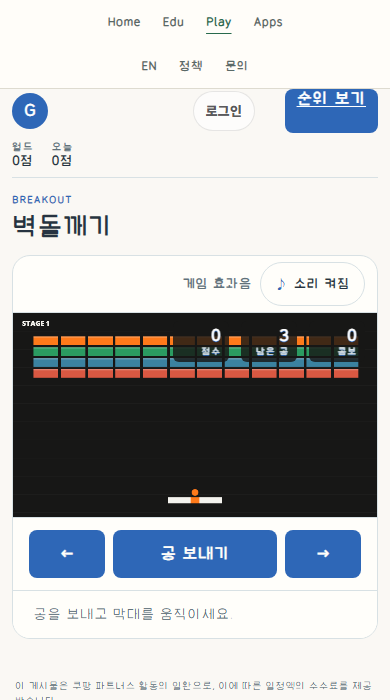
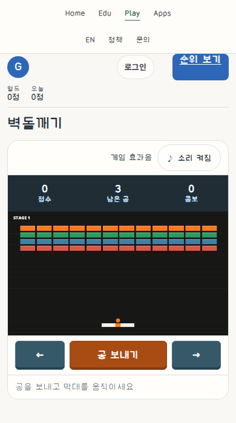

# Breakout: board-first HUD and stationary native commands

This is an authored revision of an existing game, not a controlled ordinary-quality/design-treatment experiment. The owner authorized the UI correction, static deployment and public research-Git screenshots. Guide effectiveness, measured usability and user design acceptance are not inferred from this packet.

## Same actual prelaunch instance

| Before | Scoped CSS revision |
|---|---|
|  |  |

390×700 CSS pixels, DPR1, zoom100%, same actual started/prelaunch game, board, score, lives, combo, paddle and canvas hash. Both captures use page-top scroll. No clock pause, state/seed injection or image retouching. The CSS pair uses the original engine; the one-line initial stage correction is checked separately in fresh candidate contexts. It is not hidden inside a claim of identical engine bytes.

## Guidance actually read

Private Site MCP deployment46, material `f153ff9c3306646fdc60214042797c6714a9bb7eab520ef43cd07f67c8fd4544`, updated2026-10-09T14:17:00.886Z. It matches the preceding Maze packet: common instructions were already fully read for that material version and were not repeatedly fetched. The current conditional DNS-14/DNS-18 packet, details, exceptions and source bounds was read through `complete=true`.

- Common `research/release/AI_INSTRUCTIONS.md`, SHA `c70854cd205ec14947ce28b5d01ce12819cc2f3ddf47b09db7e25efb068be042`: actual scene bounds, ownership, units and normal-flow evidence, not cosmetic declarations alone.
- Full general-button `AI_INSTRUCTIONS.md` and `GUIDE.md`: read-only meters versus commands, stationary targets, explicit real type, supported state semantics and before→intent→rendered rows. No separate icon, relief or golf-sign geometry is treated as mandatory.
- Public reference Git refresh `8f853cf89e0045c2dceb1381000bee9c1b6a0da0`: only an unrelated Sword of Astra observation package changed; it was not copied into Breakout. Latest root instructions, README and changelog were read separately from the private Site version.
- Search did not deliver a dedicated Breakout case or coding implementation. The already viewed Lichess raster was a board/control relationship reference only, not Breakout art. No third-party reference media is redistributed.

## Before → intent → actually rendered

| Axis | Actual before / protected role | Bounded decision | Evidence |
|---|---|---|---|
| Scene/HUD | Upper HUD covers bricks on a narrow display | Reserve60px outside unchanged960×540 canvas | Exact same-canvas pair plus five-width native-flow geometry |
| Target/silhouette | Generic controls with moving press feedback |48px native targets,6px corners, stationary outer box; balanced side arrows and wider launch | Whole-screen playing capture and actual pressed transform `none` |
| Surface/rim/body | Unrelated flat command cascade | Slate low-relief directions, burnt-orange launch, shallow inset lower edge; inset press without travel | Pointer-triggered press and native movement; no new decorative icon |
| Typography/layout | Existing Korean labels; read-only counts | Explicit16px/800 command labels,16–18px counts,11–12px captions; labels/handlers unchanged | Actual whole-screen images; final production ledger records computed font/bounds separately |
| Hierarchy | Start/launch compete with utilities | Compact start/result panel; orange launch between quieter directions, result Retry remains usable | Ready/playing/result captures; page/overlay scrolling is retained |
| States | Focus must remain distinct; async start is legitimate busy work |3px blue focus, static gray unavailable state, fixed pressed geometry | Native Enter Start, keyboard movement, pointer hold/release; no invented pause/selected state |
| Initial rendering | Read-only initial observer reports undefined stage | Initialize existing stage1 before first draw | Fresh candidate ready stage1; started game still resets identically |
| Return | Loss and retry must execute existing game semantics | Preserve result, score form, Retry and all game rules | Four sizes: launch/move away, real three-ball exhaustion, result, Retry→stage1/3balls/score0/48bricks |

UI geometry belongs to scoped CSS and its HTML link; initial draw state belongs to the existing game entry. Source equality against the production base permits only `let level;`→`let level = 1;` in game code. No speed, collision, power-up, stage design, scoring, input, authentication, persistence or API changes. The existing debug power setter was never invoked.

## Actual local checks and retained repairs

Five sizes1280×900/1280×720/768×900/390×700/844×390: actual normal page, native Enter Start, right key movement, left native pointer hold/release, stable released paddle, HUD separation and horizontal bounds. Four sizes (except768) additionally launched each real ball and moved the paddle away; three misses produced the normal loss screen and native Retry reset. No forced result or score submission. This is intentional native loss/input proof, not a natural clear, balance test, human participant study or full campaign proof.

The first candidate projection mistakenly served old root HTML, so its CSS link was absent and the old1px pressed transform remained. The second run reached the shorter desktop and tried pointer coordinates below the viewport. Both outputs remain: `retained-wrong-html-projection.png` and `retained-offscreen-input-observer.png`. The browser helper now serves the exact candidate HTML and scrolls the real button into view. These are projection/observer corrections, not changes to game rules or evidence erasure. A first overlay-key assertion also rejected the wrong assumed old cache key before any candidate activation; the actual source key was then used.

Local POST is rejected405; the existing fallback start is therefore not a public seed/authenticated storage claim. Third-party ads are blocked only in validation contexts to avoid live ad traffic, and blocked requests remain recorded. Bounded page-error0 is not network-failure0. Natural clear, authenticated persistence, physical devices, school concurrency, full accessibility, pointer cancel/release-away,200%zoom and user acceptance remain unrun. Public deployment/readback has its own operational ledger, not inferred from this local report.

## Provenance and rights

`manifest.json` hashes all ten approved project-owned captures and the sanitized observations. No account, nickname, token, raw run/session ID, private machine path, engine source, private reference raster or font binary is published. Public world-record values are aggregate information. This packet selects no new reuse license and changes no root guide, Site deployment or experimental protocol. Earlier Tetris/Maze evidence and failed observations remain intact.
