# Dodge: readable HUD and reachable controls/result

Own-product actual native public presentation correction. Not a gameplay redesign, model experiment, physical-device proof or external visual approval.

## Same viewport and named phase

|CSS viewport/DPR1/state|Before|After|
|---|---|---|
|390×844 entry|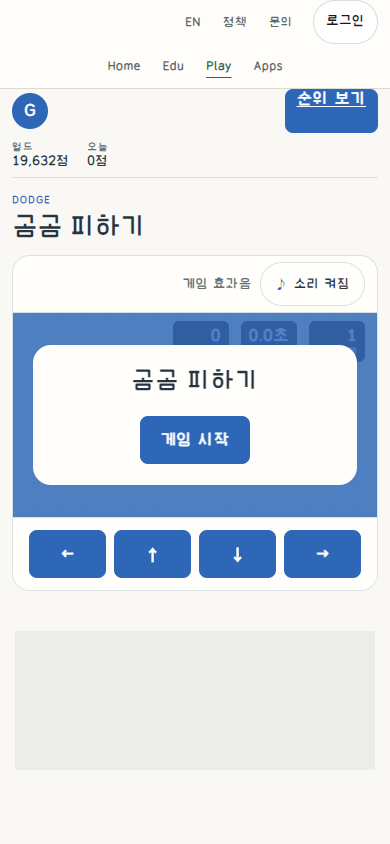|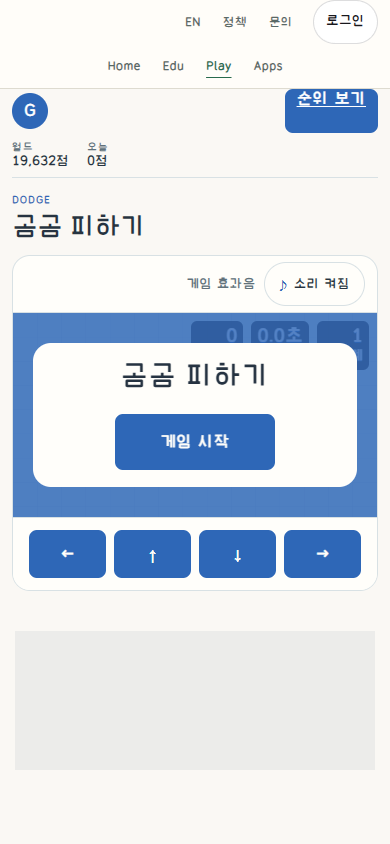|
|390×844 early play|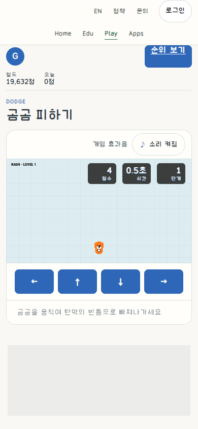|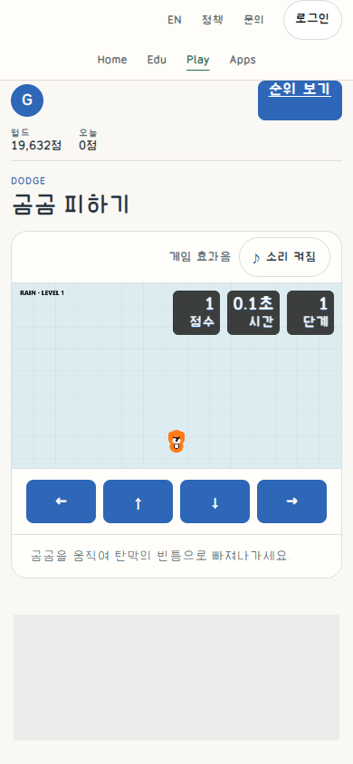|
|1280×720 entry|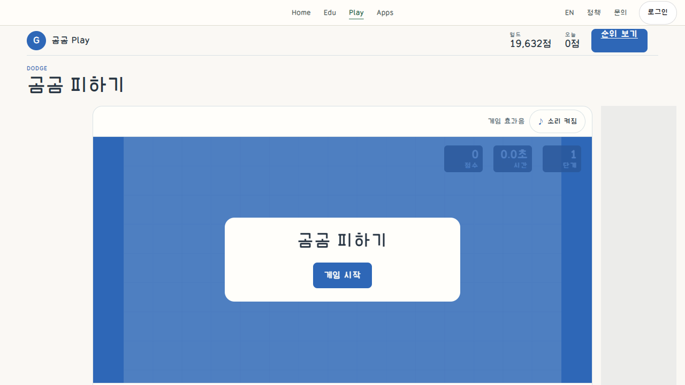|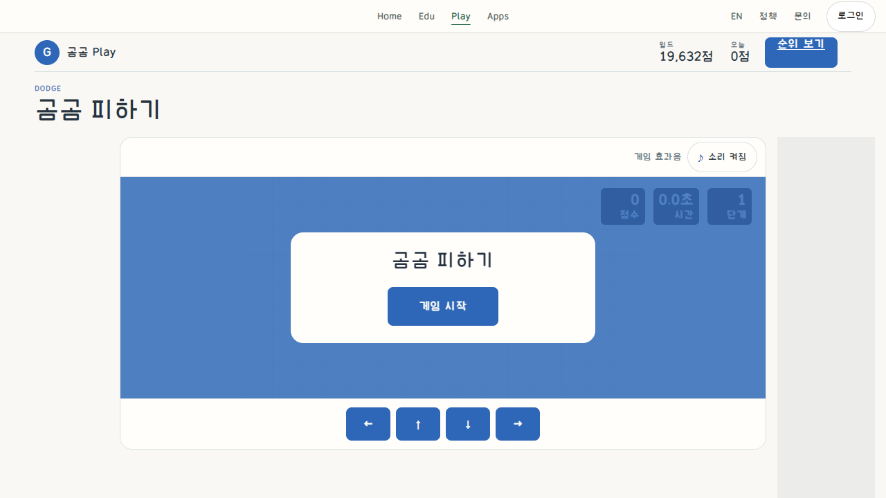|
|1280×720 early play|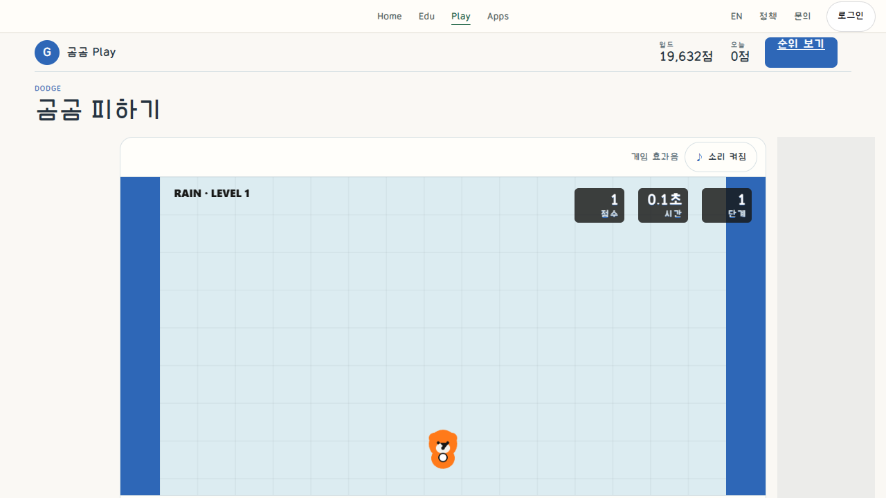|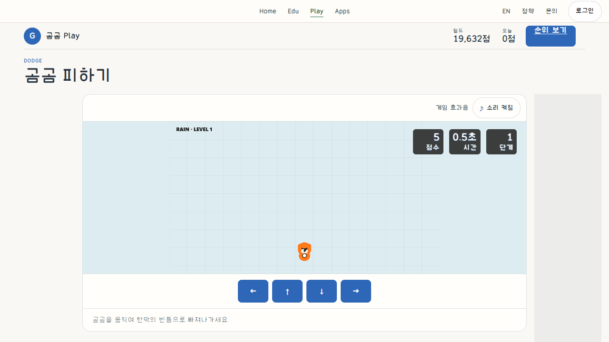|
|844×390 entry|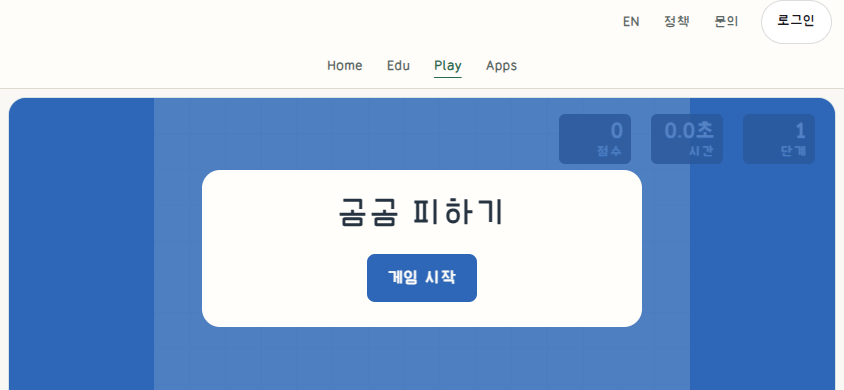|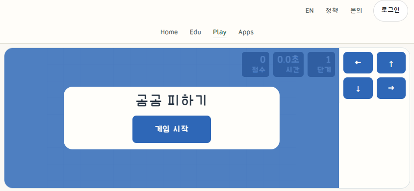|
|844×390 early play|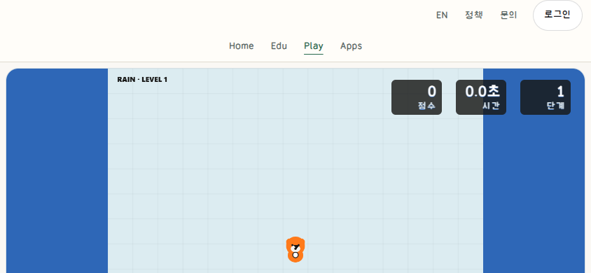|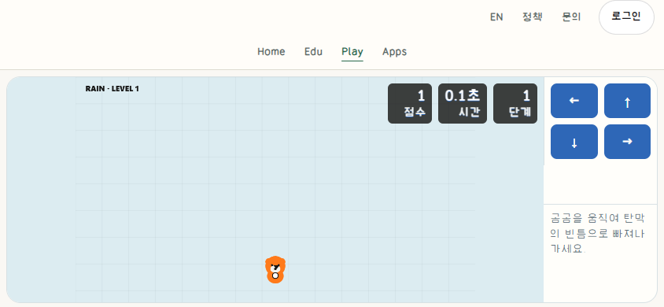|
|844×390 natural collision result|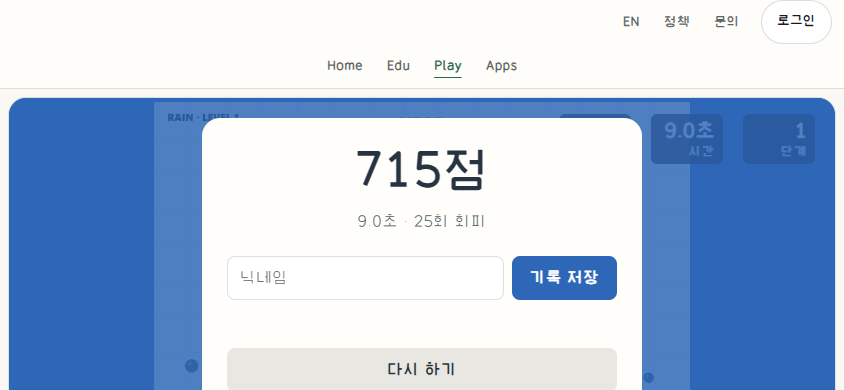|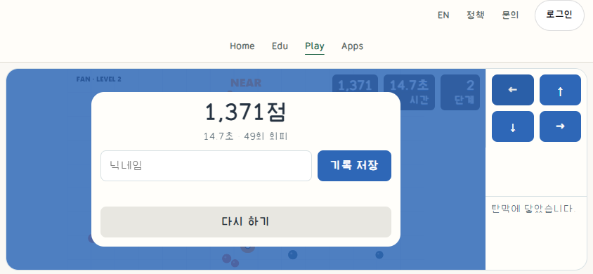|

`manifest.json` lists14 exact copied PNGs with dimensions/bytes/SHA256 and actual Before/After provider versions. Seven pairs use the same viewport,DPR and named normal UI phase. Server-issued seeds, exact score/time and bullet positions differ, especially at natural loss. This is not a pixel-identical state or seeded experiment. Native Control+Home and ready auth/fonts establish the same page position. Ads and rank/comment identities are neutral masks, not request blocking.

## Actually read source guidance

Sites deployment47/material SHA `5457b898470f556ef5cdef250cf4d7fa466069731d9ffd8b32edf378716ac4b7` checked fresh, unchanged. Same-version complete common game instructions/DNS05/14/18/Implementation roles/Universal controls reused from this ongoing work. Supplemental Git refresh `8f853cf89e0045c2dceb1381000bee9c1b6a0da0` unchanged. The exact menu-placement README/specs were read during the preceding Puyo slice; not reread to claim new guidance. No Dodge reference raster inspection or third-party artwork reuse. Example numbers are proposals, not accepted product requirements.

Applied: preserve one normal input/state owner; allocate room for actual controls and recovery; stable held targets/inset press/focus; honest native flow and captured limitations. Skills: homepage UI/server and audit-game-visuals. Reading guides itself is not proof of target quality.

## Changes

Only Dodge HTML body marker/CSS link plus its new scoped presentation stylesheet. Shared arcade CSS/shell, game rules/physics/collision/render/input/ranking/auth/analytics/ad runtime/Worker/API/DB/writer unchanged. Local dirty HTML's other differences were not deployed; overlay uses live immutable HTML. No new labels, artwork or record data.

- HUD label9px on phone/12px elsewhere becomes14px. Use existing GomgomKkalkkeum UI font.
- Stable primary56px, commands48px and short-landscape44px, input16px, visible focus/inset press without hit-target movement.
- At1280×720, the old460px board pushed commands below the viewport. New320px board leaves commands/status visible. Phone board204.75px at390 and165.375px at320 is preserved, not reduced.
- Short844×390 keeps a286px-high board (before302px) and puts commands/status in a side rail instead of below the fold. Natural loss score/input/Retry remains within the stage.
-320px page inherited a fixed320px ad widget inside a296px parent. Scoped min-width0/minmax grid tracks/max-width keep actual ad/disclosure visible and within the parent, without blocking requests or hiding the page overflow.

## Verification and retained failures

Native entry/start, updating score, held pointer/release, keyboard movement. Public input is checked via actual x displacement using read-only existing stats, not injected state. Natural collision/normal Retry at short landscape, no forced loss or record submission. Fresh anonymous contexts have no stored nickname, so no automatic personal-best submission is claimed.

Local1 exposed an `inset:8px` shorthand error stretching HUD to the bottom; actual images retained, corrected to auto bottom. Local1/2/3 also retained320px overflow failures. Diagnosis showed grid min-content tracks, not the game canvas; merely setting max-width was insufficient. The final scoped track/min-width correction passed targeted320; earlier corrected390/768/1280/844 cases were reused rather than needlessly rerun. Actual public final flow covers all five sizes.

External advertising remains a separate dependency: raw failures are retained/reported separately from owned page/API failures. Screenshots do not include third-party creative. This packet does not prove physical touch devices, long campaign/balance, school concurrency, authenticated OAuth/admin, record persistence, latency gains, external aesthetic approval or owner preference. No credentials/private identities/production DB/source/font binaries or new license assignment. Research upload is not a PR merge.
