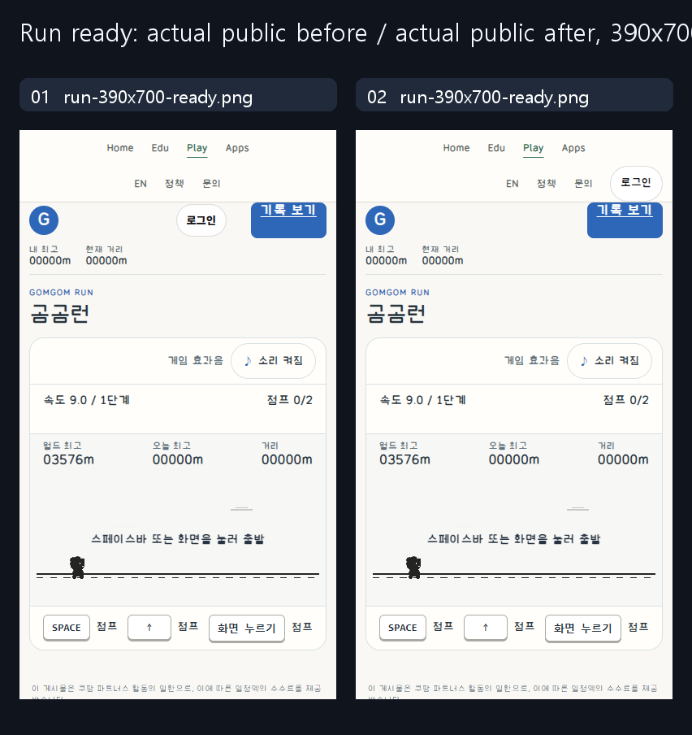

# Game login belongs to the shared header

Authorized correction of an existing product, not an ordinary/guided model trial
or measured usability result. Same390x700/DPR1/zoom100/unplayed Run ready state;
unchanged scene/records/backend. Before and after are separate actual public
contexts. No state setter, forced win, clock pause or account impersonation.

## Read / applied

Sites47/material5457b898 unchanged, whole game_ui_playground_v1/IMPLEMENTATION.md
705fd142 read, same-version common instructions retained. Git refresh8f853cf8
unchanged; research AGENTS and docs/RIGHTS_AND_SCOPE read. Previously complete
same-version universal-button guidance retained. Adopt separate state ownership
and native keyboard/recovery checks; do not copy synthetic settings or claim
causal guide gains.

## Before → intent → rendered

| Axis | Before | Intent / actual result |
| --- | --- | --- |
| Layout | Login remained next to game Records, below global navigation | Same auth mount moves into the existing global utility group, right aligned. Home/Edu/Play/Apps remain centered. |
| Owner / state | One session/provider/dialog owner | Reuse existing mount, no duplicate auth button or new login implementation. Whole source outside mount placement is byte-identical. |
| Type / targets | Existing generic control | Global font inherited, native44px minimum target in the strip. Pill face retained; a geometry/body/icon redesign was not requested. |
| Responsive | Utility centered after the first local edit | First capture retained, full-width grid correction and right-gap assertion added.320/390/768/844landscape/1280 captured. |
| Input / recovery | Existing native auth dialog | Real anonymous pointer/Enter open, Escape/Close return. Actual Run canvas start/Space second jump still works after dialog close. |

## Evidence limits

- Two shared files plus a minimal Run HTML input-guard inclusion. The existing
  helper was present in assets but absent from the actual Run HTML. First public
  dialog→canvas→Space failed: focus stayed on Login and reopened its dialog.
  Kept the failure, reused the existing guard to focus the actual clicked canvas;
  projected and final public native second jump passed. No physics/input resolver/
  Worker/bindings/API/DB/writer changes or restart.
- Six public header cases (earlier320 case with unchanged shared files, final five
  after the bounded Run fix) cover three game-shell representatives plus Play hub,
  not all games or all domains. Header/dialog geometry and errors checked; third-
  party advertising explicitly blocked, not ad-delivery verification.
- Anonymous real backend used. Authenticated long names/admin menus and full OAuth
  provider completion/profile/logout writes, physical devices, load and human
  usability are unrun. Auth source parity is not an authenticated-flow test.
- First local DOM report passed but visual alignment was still wrong. That capture
  is retained; it was not deployed. The final correction is separately recorded.
- Own project captures with neutral record masks only; no private account data,
  third-party reference screenshots/fonts/server source or new reuse license.

Manifest records exact capture sizes/hashes, public release, guides and scope.
