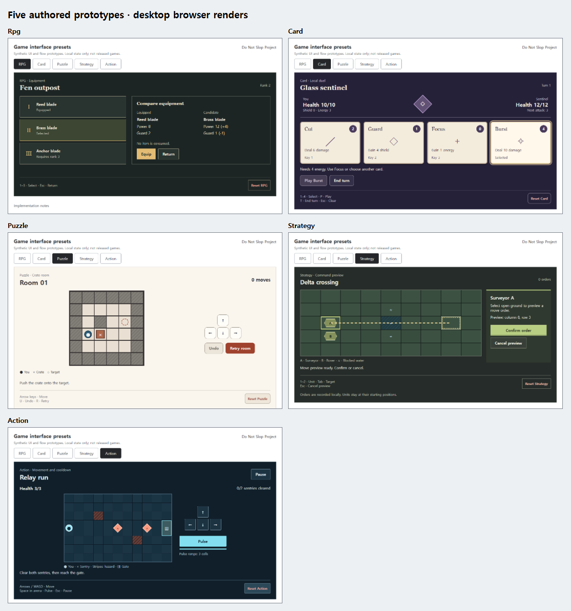
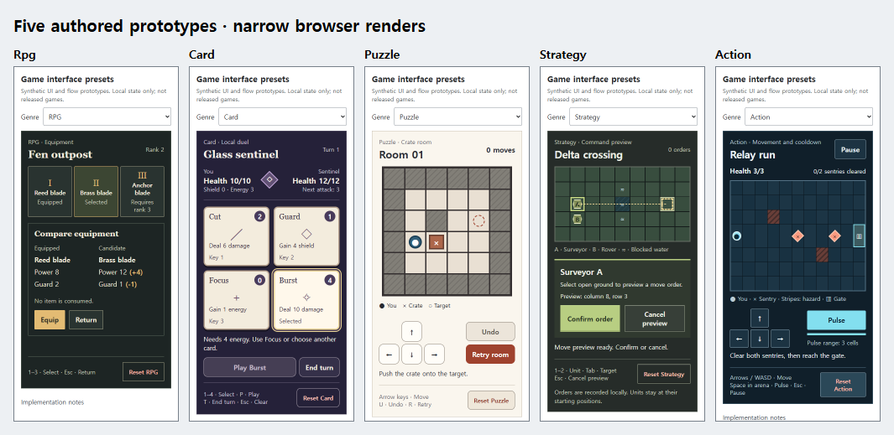

# Five game interface presets

Open [index.html](index.html) directly or through the repository's local server. This self-contained English gallery has five functional, original synthetic slices: RPG inventory/equip/return, card selection/play/end turn, puzzle move/undo/retry, strategy select/preview/confirm/cancel, and action HUD/pause/cooldown/retry. No runtime dependency, service, real economy or payment is connected.

[Design presets](presets.json) specify flow, recovery, hierarchy, roles, example geometry and actionable instructions. [Functional requirements and data](functional-fixtures.json) exclude specific palette, layout, typography and design references. This is an authored/guided demonstration, not an actual ordinary-quality/design-treatment experiment or approved final design. A future matched pair must follow [honest comparisons](../../docs/HONEST_COMPARISONS.md).

| Desktop browser renders | Narrow browser renders |
| :---: | :---: |
|  |  |

The sheets show uncropped source captures at reduced scale. [Original captures and hashes](screenshot-manifest.json), [bounded browser report](BROWSER_REPORT.md), [implementation guide](IMPLEMENTATION.md), [sources and rights](SOURCES_AND_RIGHTS.md), and [first-pass/repair history](REPAIR_LOG.md) keep their evidence limits. The original first completed implementation is retained under [first-pass](first-pass/).

Session state survives genre switches; named Reset controls clear only their example. Reload starts a fresh session. The strategy slice records orders without arrival simulation. The other four slices implement only their declared local rules.

Browser QA uses an existing Playwright Core driver and installed Chromium. Set PLAYWRIGHT_CORE_PATH to the driver module and CHROME_PATH to the browser executable, or use locally installed Playwright Core with its available Chromium. No browser dependency is required to run the gallery. Development commands from the repository root:

    node research/game_interface_presets_v1/verify-browser.mjs
    node research/game_interface_presets_v1/finish-evidence.mjs
    node research/game_interface_presets_v1/finalize-package.mjs

These commands refresh only this package's evidence. Browser viewport checks do not establish native-phone, controller, screen-reader, full usability or general instruction effectiveness. Geometry and cooldown values are proposals for these synthetic examples. No reuse license has been selected.
