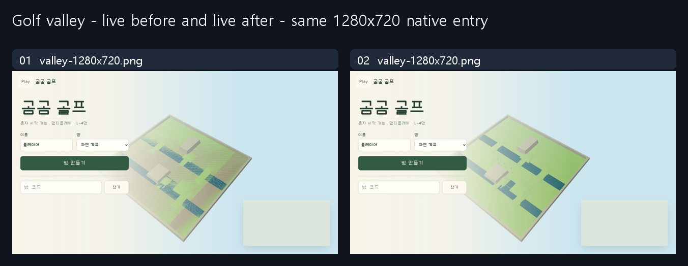

# Golf overview: distinguish depth stripes from wave aliasing

Authorized correction of an existing 3D mini-golf review candidate. Not a fresh
ordinary/guided AI experiment or measured usability/performance result. Both
entry captures use native map selection, preview seed41007, DPR1, same viewport,
camera and state. Room directory is neutrally masked in both. No clock/state
setter, forced gameplay or reference artwork is used.

## Read and applied

Do Not Slop Sites47/material5457b898: full AI_INSTRUCTIONS c70854cd and
game_ui_playground_v1/IMPLEMENTATION705fd142; DNS18 matched scene/behavior
evidence applies. DNS14 read but new command animation is not necessary here.
Git refresh8f853cf8 unchanged; research contributor/rights scope read. The actual
product view owns projection; authority, course collision and state remain elsewhere.
No example economy, menu or ornamental control copied.

## Before → intent → rendered

| Axis | Before | Change / observed result |
| --- | --- | --- |
| Ground | Large800-unit overview retained the close-up0.1 near plane; ground/base displayed stripes | Existing local camera-distance near-plane correction reused. Native overview near8.1 versus follow0.1; ground clearer without altering meshes/hulls. |
| Water | After the depth correction, high-frequency waves still appeared as dense noisy stripes | Fragment derivative footprint fades unresolved waves/foam at overview scale; near-view frequency/flow/color logic retained. Intermediate image preserved. |
| Entry / identity | Existing map selector and entry controls | Same eight maps and labels, no new UI skin or controls. Mobile entry covers preview, so no mobile-terrain proof is inferred there. |
| Actual flow | Existing room/start/overview/follow/two-stage shot/leave | Native create/start, camera transitions,1stroke, mobile game overview and leave passed with real backend. Getter-only observation assists locating the rendered ball; no setter or authority bypass. |

[Three.js camera documentation](https://threejs.org/manual/pages/cameras.html)
explains depth precision. [Khronos WebGL2 reference](https://www.khronos.org/files/webgl20-reference-guide.pdf)
defines fragment derivatives. Screen-footprint fading is this project's bounded
implementation choice, not a copied official parameter recipe.

## Evidence and limits

- Four static files only: view/water plus two cache references. Full frozen base
  overlay proves all other assets unchanged; Worker/resources/API/DB/writer and
  shared-header correction preserved. No restart, room/score reset or cache purge.
- Public native selection:8maps×2viewports; actual WebGL shader compilation/errors
  and horizontal overflow checked. Ground/water visual acceptance covers the
  overview, not every mesh/animated hazard. No all-campaign/balance claim.
- Actual native game sequence uses a read-only view getter for projection
  inspection; final entry captures are uninstrumented public resources. Source
  parity/numeric checks are auxiliary, not physical-device evidence.
- First networkidle wait and first prototype observer failures retained locally;
  they were testing errors, not silently converted into gameplay success. Depth-
  only intermediate remains visible above. Screenshots do not certify latency.
- No physical phones, multi-human play, full3round records, close-up water travel,
  external visual review, full accessibility or user design approval. Review-
  candidate/noindex status remains. Advertising blocked, not tested.
- Exact images/hashes and sanitized observations are in the manifest. Own product
  captures only; no private accounts/codes, tokens, product source, font binaries,
  third-party reference media or new reuse license.
