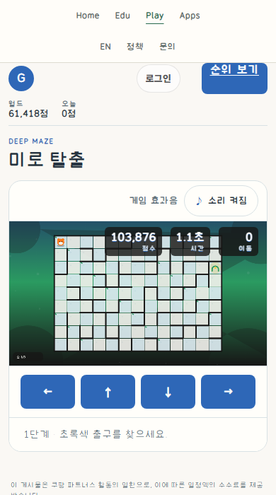
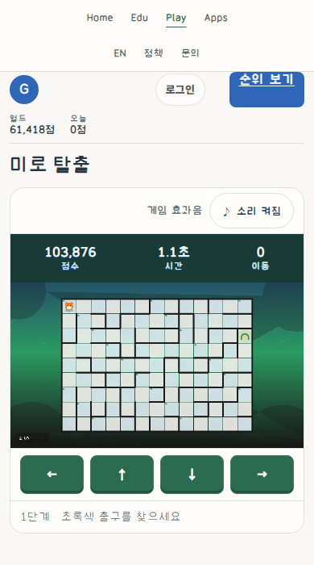

# Maze: unobstructed board and native controls

This is an authored revision of an existing GomGom game, not an ordinary-quality versus guide-treatment experiment. The owner authorized the UI correction and publication of before/after screenshots to this research Git repository. Publishing the evidence does not establish user design approval, guide effectiveness or measured usability gains. The artifact ID uses 20261010; the local work began late on 2026-10-09 KST.

## Matched CSS projection

| Before | CSS revision on the same playing instance |
|---|---|
|  |  |

390×700 CSS pixels, DPR1, zoom100%, same actual maze, stage, player, moves, timer and canvas hash. Both viewport captures scroll to the page top. This **CSS-only** comparison quiesces the presentation loop after its queued frame; it neither injects a seed nor sets progress. It is not a native timing/performance result. The unchanged clock and actual input are exercised in independent fresh contexts. The final renderer's stage-caption relocation is checked separately below, not claimed to be part of this identical-canvas pair.

## Actually read MCP guidance

- Installed private Site deployment46, material hash `f153ff9c3306646fdc60214042797c6714a9bb7eab520ef43cd07f67c8fd4544`, updated2026-10-09T14:17:00.886Z. Changed material was read again, rather than using the prior Tetris packet as current.
- Complete common packet `research/release/AI_INSTRUCTIONS.md`, SHA `c70854cd205ec14947ce28b5d01ce12819cc2f3ddf47b09db7e25efb068be042`, plus DNS-14/DNS-18 and their returned exceptions/source limits, through `complete=true`: reserve scene bounds, preserve authority, distinguish stationary targets from press feedback, and require matched rendered/native-flow evidence.
- Complete short-puzzle branch `research/plugin_draft/skills/review-visible-design/references/game-short-puzzle.md`, SHA `f52858646604d36a1f8ea367ebef015040b9cc393ef208b07c5e62f6871b16ba`: read-only move/goal information is not a command; preserve board/input/restart meaning. The branch's cartoon art and absent pause/match states were not imported.
- The delivered Lichess entry raster was actually inspected, SHA `a911f8630dc2d786a8e8168a98e26510fb2a59645959cdf06d8f63d8ab3a4b06`; board/control relationship only. Its pixels were not copied or redistributed.
- Maze material search returned no direct case; the short-puzzle case-ID lookup returned `Unknown case ID`. Neither is counted as a complete case read. Common implementation ownership guidance and the actually delivered puzzle branch were used; the Tetris-specific coding brief was not treated as a Maze contract.

## Before → intent → rendered/input ledger

| Axis | Observed problem | Bounded decision | Evidence |
|---|---|---|---|
| Scene/HUD | Score/time/move blocks hide upper maze cells on phone | Reserve a60px HUD row, outside the unchanged960×540 canvas | Identical-canvas CSS pair; geometric separation in five fresh viewports |
| Main action | Large generic dialog, unrelated shared control grammar | Compact cream start/result panel with forest-green primary and quiet native direction row | Ready/result screenshots and actual Start/Retry clicks |
| Shape/body | Press shifts visible control position | Fixed native48px target; shallow inset lower edge becomes inset upper press feedback | Source geometry plus actual focus/native activation; exhaustive pointer cancel untested |
| Typography | Small HUD captions compete with the board |16–18px tabular values,11–12px captions; actual existing labels, no new onboarding prose | Whole-screen rendered crops; complete accessibility is unrun |
| State | Focus/disabled/pressed meaning inherited from generic arcade cascade | Distinct3px brown focus, stationary pressed face, static gray disabled state | Native Enter Start and fresh gameplay; disabled storage remains disabled in offline local preview |
| Late board | Canvas stage caption masks lower-left cells in25×15 maze | Move existing caption and transient stage banner into y2–26 strip; largest maze starts at y30 | Retained obscured stage3 observation and independent final stage3 render; not a same-maze pair |
| Return | Result panel and Retry must remain usable at short heights | Preserve existing result/form/Retry, allow native page/overlay scrolling | Four aspect ratios: three-stage native clear, result, Retry → stage1/moves0 |

To change these surfaces, edit the game's scoped CSS for DOM geometry/state appearance and the existing draw functions for caption coordinates. Maze generation, movement legality, seed handling, stage count, score calculation, input handlers, authentication, persistence and room/API authority remain unchanged. No speculative manager, mode or missing pause feature was added.

## Fresh local native-flow checks

Final checks used1280×900,1280×720,768×900,390×700 and844×390. All entered through the actual page, native Enter Start, keyboard movement and a native DOM direction click. No horizontal overflow or page errors occurred in those bounded runs. HUD bounds end before the canvas starts.

Four aspect ratios continued through all three actual mazes and the normal result/Retry path. The automation reads visible wall pixels and the existing read-only stage/exit observer, then sends ordinary key presses; it does not set position, seed, score, stage or result. This is native game execution, not human difficulty/balance evidence. The768px run covers initial movement only. Local POST is refused405, so the existing offline fallback seed path is used and local score storage is **not** proved. No nickname or score was submitted.

## Retained failures and scope limits

The first comparison attempted CDP virtual-time pause, but a pending render still changed the timer/canvas. Both unsuccessful captures are retained as `failed-pair-*`, not accepted as a matched pair. The later pair quiesces only its comparison presentation loop and proves actual equality. A wall-reading helper initially classified dark green forest gaps as black walls; it was corrected to neutral wall ink. An immediate post-Retry assertion ran before the existing async start completed; it now observes the native transition. These are comparison/navigation-observer repairs, not game-rule changes.

The lower-left stage caption defect was found during the natural full-game route, repaired in the rendering owner, and recaptured. It is not hidden behind the earlier HUD-only pass. Earlier outputs remain separate from the final observations/hash inventory.

Third-party ads are blocked in validation contexts to avoid live ad traffic. Expected blocked requests and405local POST observations remain reported. Page-error0 is not a zero-network-failure claim. Authenticated persistence, physical phones, human usability, school performance, complete keyboard/screen-reader/accessibility, pointer cancellation,200%zoom and user visual acceptance are unrun. Production deployment has a separate operational ledger, not inferred from this local packet.

## Rights and files

Project-owned screenshots are explicitly approved for this publication. `manifest.json` records exact included capture hashes/bytes. No account, nickname, room code, secret, private machine path, third-party reference raster, font binary or full game engine is included. Public world-record values are aggregate data. No new reuse license is selected. The guide/data/research scope is not changed by uploading this case.
