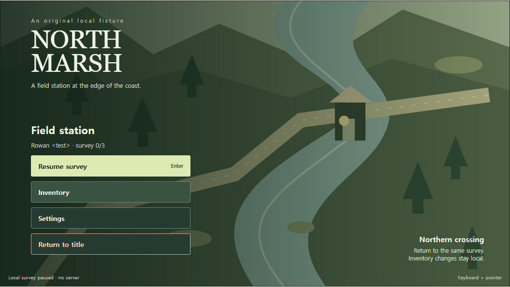
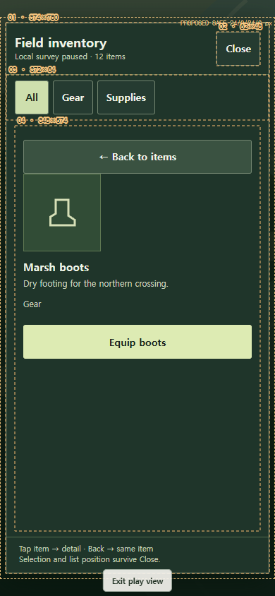
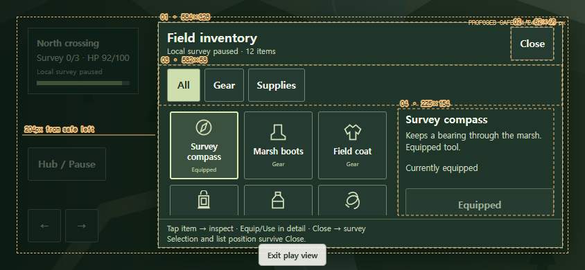

# Menu placement v1

**English-first visual manual; original authored proposals. Public source, pending design acceptance.**

| Desktop / controller | Portrait inventory | Landscape inventory |
|---|---|---|
| [](captures/review-candidate-2/desktop-flow-contact-sheet.png) | [](captures/review-candidate-2/mobile-flow-contact-sheet.png) | [](captures/review-candidate-2/landscape-flow-contact-sheet.png) |

Actual screens of this original fixture. Click a capture for the labeled screen collection. **25 browser scenarios passed**, with [evidence and unrun limits](BROWSER_REPORT.md).

Open [index.html](index.html), or run from the repository root:

```powershell
node research/menu_placement_v1/serve.mjs
```

Visit `http://127.0.0.1:4176`. No dependencies, requests, accounts, or external assets are needed by the example. A call sign is synthetic fixture data, never authentication.

Try **Enter station → Connect as guest → Mark ready → Enter hub → Resume survey → Inventory → item → Close → Hub → Return to title**. Loading, injected failure, retry, cancellation, disconnect, empty inventory, long labels, and repeated activation are reachable. Inspect shortcuts open proposed states directly and do not prove flow completion.

| Profile | Menu proposal | Inventory proposal | Input |
|---|---|---|---|
| Desktop | Left rail / centered alternative | Right split panel / wide collection | Pointer, Tab, Enter, Space, arrows, I, Q/E, Esc |
| Controller | Central stack / left alternative; larger focus targets | Wide grid / right panel | Keyboard stand-ins; standard Gamepad API adapter |
| Mobile portrait | Lower stack / upper-middle alternative | Collection → separate detail → same collection position | Tap, explicit Back and Close |
| Mobile landscape | Left stack / centered alternative; compact connection form | Split collection and detail / wider collection | Separate movement, survey and menu zones |

**Play view** uses the actual browser viewport while preserving state. **Compare A / B** shows the same fixture and state with the alternate layout inert. Orange guides and the live table measure this original render in CSS pixels. The gap readout, safe-area scenario, text scaling, and JSON export make the placement reviewable. All dimensions remain project proposals, including the 44/60/48 px target sizes and 0/24/44 px inset scenarios.

The local survey pauses while the inventory or hub is open. No multiplayer game pause behavior is inferred. No persistent save service exists; reload resets the fixture. Return to title keeps progress in this tab; Reset restores all fixture data while retaining the teaching settings.

- [AI_INSTRUCTIONS.md](AI_INSTRUCTIONS.md): reusable instructions with exceptions and checks.
- [placement-contract.json](placement-contract.json): proposal tokens, screen/input contracts, recovery and focus rules.
- [sources.json](sources.json): official observations and source rights; game images are linked only.
- [BROWSER_REPORT.md](BROWSER_REPORT.md), `checks/`, `captures/`: bounded native-browser verification and actual local screens.
- [CHANGELOG.md](CHANGELOG.md), [HANDOFF.md](HANDOFF.md): version, repairs, exact next action and blockers.

These alternatives are deliberately authored educational examples. They are not ordinary-AI versus instructed-AI experimental arms, empirical usability results, a reconstruction of a source game, a universal placement rule, or a user-approved final design. Physical controllers, phones, real software keyboards, and screen readers require their own checks. Existing `game_ui_playground_v1` and `gameplay_details_v1` files are preserved.

Implementation base: main `6f3944309604ed2e10784cd62119b2d429c9a7e2`, checked out 7 October 2026. Publication integrates concurrent main `cad72abf335c4acf825ce840074834297c18d524`; only this new directory and two navigation files change. [Public integration record](PUBLIC_INTEGRATION.md) explains scope, checks and the distinct publication/design-approval states. No Site edit, plugin installation or new reuse license is performed.

Development history is retained, including failures and superseded passing versions. The latest candidate is `checks/review-candidate-2/` and `captures/review-candidate-2/`; earlier folders are not the current verdict.
