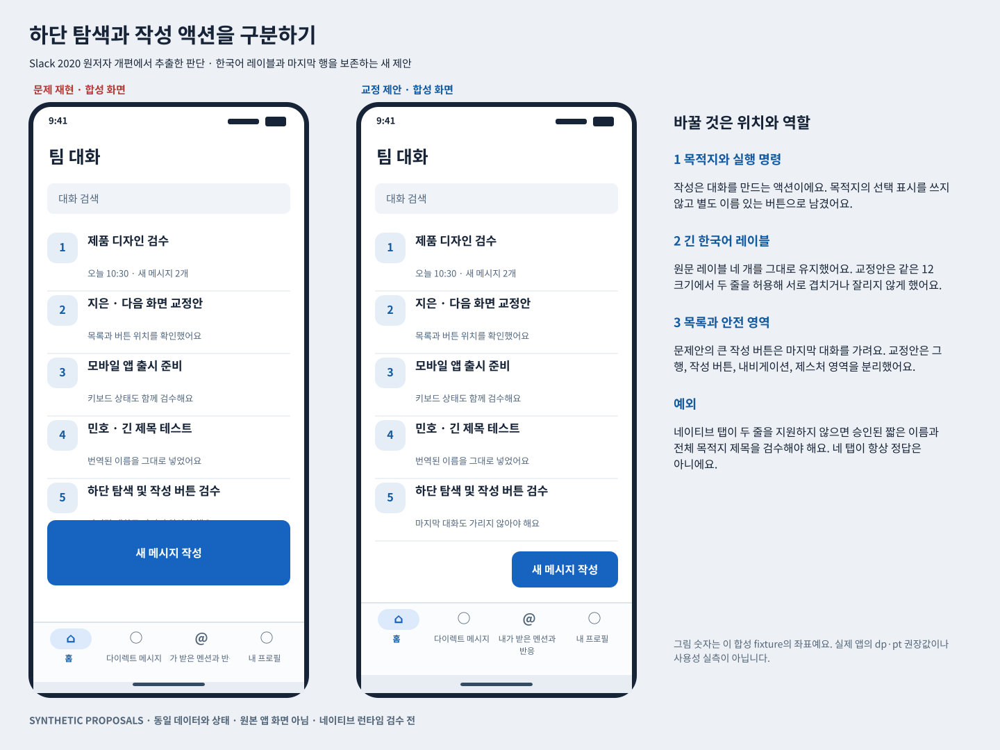
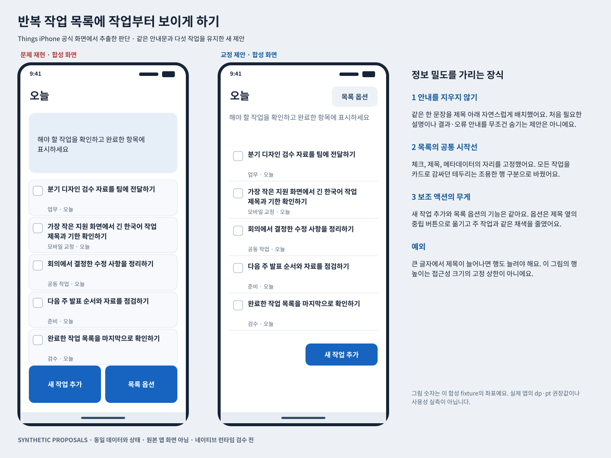
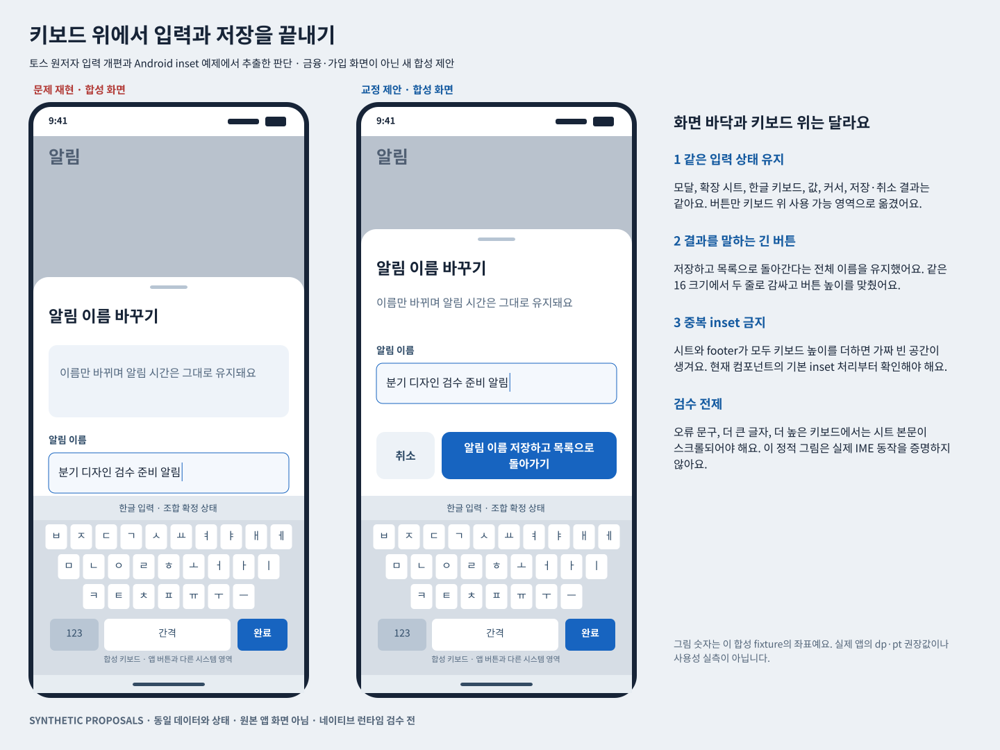

# 네이티브 모바일 앱의 시각적 컨트롤 배치 교정

조사일 2026년 10월 4일 UTC

이 보충편은 하단 탐색, 큰 주 액션과 보조 액션, 긴 한국어 이름, 키보드와 시트의 가림, 반복 작업 목록의 정보 밀도를 다룬다. 원저자가 공개한 Slack 모바일 개편, Things iPhone 개편, 토스 가입 입력 개편의 실제 시각 자료를 확인했다. Duolingo와 Todoist를 다시 사례로 사용하지 않았다.

핵심은 “모바일답게 둥근 카드와 큰 하단 버튼을 넣기”가 아니다. 현재 목적지, 지금 실행할 명령, 읽어야 할 작업 정보, 시스템이 차지하는 영역을 구별해야 반복 교정이 줄어든다. 아래 수정 명령은 해당 문제가 있을 때 쓰는 조건부 제안이다. 제품 관찰과 새 제안을 구별하고, 데이터와 상태를 고정한 합성 비교판으로 무엇을 바꾸는지 보여준다.

## 읽는 법과 검증 범위

- 원저자 설명은 공식 글의 보고다. 글에 나온 사용성 평가를 이번 연구가 다시 측정한 결과로 쓰지 않는다
- 공식 시각 관찰은 글에 연결된 원본 PNG·JPEG·GIF와 Android 예제 MP4의 표본 프레임을 열람한 결과다. 실제 앱을 실행한 것은 아니다
- 교정 명령과 비교판은 이번에 작성한 새 제안이다. 원래 앱이 이 문제를 갖고 있다는 판정이나 공식 재설계안이 아니다
- 합성 비교판 양쪽은 같은 ID, 문자열, 작업 순서, 선택·입력·키보드 상태를 사용한다. 위치, 그룹, 채색 면적, 줄바꿈과 컨테이너 높이만 바꾼다
- 문제안의 일부 요소가 가려지거나 잘리는 것은 재현하려는 실패다. 데이터가 삭제된 것은 아니다. 교정안은 같은 데이터를 노출한다
- 390 × 844와 그림의 좌표는 작성한 fixture의 논리 단위다. 실제 앱의 dp·pt·CSS px를 실측한 값이 아니며 보편적인 버튼·바 높이 권장값도 아니다
- 이번 정적 검수에서 통과한 것과 네이티브 런타임에서 아직 실행하지 않은 것을 나누어 적었다

네임스페이스는 antislop.mobile_control_layouts.v1이다. 사례·명령·fixture가 기존 카탈로그 ID와 충돌하지 않도록 이 보충편 안에서만 새 ID를 썼다. 기존 규칙이나 Site를 수정하지 않았다.

## 먼저 고를 수정 순서

1. 시스템 키보드·제스처 영역 때문에 입력이나 저장을 끝낼 수 없다면 그 가림부터 고친다
2. 목적지와 실행 명령이 섞였다면 역할과 선택 표시를 분리한다
3. 긴 레이블과 제목이 잘린다면 같은 글자 크기에서 줄 수와 사용 가능한 폭을 조정한다
4. 작업 데이터보다 설명·장식·동일한 강도의 보조 버튼이 앞선다면 해당 반복 사용 상태의 위계를 조정한다
5. 실제 지원 기기, 큰 글자, 오류, 복귀와 보조기술에서 확인한다. 예쁜 정적 그림을 마지막 증거로 삼지 않는다

## 1 Slack 모바일 개편에서 목적지와 작성 액션 구별하기

### 원본에서 확인한 것

Slack 원저자들은 2020년 모바일 개편에서 DMs가 iPhone의 덜 알려진 스와이프와 Android의 드롭다운에 숨어 있던 문제를 설명한다. Home·DMs·Mentions·You를 탭 바에 올리고, 대화를 먼저 찾아 들어가지 않아도 새 메시지를 시작할 수 있는 별도 작성 경로를 설명한다. 공식 탭 GIF의 표본 프레임에는 네 목적지의 선택 상태와 별도 작성 버튼이 보인다. 작성 GIF에는 키보드 위 입력줄이 있는 새 메시지 화면이 보인다. 이는 역사적 개편 근거이며 2026년 설치 앱의 정확한 탐색 구성을 뜻하지 않는다. [Slack 원저자 개편 글](https://slack.com/blog/productivity/simpler-more-organized-slack-mobile-app), [공식 탭 GIF](https://d34u8crftukxnk.cloudfront.net/slackpress/prod/sites/6/IA-mobile_tab-bar-1.gif), [공식 작성 GIF](https://d34u8crftukxnk.cloudfront.net/slackpress/prod/sites/6/IA-mobile_Composing-a-message-1.gif)

Apple의 현재 탭 바 지침은 최상위 구역을 오가는 탐색과 현재 화면에 작용하는 액션을 구별하고, 탭 레이블을 붙이되 가능하면 짧게 쓰도록 안내한다. iPad 등 다른 플랫폼 위치와 보조 컨트롤 예외도 있으므로 이 사례를 “모든 앱은 하단 네 탭”으로 일반화하지 않는다. [Apple 탭 바 지침](https://developer.apple.com/design/human-interface-guidelines/tab-bars)

### 반복 교정이 생기는 지점

합성 문제안은 네 목적지와 새 메시지 작성 액션을 모두 하단에 넣었지만 작성 버튼을 과하게 키워 마지막 대화의 메타데이터를 가린다. 긴 한국어 목적지 이름은 단일 행 안에서 잘리고, 내비게이션 상호작용 영역은 작성한 시스템 제스처 띠까지 내려간다. 하단에 있다는 좌표만 맞았을 뿐 각 요소의 역할과 가림 관계를 맞추지 않은 상태다.

그림은 원본 Slack 화면이 아니다. 아이콘, 이름, 대화 내용과 배치는 새로 작성했다. 원본의 제스처를 복제하거나 현재 앱 상태를 재현하지 않는다.

### 같은 내용과 상태

fixture ID antislop.mobile_control_layouts.v1.fixture.slack_navigation_action

- 현재 목적지는 home, 키보드와 모달은 닫힘, 스크롤은 0, 선택된 대화와 진행 중 요청은 없음
- 목적지는 홈 / 다이렉트 메시지 / 내가 받은 멘션과 반응 / 내 프로필의 같은 네 ID와 전체 레이블
- 대화 다섯 개의 제목, 세부 문장, 순서와 새 메시지 작성 액션을 양쪽에 그대로 둠
- 작성 결과는 작성 화면을 여는 것이다. 새 목적지로 선택하거나 메시지를 전송하는 행동으로 바꾸지 않음
- 교정안에서 글자 크기를 줄이지 않음

전체 문자열과 상태는 mobile_app_corrections_v1.cases.json의 해당 fixture에 있다.

### 바로 사용할 수정 명령

N1 목적지와 실행 명령이 같은 탭 역할을 쓰는 경우

“하단 바에는 전환 목적지만 남기고, 새 메시지 작성은 목록 영역의 별도 버튼으로 분리하라. 선택 탭 스타일을 작성 버튼에 쓰지 말라. 목적지 ID와 순서, 선택 상태를 유지하라.”

- 바꾸는 것: 역할의 그룹, 작성 버튼의 위치와 강조
- 보존하는 것: 목적지 전체, 현재 위치, 작성 기능
- 예외: 플랫폼이 제공하는 미니 플레이어나 탭 부속 컨트롤은 별도 컴포넌트 규약을 따라야 한다. 부착된 컨트롤을 모두 “잘못된 추가 탭”으로 판정하지 않는다

N2 한국어 목적지 레이블이 잘리는 경우

“먼저 레이블의 실제 렌더링 폭과 각 탭 폭을 재라. 이 합성안에서는 같은 글자 크기로 두 줄을 허용하고 줄 높이와 바 높이를 함께 늘려라. 제품명 축약은 목적지의 뜻이 보존되는지 확인하고 별도 승인을 받아 적용하라.”

- 바꾸는 것: 줄바꿈, 레이블 상자의 높이와 바 높이
- 보존하는 것: 전체 레이블과 목적지 매핑, 글자 크기
- 예외: 네이티브 탭 컴포넌트가 두 줄을 지원하지 않으면 억지로 이 그림을 구현하지 않는다. 승인된 짧은 레이블, 해당 화면의 전체 제목, 접근 가능한 이름을 함께 검수한다. 일부 플랫폼에서 표시 이름과 접근 가능한 이름을 다르게 쓰더라도 같은 목적지를 가리키는지 확인한다

N3 마지막 행이나 시스템 영역을 가리는 경우

“작성 버튼과 내비게이션의 실제 가림 높이를 목록의 끝 스크롤 여유에 반영하고, 상호작용 영역은 시스템이 보고한 안전 영역 안에 배치하라. 그림 배경을 끝까지 칠하는 것과 터치 영역을 끝까지 늘리는 것을 구별하라.”

- 바꾸는 것: 끝 콘텐츠의 여유, inset에 맞는 상호작용 경계
- 보존하는 것: 마지막 행의 데이터와 접근 경로
- 예외: 시스템 안전 영역은 기기·OS·회전·제스처/버튼 탐색 방식마다 다르다. 그림의 26 단위를 하드코딩하지 않는다. Android도 시스템 침범을 처리하고 제스처 inset 아래에 터치 대상을 놓지 않도록 안내한다. [Android 시스템 바 지침](https://developer.android.com/design/ui/mobile/guides/foundations/system-bars)

### 테스트

- 통과한 정적 검사: 양쪽 전체 문자열과 의미 맵 일치, 모든 도형 상자의 캔버스 내 배치, 교정안의 레이블 상자 안 글자 폭과 높이, 작성 버튼과 마지막 행·탐색·제스처 띠 분리
- 의도된 문제 재현: 큰 작성 버튼이 마지막 행을 가리고 긴 단일행 레이블이 자체 타일에서 잘림
- 아직 실행하지 않은 네이티브 검사: 각 목적지로 전환 → 스크롤 → 상세 진입 → 복귀 후 선택한 복원 정책 확인, 별도 작성 시작, 작은 지원 폭, 큰 접근성 글자, 회전, 탐색 모드, VoiceOver/TalkBack의 이름·선택 상태
- 실패하면 다시 고칠 것: 레이블만 축소하지 말고 바와 콘텐츠의 사용 가능 높이를 다시 배분한다. 목적지를 무단 삭제하거나 “더 보기”로 숨겨서 통과 처리하지 않는다

## 2 Things iPhone 개편에서 작업 밀도와 보조 액션 판단하기

### 원본에서 확인한 것

Cultured Code의 2025년 Things 3.22·OS 26 개편 글은 여백을 넓히고 컨트롤을 갱신했다고 설명한다. 공식 iPhone 이미지는 Today의 여러 작업과 메타데이터, 작은 추가 버튼, 편집 패널의 Save와 키보드를 함께 보여준다. 제스처 도움말은 Magic Plus를 원하는 위치로 끌어 작업을 넣는 행동을 설명한다. 이 자료에서 얻을 수 있는 것은 작업 내용과 추가·편집 컨트롤의 시각적 구별이다. 더 좁은 여백이 항상 낫다거나 실제 저장·취소 동작이 검증됐다는 결론은 얻을 수 없다. [Things 공식 개편 글](https://culturedcode.com/things/blog/2025/09/things-for-os-26/), [공식 iPhone 이미지](https://culturedcode.com/frozen/2025/09/things-os26-screenshot-ios-io75.jpg), [공식 제스처 도움말](https://culturedcode.com/things/support/articles/2803582/)

### 반복 교정이 생기는 지점

반복 사용 목록에 일반적인 안내를 큰 카드로 넣고 모든 작업에도 카드를 반복한 뒤, 추가와 목록 옵션을 같은 크기의 파란 버튼으로 놓으면 읽어야 할 작업보다 설명과 컨트롤이 먼저 보인다. 이 합성안은 안내 문장을 삭제하지 않고 컨테이너의 높이를 줄인다. 작업은 같은 시작선의 목록으로 묶고, 주 액션과 보조 액션의 채색 면적을 구별한다.

그림의 개인 작업 앱, 작업 제목, 목록 옵션 레이블은 새 fixture다. Things의 실제 메뉴명이나 인터랙션을 발명해 설명한 것이 아니다. 소스에서 보인 작은 추가 컨트롤을 “실제 터치 영역도 작다”로 추론하지 않는다.

### 같은 내용과 상태

fixture ID antislop.mobile_control_layouts.v1.fixture.things_dense_tasks

- 키보드·모달·메뉴는 닫힘, 스크롤은 0, 작업 선택과 진행 중 요청은 없음
- 같은 다섯 작업, 제목과 메타데이터, 순서와 미완료 상태
- “해야 할 작업을 확인하고 완료한 항목에 표시하세요”라는 안내는 양쪽에 보임
- 새 작업 추가와 목록 옵션의 ID·이름·결과는 같음
- 안내·제목·메타데이터·버튼의 글자 크기는 양쪽이 같음

### 바로 사용할 수정 명령

T1 반복 목록에서 큰 일반 안내가 작업을 밀어내는 경우

“같은 안내 문장을 제목 아래 필요한 줄 수의 자연스러운 문장으로 놓고, 설명 카드의 최소 높이와 장식용 패딩을 제거하라. 목록 행의 제목·기한·상태를 먼저 보존하라. 처음 필요한 설명, 오류 설명, 되돌릴 수 없는 결과 안내는 이 명령의 삭제 대상이 아니다.”

- 바꾸는 것: 안내 컨테이너 높이와 그룹
- 보존하는 것: 안내의 내용, 작업 데이터, 읽을 수 있는 글자 크기
- 예외: 첫 실행의 빈 목록, 낯선 단계, 결과가 큰 절차에는 더 충분한 설명이 필요할 수 있다. 채워진 반복 목록의 상태를 다른 상태에 그대로 적용하지 않는다

T2 카드가 같은 목록의 시작선을 흐리는 경우

“같은 작업을 공통 시작선의 목록으로 정렬하라. 체크 영역, 제목, 메타데이터의 열을 유지하고 긴 제목은 행 안에서 감싸라. 행 사이 구분은 먼저 조용한 선이나 여백으로 해결하라. 구분 의미가 다른 그룹까지 하나로 합치지 말라.”

- 바꾸는 것: 반복 카드 장식과 정렬
- 보존하는 것: 작업 순서, 전체 제목과 메타데이터, 완료 상태
- 예외: 풍부한 미리보기, 서로 다른 객체 그룹, 독립 이동 블록, 카드 자체 액션은 카드가 필요할 수 있다. 밀도를 높이겠다고 그 경계를 없애지 않는다

T3 주 액션과 보조 액션이 모두 크고 진한 경우

“새 작업 추가는 계속 보이는 이름 있는 액션으로 남기고, 목록 옵션은 제목 근처의 중립 버튼으로 옮겨라. 보조 액션의 터치 영역과 접근 가능한 이름은 유지하되 채색 면적과 반복 강조를 줄여라.”

- 바꾸는 것: 보조 액션의 위치와 시각적 무게
- 보존하는 것: 두 액션의 ID, 전체 이름과 결과, 도달 가능한 터치 영역
- 예외: 정렬이나 다중 편집이 현재 주 과업인 상태에서는 옵션이 주 컨트롤이 될 수 있다. 보조 액션을 모든 상태에서 영구적으로 약하게 만들지 않는다

### 테스트

- 통과한 정적 검사: 같은 다섯 작업, 안내와 액션 문자열, 전체 제목·메타데이터·버튼 이름의 상자 내 배치, 캔버스 경계
- 관찰과 구별한 제안: 안내의 내용은 유지하고 컨테이너 높이와 카드 장식만 줄임. 소스 개편 자체가 여백을 넓혔다는 사실과 모순되는 “항상 더 조밀하게” 규칙을 만들지 않음
- 아직 실행하지 않은 네이티브 검사: 추가 → 위치 선택 → 저장·취소 → 실패 후 초안 보존과 목록 복귀, 큰 접근성 글자, 긴 기한과 메타데이터, 플랫폼 최소 터치 대상과 비중첩
- 실패하면 다시 고칠 것: 고정 행 높이를 풀고 작업 행이 커질 수 있게 한다. 글자를 줄이거나 기한·상태를 제거해 목록 수를 늘리지 않는다

## 3 토스 입력 개편에서 키보드와 시트 가림 교정하기

### 원본에서 확인한 것

토스 Head of UX 정희연의 2022년 글은 2018년 가입 화면의 시안과 실제 구현 차이를 설명한다. CTA와 통신사 필드가 키보드 때문에 가리고, 휴대폰 번호 입력에 부적절한 키보드가 나온 문제가 명시되어 있다. 원본 시안 PNG의 마지막 화면에는 숫자 키보드 위 파란 CTA가 보인다. 구현 PNG의 마지막 화면에는 한국어 키보드와 번호 필드가 보이며 CTA·통신사 필드는 보이지 않는다. 저자는 정해진 형식에 맞춰 새 필드를 위로 쌓는 해결을 설명한다. 이는 현재 가입 앱 검증이나 모든 폼의 자동 진행을 권하는 규칙이 아니다. [토스 원저자 글](https://toss.tech/article/toss-signup-process)

Android 공식 inset 예제는 IME에 맞춰 LazyColumn과 마지막 TextField 공간을 조정하는 과정을 설명한다. MP4의 0·3·5초 프레임에서는 키보드가 열린 상태의 하단 입력이 드러나는 예제를 확인했다. 단순히 화면 바닥 여백을 더하는 대신 누가 inset을 적용하고 소비하는지 파악해야 한다. [Android inset 설명과 실제 예제 영상](https://developer.android.com/develop/ui/compose/system/insets-ui)

### 반복 교정이 생기는 지점

시트 footer를 화면 바닥에 고정하면 키보드가 열릴 때 그 뒤로 들어갈 수 있다. “버튼은 sticky다”라는 구현 설명은 사용자가 버튼을 볼 수 있다는 증거가 아니다. 시트의 사용 가능 영역, 현재 필드, 오류와 footer를 키보드와 함께 배치해야 한다. 긴 한국어 저장 이름이 버튼 안에서 잘리면 저장 후 어디로 가는지까지 사라질 수 있다.

그림은 알림 이름을 바꾸는 새로운 합성 앱이다. 금융·가입 흐름을 운영하거나 신원 정보를 받는 예제가 아니다. 원본에 있는 시연용 신원·전화번호 값을 복사하지 않았다. 토스의 역순 필드를 그대로 이식하지도 않았다.

### 같은 내용과 상태

fixture ID antislop.mobile_control_layouts.v1.fixture.toss_keyboard_sheet

- 모달 열림, 시트 확장, 한국어 텍스트 키보드 열림, reminder_name 필드에 포커스
- 값은 “분기 디자인 검수 준비 알림”, 조합은 확정, 커서는 값의 끝, 스크롤 0
- 오류와 진행 중 요청은 없음
- 도움 문장은 “이름만 바뀌며 알림 시간은 그대로 유지돼요”로 같음
- 취소는 초안을 적용하지 않고 닫기, “알림 이름 저장하고 목록으로 돌아가기”는 이름을 저장한 뒤 목록으로 복귀하기
- 문제안에 가려진 버튼도 같은 fixture 안에 존재한다. 교정안은 그 결과를 바꾸지 않고 드러낸다

### 바로 사용할 수정 명령

K1 키보드 뒤로 저장·취소가 들어가는 경우

“현재 키보드가 차지한 실제 가림 영역을 사용해 시트의 사용 가능 높이를 다시 계산하라. 저장과 취소는 키보드 위 footer에 남기고, 현재 필드와 오류는 그 위의 스크롤 영역에서 보이게 하라. 시트와 내부 footer가 같은 inset을 두 번 더하지 않는지 확인하라.”

- 바꾸는 것: 시트 사용 가능 높이, 본문 스크롤과 footer의 배분, inset 소유권
- 보존하는 것: 키보드·포커스·초안과 저장·취소 결과
- 예외: 열람한 현재 Compose ModalBottomSheet API는 contentWindowInsets를 통해 기본 IME 처리를 설명한다. 프로젝트의 Material3 버전과 중첩 소비를 확인하기 전에 imePadding을 무조건 한 번 더 넣지 않는다. 다른 창에서 키보드가 열리는 범위 등에는 다른 처리가 필요할 수 있다. [현재 ModalBottomSheet API 계약](https://developer.android.com/reference/kotlin/androidx/compose/material3/ModalBottomSheet.composable)

K2 긴 한국어 동작 이름이 줄어들거나 잘리는 경우

“긴 동작 이름을 두 줄로 감싸고 버튼 높이·내부 패딩을 그 줄 수에 맞춰 늘려라. 글자 크기를 줄이거나 결과를 설명하는 말만 잘라내지 말라. 취소와 저장을 같은 채색·면적으로 강조하지 말라.”

- 바꾸는 것: 줄바꿈, 버튼 높이, 보조 액션의 강조
- 보존하는 것: 전체 결과 이름, 글자 크기, 취소 경로
- 예외: 더 짧은 제품 레이블이 적절할 수 있지만 화면 맥락과 접근 가능한 이름을 합쳐 결과가 충분히 명확한지 검수한다. 이번 fixture가 임의의 문구 변경을 허가하지는 않는다

K3 새 필드나 키보드 종류가 예측을 깨는 경우

“새 필드는 현재 가시 영역 안에 나타나고 포커스가 따라오게 하라. 필드 의미에 맞는 키보드를 선택하라. 정해진 길이만으로 자동 제출하지 말고 붙여넣기, 한국어 조합 중, 값 수정과 검증 실패를 검수하라. 입력값이 완성된 것과 저장이 승인된 것을 구별하라.”

- 바꾸는 것: 새 필드 노출과 포커스, 키보드 매핑
- 보존하는 것: 입력값과 검증 조건, 명시적 저장 경계
- 예외: 낮은 위험의 정해진 형식 선택은 입력 확정 후 자동 진행을 쓸 수 있다. 결제·약관·파괴적 변경·본인 확인에 같은 경계를 적용하지 않는다. 토스 원문의 과거 해결은 별도 절차의 실행 허가가 아니다

### 테스트

- 통과한 정적 검사: 양쪽 모달·키보드·값·도움 문장·행동 이름 동등성, 교정안의 필드와 footer가 합성 키보드 위에 배치됨, 긴 주 액션이 같은 글자 크기에서 두 줄로 들어감, 캔버스 경계
- 의도된 문제 재현: 화면 바닥에 고정한 footer가 키보드 뒤로 들어감
- 아직 실행하지 않은 네이티브 검사: 키보드 열림·닫힘과 애니메이션, 더 높은 키보드와 예측 줄, 한국어 조합·붙여넣기, 하드웨어 키보드, 회전, 오류·큰 글자로 본문 길이가 늘어난 상태
- 아직 실행하지 않은 상태 검사: 뒤로가기가 키보드와 시트에 미치는 플랫폼 정책, 닫은 뒤 포커스 복원, 저장 실패 시 초안과 시트 유지, 취소가 저장하지 않음, 같은 inset을 중복 적용한 빈 공간 없음
- 실패하면 다시 고칠 것: footer를 없애거나 확인 버튼 없이 자동 저장으로 바꾸지 않는다. 먼저 본문이 스크롤하고 현재 필드·오류가 드러나는지 확인한다

## 공통 검사 매트릭스

그림의 기본 상태만으로 통과 판정을 내리지 않는다. 실제 앱에서 지원하는 최솟값과 동작 정책을 먼저 적고 다음 상태를 확인한다.

1. 가장 작은 지원 폭과 큰 기기 폭에서 전체 한국어 이름을 넣기
2. OS가 지원하는 큰 접근성 글자 범주에서 레이블·메타데이터·오류가 증가하기
3. 키보드 닫힘, 한국어 조합 중·확정, 숫자 키보드, 예측 줄, 하드웨어 키보드 상태
4. 시스템 제스처와 버튼 탐색, cutout, 회전, 창 크기 변경
5. 마지막 행까지 스크롤했을 때 실제 고정 컨트롤이 내용을 가리지 않기
6. 선택된 목적지와 버튼 이름을 화면 낭독기가 구별해 읽기
7. 모달 열림과 닫힘의 포커스 정책, 뒤로가기와 취소의 의미
8. 입력 실패·저장 실패·재시도에서 초안과 현재 문맥 유지
9. 시각적으로 조용한 보조 액션도 플랫폼의 실제 터치 대상 요건을 지키기
10. 같은 데이터와 상태로 수정 전후를 비교하기. 삭제한 콘텐츠나 바뀐 상태 덕분에 “좋아 보이는” 비교를 통과 처리하지 않기

### 수치와 결과를 주장하는 경계

- 하단 바 높이, 버튼 높이, CTA가 차지할 화면 비율, 카드 면적 비율을 한 수치로 일반화하지 않는다
- 모든 화면에 큰 주 버튼 하나가 반드시 있어야 한다고 쓰지 않는다. 메시지 목록, 입력 시트, 다중 편집의 행동 위계는 다르다
- 같은 합성 좌표에서 더 잘 들어맞는다는 것은 사용자가 더 빠르다거나 실수가 줄었다는 실측이 아니다
- SVG의 상자 검사와 글꼴 폭 검사는 정적 렌더 검수다. 플랫폼 터치 목표, 포커스·화면 낭독, 입력기·회전 검증을 대신하지 않는다
- 일부 개선 근거가 오래된 개편 글이라는 점을 숨기지 않는다. 현재 앱의 출시·플랜·탭 수·계정별 상태를 역사적 이미지에서 추측하지 않는다

## 파일과 검수 결과

- mobile_app_corrections_v1.cases.json: 네임스페이스가 있는 사례·명령·예외·테스트·fixture·출처·권리 경계
- mobile_app_v1/boards/01_navigation_action.svg와 .png: 탐색·작성·긴 레이블
- mobile_app_v1/boards/02_dense_task_actions.svg와 .png: 반복 작업 목록·설명·보조 액션
- mobile_app_v1/boards/03_keyboard_sheet.svg와 .png: 키보드·시트·긴 저장 레이블
- 원본 제3자 화면·영상·표본 프레임은 포함하지 않는다. 연결한 원문 출처만 참고한다.

최종 정적 결과: 합성 비교판 3개의 문자열 의미 맵 일치, 캔버스 경계 통과, 의도된 문제안의 잘림을 제외한 텍스트 상자 넘침 0건. PNG를 열람하여 한국어 렌더링과 교정된 줄바꿈·가림 분리를 확인했다. 네이티브 런타임 검수는 미실행이다.

## 출처와 재사용 권리 경계

공식 공개 이미지라는 사실은 재배포 허가를 뜻하지 않는다. Slack·Things·Toss의 원본 이미지, GIF와 그 표본 시트는 이번 연구의 출처 확인용으로만 저장했다. 해당 자료의 재배포 라이선스는 확정하지 않았으며 Site·플러그인·외부 패키지에는 넣지 않는다. 원본 화면을 따라 그려 브랜드 자산을 재현하는 것도 이 비교판의 목적이 아니다.

Android의 콘텐츠 라이선스는 문서·코드와 그 밖의 콘텐츠를 구별하고 예외·상표·링크 외부 자료의 경계를 설명한다. 특정 MP4 자산의 분류를 이 연구가 별도 판정하지 않았으므로 원본 영상과 프레임도 이 보충편의 공개 후보에서 제외한다. [Android 콘텐츠 라이선스](https://developer.android.com/license)

새로 작성한 SVG·PNG 세 장은 원본 이미지를 삽입하지 않고 새 내용과 도형으로 만들었다. 이 자료를 쓰는 경우 SYNTHETIC PROPOSALS와 “원본 앱 화면 아님 / 네이티브 런타임 검수 전” 표시를 유지한다. 본문 관찰은 원문 링크와 함께 짧게 설명하고, 이번 제안이 공식 앱 개선안으로 오인되지 않게 한다.

이 자료는 원문 조사와 합성 비교판·정적 검토다. 실제 네이티브 앱, 계정, 거래, 플러그인 설치·등록을 검증하지 않았다.
