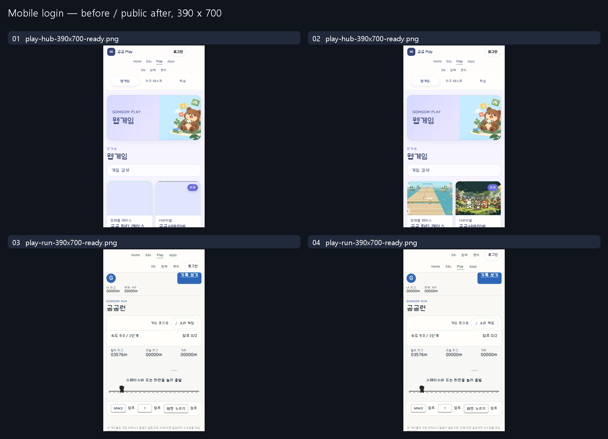

# Mobile header account placement

Actual existing-product correction, not an ordinary/guided model experiment.
The owner requested both the repair and research Git screenshots. Only two CSS
files changed; no authentication/session/provider, gameplay/record, API, Worker
binding or data change. No new login system or decorative controls.

## Observed issue and decision

The Play hub aligned its132px account container right, but left its62px Login
child at the container's start. The game strip put centered portal destinations
above utility links and Login, leaving Login on row2. Container alignment was not
proof of control alignment, and rightmost-row2 was not upper-right placement.

The hub now aligns the existing child to the end. At the existing responsive game
breakpoint the unchanged utility/auth group occupies row1 and portal links row2.
The button, dialog, data owner and labels are reused. Main/Edu/Apps already put
account links top-right, so their sources were not rewritten.

## Read guidance and protected behavior

Sites MCP47/material5457b898; Implementation705fd142 exact original fully read.
Same-version common/control instructions retained. Git8f853cf8 refreshed unchanged.
Applied: single existing state owner, minimal actual layout change, native
open/Escape/Enter/close recovery, preserved routes and matched screenshots.
Reference fixture features, proposed values and approval labels were not copied.

## Actual evidence and limits

Before and public after use normal anonymous ready and open-dialog states at
390×700 CSS px/DPR1. In the raw hub Before, lower lazy card thumbnails were still
loading; After has loaded thumbnails. That incidental difference is retained,
not presented as a loading-speed or catalog improvement. Compare the header's
same anonymous state; Run ready captures match their actual game state.
Public320/390/768/844landscape/1280 includes the two shells,
native dialogs and an actual Run doublejump after closing its dialog. Main/Edu/
Apps mobile positioning and read-only session bridge200 are checked separately.
Source snapshots/public SHA/cache/health are delivery evidence, not OAuth proof.

First failed assertions/cancelled-request reports are retained outside this
public case; their causes and bounded follow-ups are in observations.json.
Ads are explicitly blocked; records are masked in neutral gray, not fluorescent
UI. No forced game state/mock account. No physical-device, authenticated OAuth,
admin/long-name, full accessibility, school load, human usability or external
visual acceptance claim. Own product captures only; no third-party references,
font binaries, private account data, secrets or new reuse-license grant.
