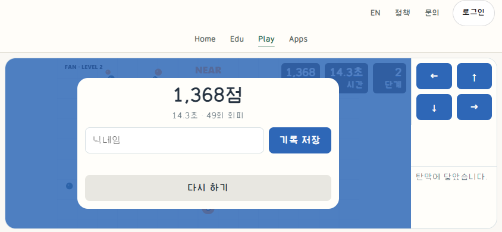
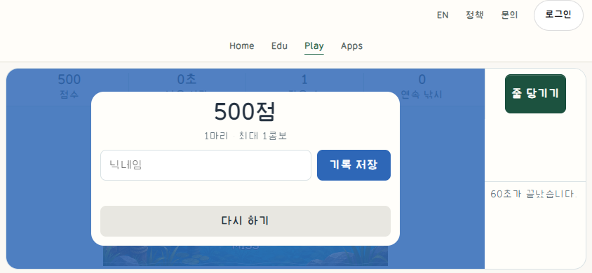
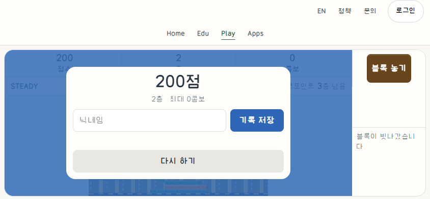
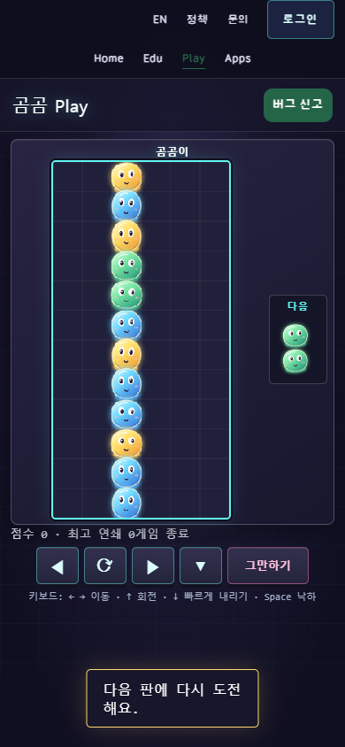
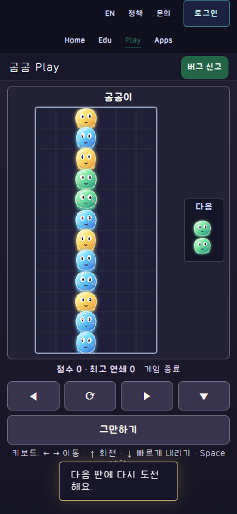
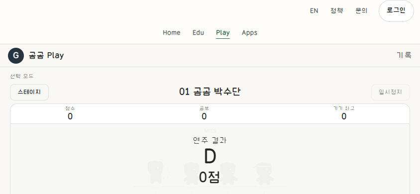
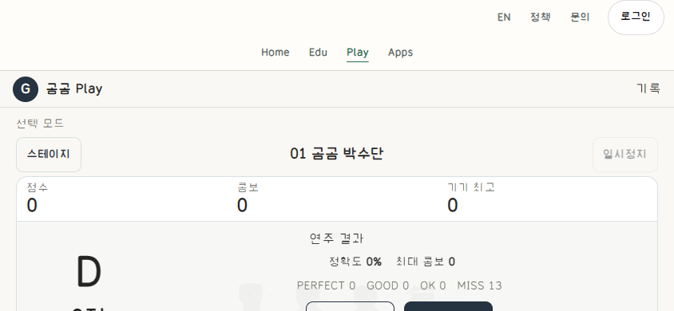

# Same native ended-state CSS comparisons

Five supplemental pairs of existing GomGom web-game presentation revisions.
These are **current-client CSS reconstructions**, not historical deployment
screenshots, full old-client executions, or ordinary/guided AI experimental arms.

Each game was started through its normal public controls and naturally ended.
The same stopped round was then captured with the added presentation CSS absent
and present. No score, timer, board, game-end state or animation clock was injected.
Current JavaScript, metadata DOM, canvas ink and shared header stay in both arms.
The archived prior HTML hashes establish that the additional CSS link was absent
before the original change, not that every earlier visual feature is reconstructed.

## Captures

| Game / same actual state | Before CSS | Current CSS |
| --- | --- | --- |
| Dodge:1368points,14.3seconds,49dodges;844×390 |  |  |
| Fishing:500points,one catch,normal60s end;844×390 |  |  |
| Tower:200points,two floors,normal miss;844×390 |  |  |
| Puyo:natural solo loss,same board and next piece;390×844 |  |  |
| Rhythm:first track natural end,D/0points/MISS13;844×390 |  |  |

[Manifest](manifest.json) preserves dimensions, byte lengths, PNG SHA-256,
readable canvas pixel hashes and identical semantic-state fingerprints per pair.
[Observations](observations.json) records actual guide sources/hashes, normal
inputs, local visual review, real network effects and the comparison limits.

DPR1 and the same ordinary reduced-motion preference were used in both arms.
These are uncropped viewport captures at the top of the page. The short Rhythm
frame does not show all lower result actions; actual scroll/retry checks belong to
the original game publication receipt, not to this image-only supplement.
Equal neutral privacy/ad masks protect record/comment/room lists and ad areas.
No gameplay or result controls are masked. No raw user identity, room code,
private Site reference pixels, secret, font binary or production script is added.

The existing earlier random-frame/milestone pairs remain unchanged and should not
be promoted to exact-state evidence. Native input verification, public delivery,
CSS comparison, external approval and measured usability/performance are distinct.
Publication is authorized by the owner; no new reuse license or PR merge is implied.
