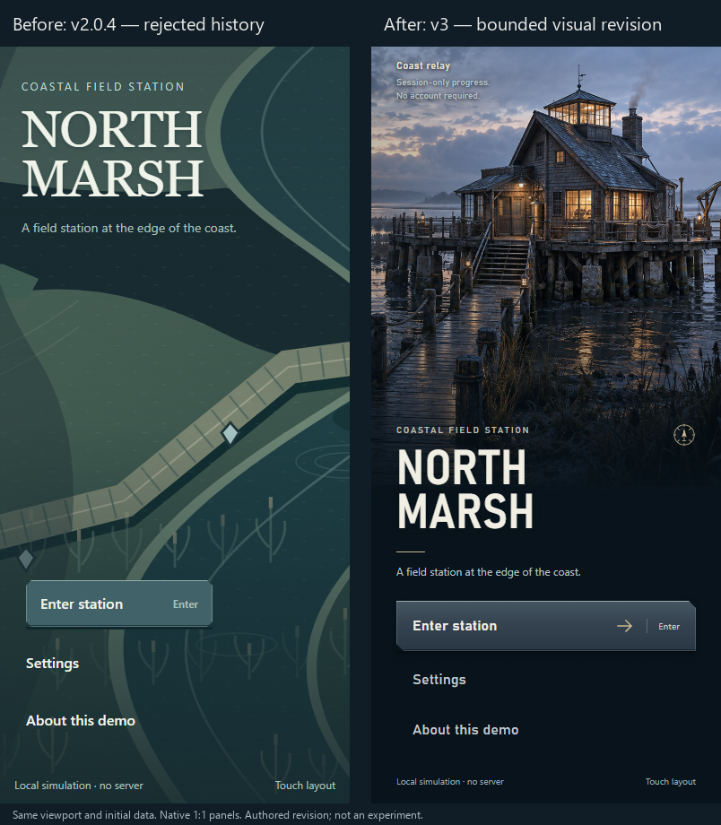

# North Marsh station arrival — title v3

The left-title alternative now presents a recognizable station, raised platform and connected boardwalk, with a quiet action rail. This latest candidate received positive visual feedback and explicit publication authorization. That feedback applies to this bounded title, not earlier examples or a claim of finished AAA quality.

[Full desktop comparison](captures/desktop-before-after.png) · [Desktop after](captures/desktop-after.png) · [Portrait comparison](captures/portrait-before-after.png) · [Portrait after](captures/portrait-after.png)

[](captures/desktop-before-after.png)

<a href="captures/portrait-before-after.png"></a>

Both sides retain the same initial data and viewport. Panels are pasted at native 1:1 size, with labels outside gameplay. These are this project's original synthetic scene captures, not third-party game screenshots, user/private screenshots, experimental arms or measured usability results. The workshop exit utility is hidden only during clean captures; its actual fixture behavior remains available.

## Run and implement

```sh
node research/north_marsh_title_arrival_v3/serve.mjs
```

Open http://127.0.0.1:4176, choose Desktop or Portrait and alternative A, then Play view. Controller's existing left rail is alternative B; the hardware remains unrun. [Runnable source](index.html) · [Exact implementation instructions](AI_INSTRUCTIONS.md) · [Source-first guide](../../guides/source-first-ui-craft.md).

`arrival-v3.css` is scoped to the left-title alternative. `assets/arrival-desktop.png` is an original generated illustration, with no external images supplied to generation. Portrait reframes the same image with CSS; it is not a separate painting or an independently simulated 3D world. Direction glyphs are original native SVG. System fonts are referenced, not redistributed.

Enter, Settings and About retain their order, IDs and native activation. Call sign, route, tab-only progress, the 900ms local connection simulation, generation/cancellation guards, canonical contracts and gameplay coordinates remain. One bounded behavior repair allows Tab from Settings' range input to reach the existing modal trap only in the new title's modal. Enter still focuses Connect; close restores the exact opener.

Other fixture scenes and the centered-title alternative retain the preceding treatment. No unrelated original menu/lab runtime is replaced in the repository. [Rejected v2.0.4 source and status](history/rejected-v2.0.4/README.md) are history, not success examples.

## Inspect the craft and its limits

Native crops: [primary](captures/primary-default.png), [actual down](captures/primary-down.png), [drag-off restored](captures/primary-cancel.png), [independent focus](captures/primary-focus.png), [type](captures/type-native.png), [station material](captures/station-material-native.png), [portrait primary](captures/portrait-primary-native.png), [portrait type](captures/portrait-type-native.png).

The station reads through pilings, roof, warm windows, wet boards and near/far value separation. Enter is distinct from quiet secondary actions. Remaining weaknesses: the action face is still a clean CSS gradient rather than richly textured enamel; the type is system-font composition rather than a bespoke identity; later connection/play scenes have a different visual language. Functional counts cannot establish aesthetic quality.

**Unresolved 200% visual concern:** the [portrait](captures/portrait-200-text-model.png) and [landscape](captures/landscape-200-text-model.png) use an authored text-scale model. Actions remain usable in the tested model, but enlarged content pushes identity onto busy artwork and weakens the quiet reading region. This is not a clean visual pass and is not native OS text scaling or true browser zoom.

[Browser report and remaining gates](BROWSER_REPORT.md) · [Source inspection boundaries](sources.json) · [Rights/hash allowlist](provenance.json) · [History and repairs](CHANGELOG.md).

Actual pre-implementation pixel inspection covered [God of War Ragnarök Armor Menu](https://zachgamedev.com/god-of-war-ragnarok/) and [Cyberpunk 2077 Update 2.2 customization](https://press.cdprojektred.com/en/224/760). [Forza creator work](https://williamemery.artstation.com/projects/lD1oL5) remains a source link; its pixel inspection was blocked. An additional restricted reference board was unavailable. No full three-game inspection, source transition or source usability claim is made. No external AAA screenshot is bundled.
