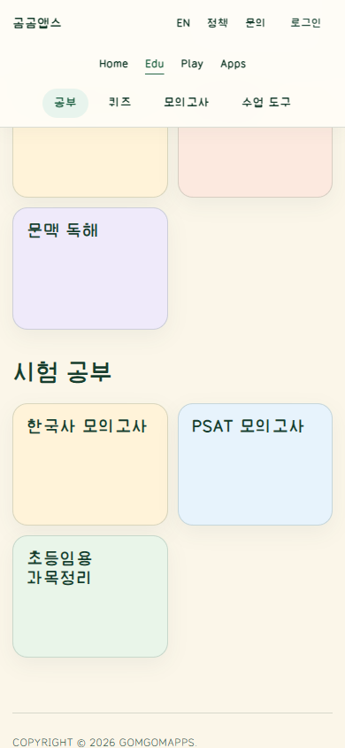
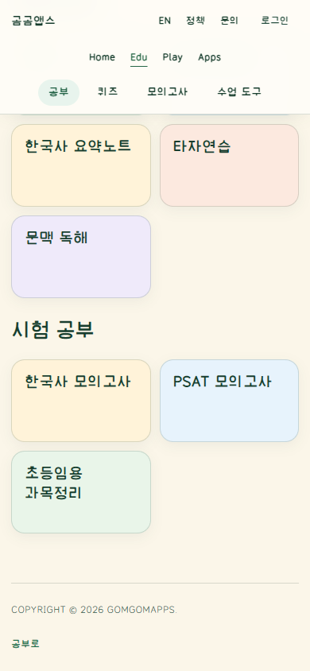
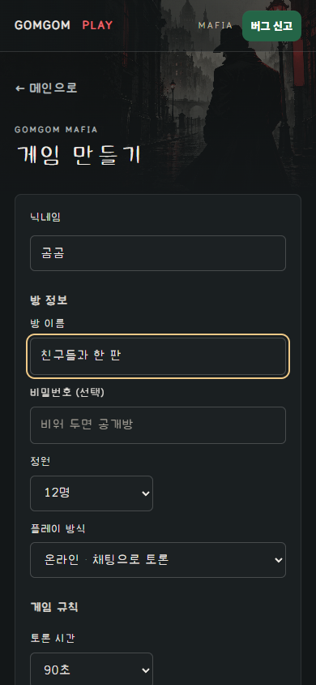
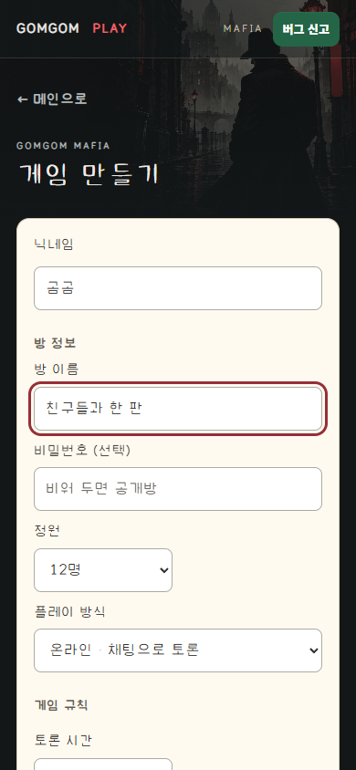
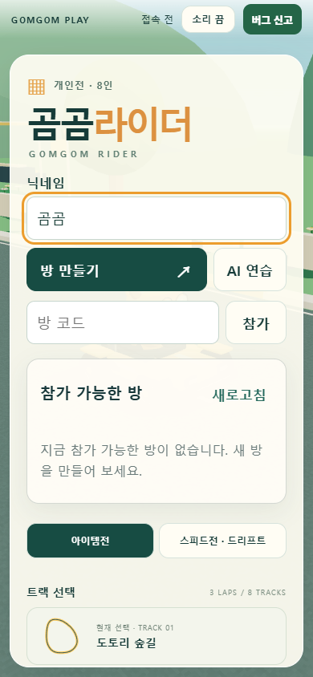
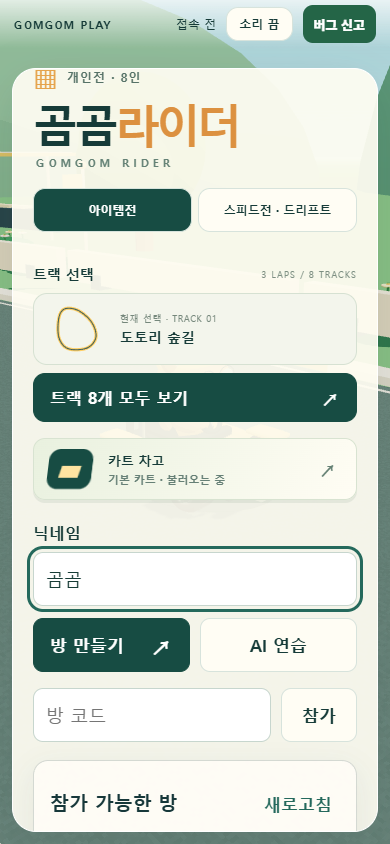
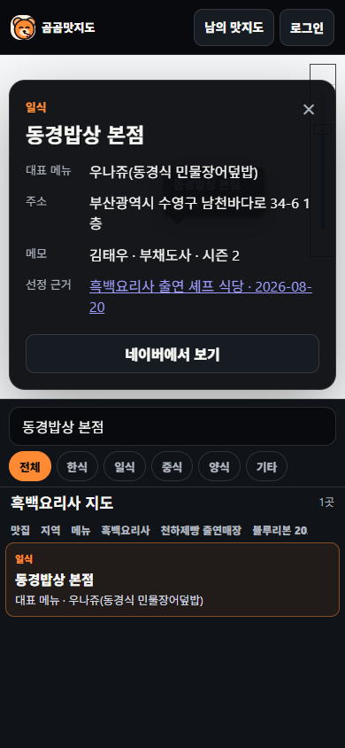
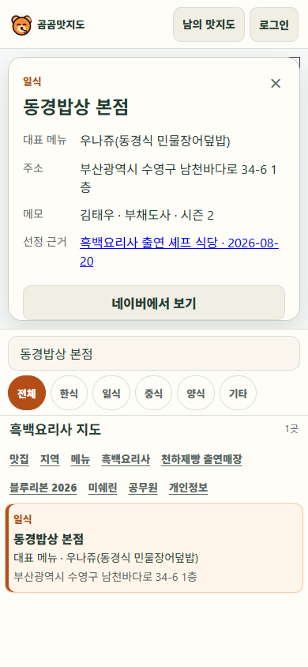

# GomGom portals and room-entry UI: bounded CSS comparison

Twelve same-viewport pairs, 24 full-frame browser captures. This addition records
already-published presentation changes; it does not introduce another production
release or imply completion of every game, mode, account or device workflow.

## What the pair means

Both arms use the same actually loaded public DOM, native inputs and content.
Before substitutes the exact preserved pre-change stylesheet; After substitutes
the freshly fetched public stylesheet. Only that stylesheet changes. These are
**present-day CSS projections, not historical deployment captures or controlled
ordinary-versus-guided AI outputs**. Actual source hashes, semantic-state hashes,
viewport, DPR, scroll offsets, dimensions and PNG hashes are in
[manifest.json](manifest.json). Original failed runs are retained locally.

| Surface | Same native task/state | CSS viewport |
| --- | --- | --- |
| EDU | Daily/exam hub | 1280×900, 390×844 |
| EDU | Actual scroll to exam study | 390×844 |
| Play | Real public catalog and search | 1280×900, 390×844 |
| Mafia | Create form, nickname/title filled, capacity12; then Back→Join directory | 390×844 |
| Rider | Anonymous room directory with entered nickname, actual refresh reachable | 390×844 |
| EAT | Public map/list, then native search→visible restaurant detail | 1280×900, 390×844 |

The Play After CSS includes the later mobile-header adjustment, so it is not
misrepresented as byte-identical to the original Oct8 After. All content/routes
are current. EAT searches a real visible restaurant at each viewport; a Jeju
restaurant is not forced into a mobile viewport that excludes it.

## Read instructions and decisions

Sites deployment48 / material
`6bb523382c2693995ddfbe656aaaeff447ffef64cd2c63f5a14c9fb15176aaa0`:
complete `research/release/AI_INSTRUCTIONS.md`, the game-playground implementation
guide and implementation roles, plus selected DNS-18/RB12/VWR11/VWR12 guidance.
Exact document hashes and applied decisions are in
[observations.json](observations.json). Supplemental public Git reference:
`8f853cf89e0045c2dceb1381000bee9c1b6a0da0`.

The guides informed protected task/data/native-input boundaries and honest
comparison labels. Draft recipes are not new product approval. Previously read
instructions and published fixes are not retroactively attributed to a newly
read guide. This packet measures no causal guide effect or usability gain.

## View the frames

Each pair's manifest links exact Before/After files; no crop, resizing or image
polish is applied. Representative comparisons:

| Before | After |
| --- | --- |
|  |  |
|  |  |
|  |  |
|  |  |

## Privacy, rights and limits

Room-directory contents are masked equally with a neutral capture mask. Rider's
first full-scene mask was invalid because it covered its UI and is not published.
Its world background continues animating; this is the same entry task, not the
same animation frame or camera pose. Native room creation is not claimed here.

For EAT, equal screenshot-only CSS paint exclusion removes third-party map tile
images/canvases/background images and advertisements, **without hiding the map
container or our detail card**. This is disclosed redaction, not how the public
product looks. Unmasked originals are retained locally; cartography correctness
and map pixel parity are not claimed from the public frames. Earlier rectangle
masks that hid the detail or unrelated controls are excluded. No third-party
media, private Site art, font binary, production source or account record is added.

Whole-run failures stay failures: selected successful pairs from run1/repair3
do not convert their later unrelated EAT failures to PASS. Final EAT public8
and exam missing5 runs passed their recorded bounded checks. Background analytics
and provider impression POSTs remain visible in the sanitized observations;
there was no record write, room creation, reset or mock authentication.

These frames are not human usability research, physical-device proof, full
accessibility coverage, full campaign/mode completion or external visual approval.
Authorized research publication selects no new reuse license and does not
authorize PR auto-merge, production restart or another release.
