# Puyo: readable boards, stable controls, real four-player layout

## Intent and preserved contract

Improve the existing Play Puyo entry and game presentation, not its rules or network model. Preserve the colored slime art, solo play, existing PC/tablet-only AI and friends contract, room creation/code entry, authoritative WebSocket game, auth owner and common navigation. No new copy, artwork, game data or license assignment.

## Actually read guidance

Do Not Slop Sites deployment47/material SHA `5457b898470f556ef5cdef250cf4d7fa466069731d9ffd8b32edf378716ac4b7` was freshly checked on resume, unchanged. Common game instructions and selected DNS05/14/18, Implementation roles and Universal controls were read completely in this same-version work. The menu-placement atlas README `f6dd09ff5f286522d3df3f10abb6901bff99d4651f3f9d44b90a0e95e1755a7a` and placement-specs JSON `29f484ab7dfa12c7d0512c3877198355e584c9e3b2b7cacb097b080fcef9d39e` were read to completion for this slice. Unknown `menu-placement` case lookup did not return images; no external example raster inspection is claimed. The checked supplemental Git reference was `8f853cf89e0045c2dceb1381000bee9c1b6a0da0`. Example units are proposals, not a product contract.

Applied decisions: keep the existing input/state owner; fix visible allocation before decorative effects; use stable native hit targets with an inset pressed state; retain focus/reduced motion; capture actual native game and recovery rather than forced states.

## Changes

- Puyo-only presentation stylesheet and two exact HTML insertions, not a dirty whole-page replacement. Score/status move together into a metadata wrapper before controls.
- Score/hints from 9.92px to 14px; body uses the existing GomgomKkalkkeum font.
- Remove scanline/glowing grid decoration and reduce neon emphasis to muted lavender/coral, preserving the existing slime palette and board.
- Entry primary56px/other controls48px; short landscape controls44px. Pressing does not move the hit target; visible keyboard focus remains.
- AI board at844×390: 37.5px wide before,90px after. Score and commands move to the right, rather than reducing the board further.
- Four actual players: parallel boards on desktop,2×2 on tablet, four compact parallel boards plus the right-hand command rail in short landscape. At768×900 commands end at885.78px after instead of977px before; at844×390 they end at279px instead of493px.

## Evidence and limitations

| Same viewport / named state, DPR1 | Before | After |
| --- | --- | --- |
|390×844 entry|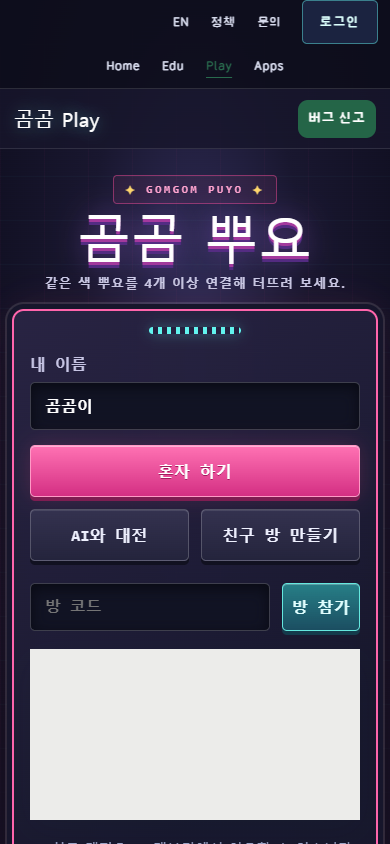|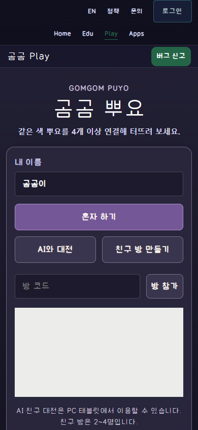|
|390×844 early solo|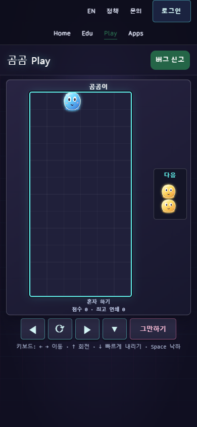|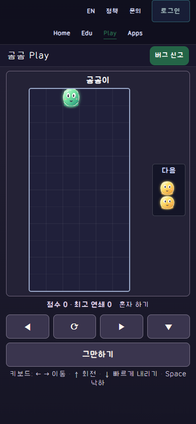|
|1280×720 entry|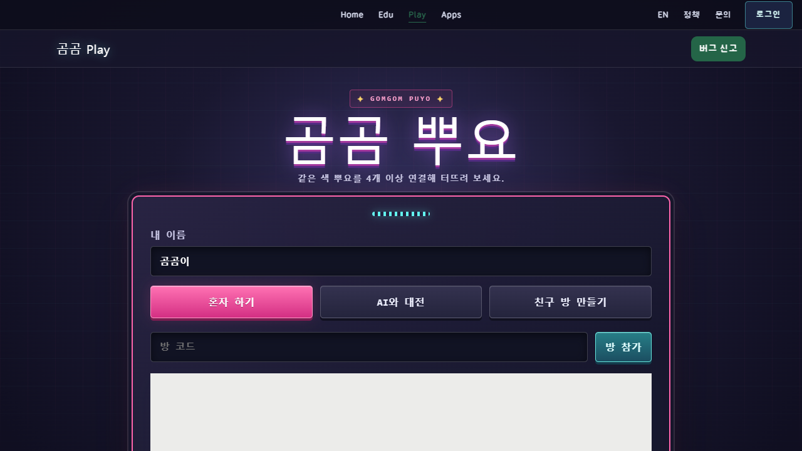|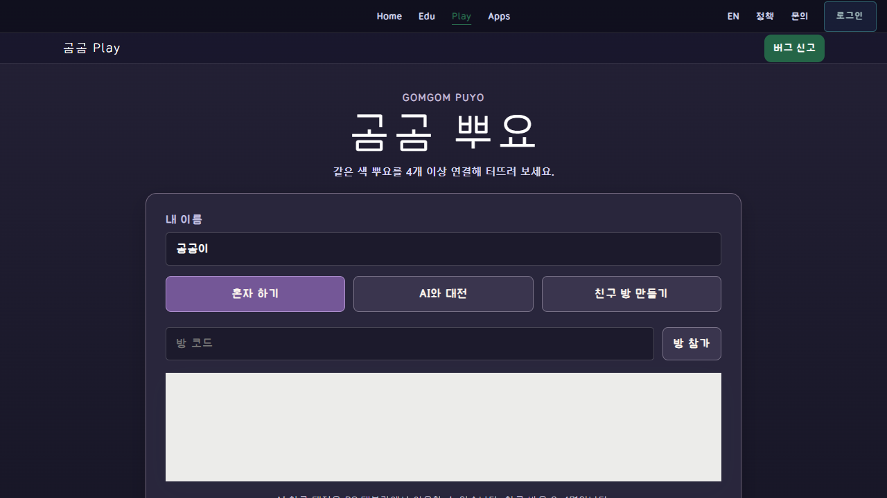|
|1280×720 early solo|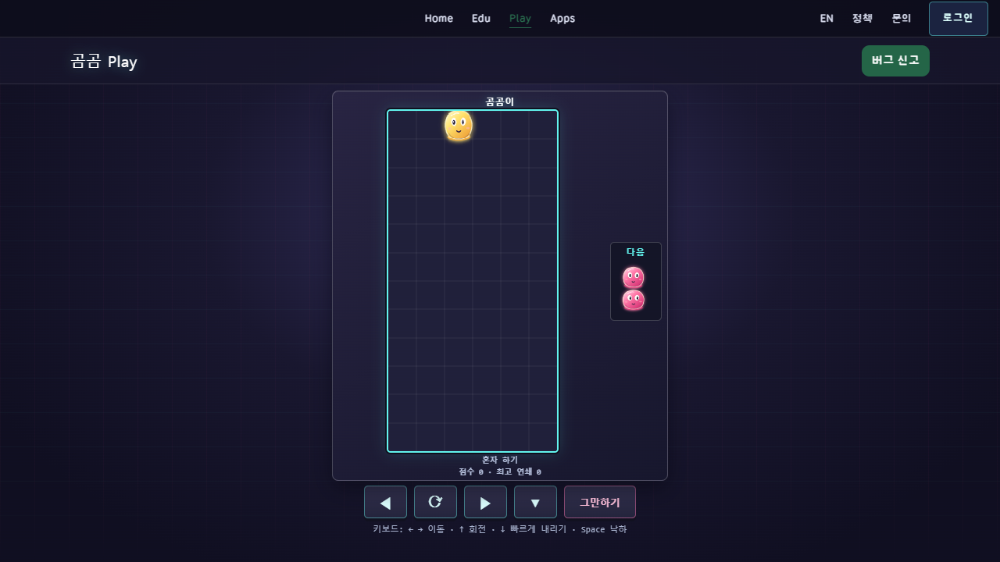|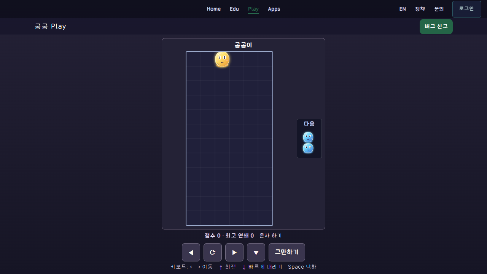|
|844×390 entry|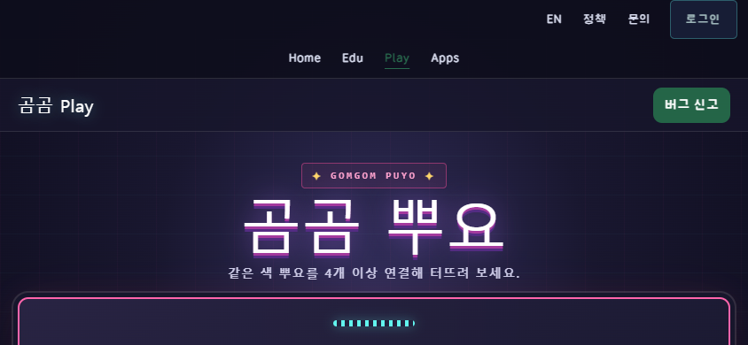|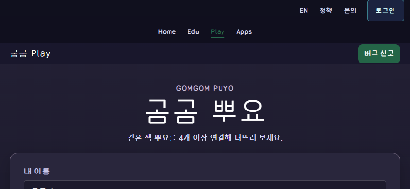|
|844×390 early solo|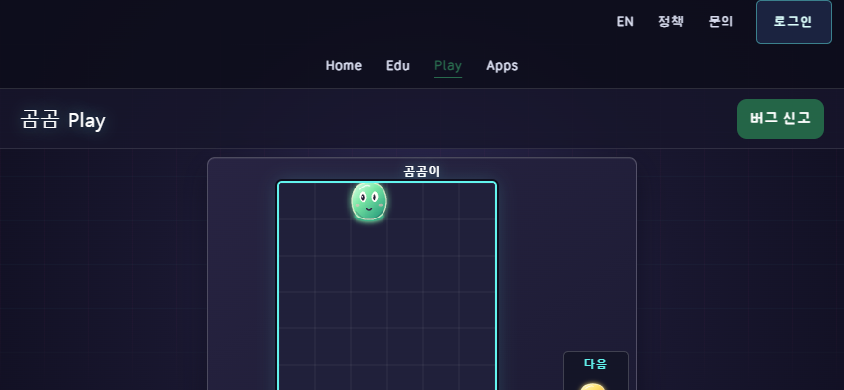|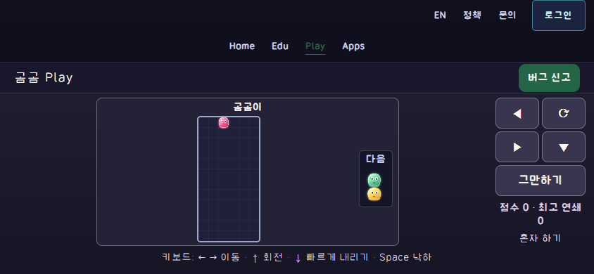|
|1280×720 AI|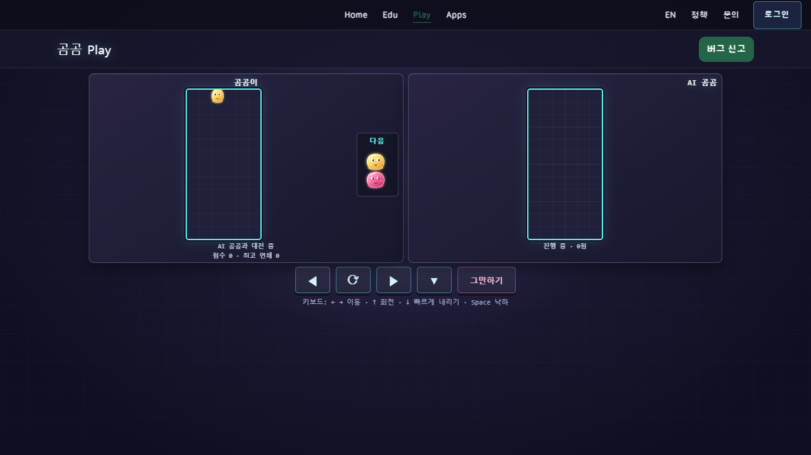|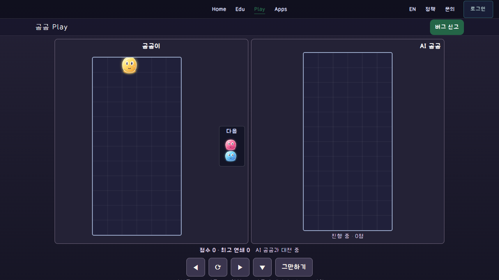|
|844×390 AI|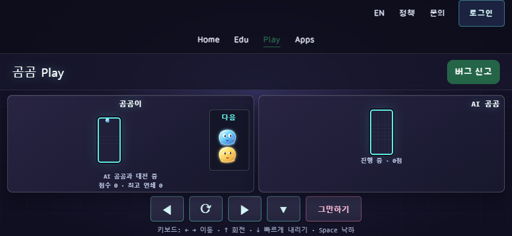|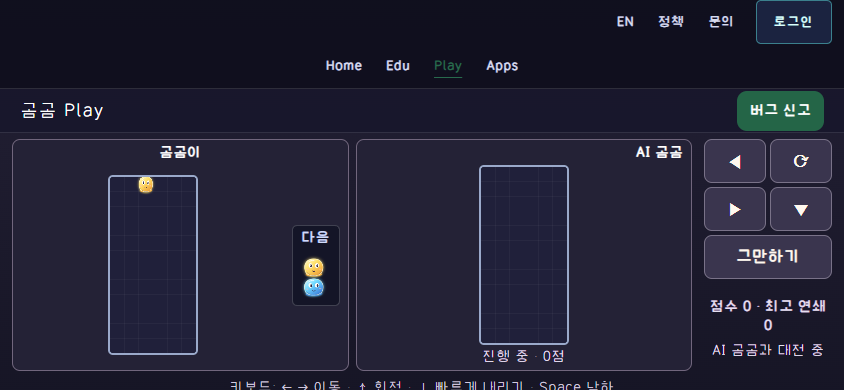|
|1280×720 four-peer lobby|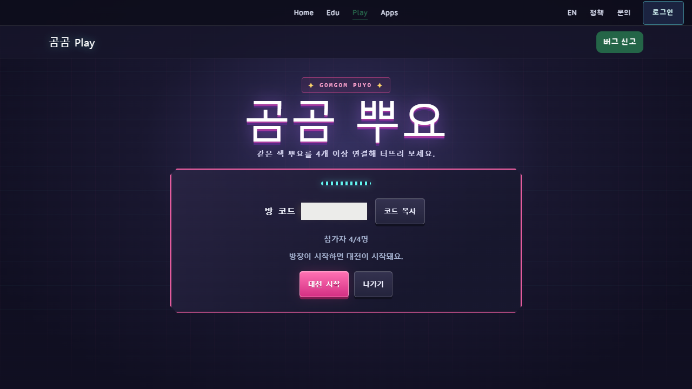|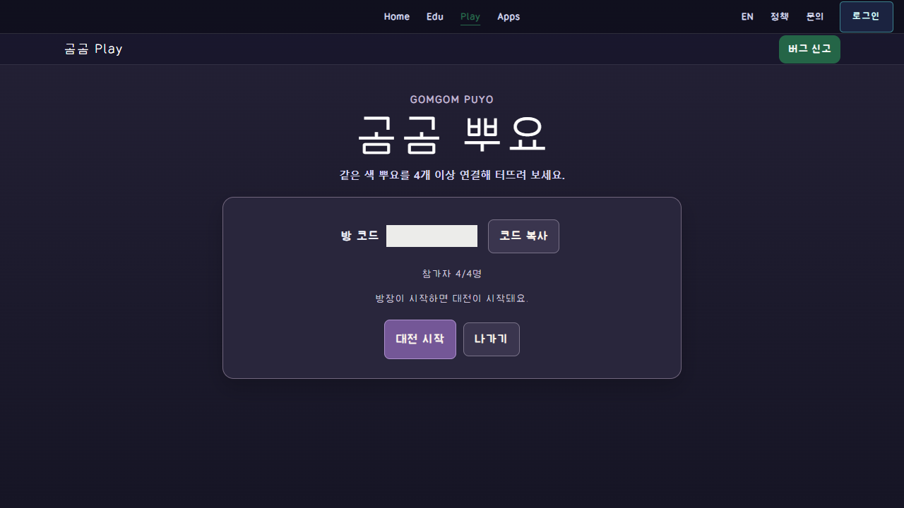|
|844×390 four-peer lobby|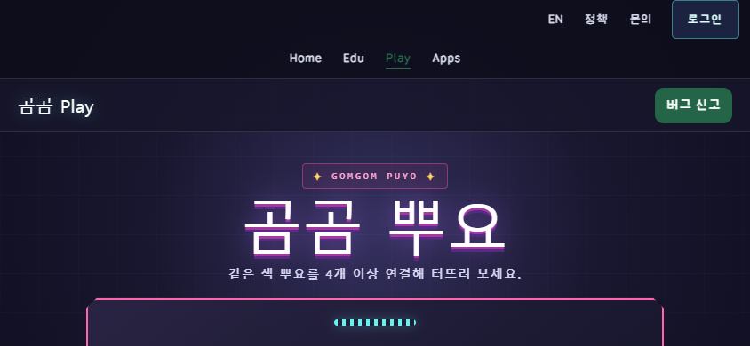|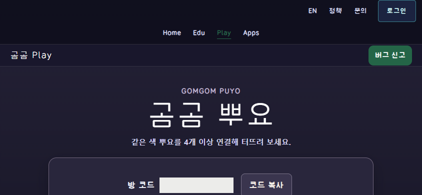|
|1280×720 four-peer start|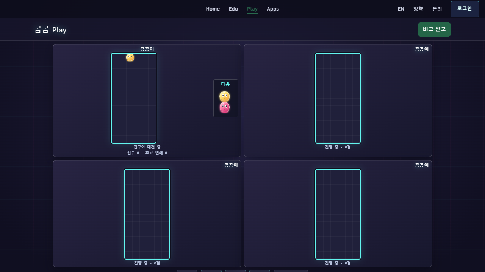|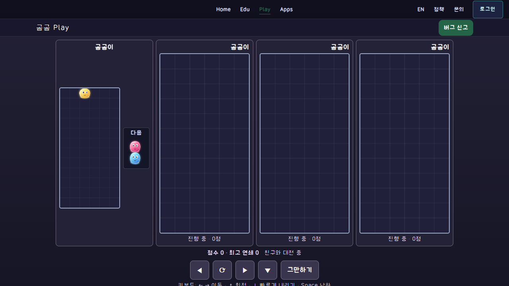|
|844×390 four-peer start|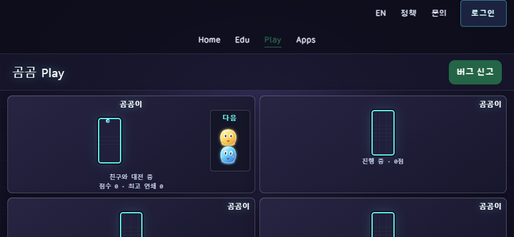|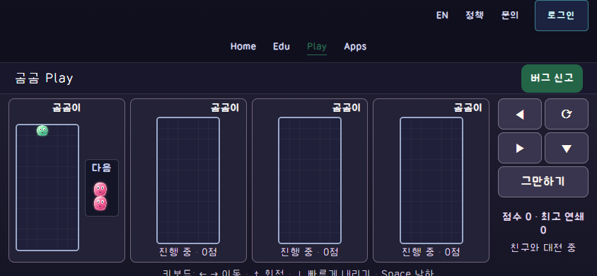|

After-only: [held control390×844](captures/after-held-390.png), [natural solo-end390×844](captures/after-ended-390.png).

`manifest.json` lists26 exact PNG copies with dimensions/bytes/SHA256. Twelve Before/After pairs use the same viewport/DPR and named entry, early solo, AI, four-peer lobby and four-peer start phase. Slime colors, spawn pairs and exact gravity frame are randomized; this is not a pixel-identical state experiment. Code and dynamic room-directory content are neutral-masked, not request-blocked. Held and natural solo-end captures are After-only.

Normal buttons and native keyboard/mouse input create the states. Four distinct browser contexts create/join/start/exit ephemeral rooms through the actual UI/API. No direct API write, forced progress/win, mock auth, record submission or room reset. Public solo end comes from native Space drops, followed by ordinary exit and new solo entry.

Earlier screenshots/metrics exposed native wheel overscroll compositor movement: DOM bounds and the immediate capture differed. Original failed/intermediate packets were retained in the project evidence. Final Before3 and After use native Control+Home plus scrollY0 and a ready shared auth control. The initial120px universal board assertion was a proposal; short landscape now measures90px explicitly, rather than claiming desktop-size boards fit there. Release1 was prepared before final4peer/capture fixes and never deployed; release2 is the final frozen candidate.

These captures prove the stated layout/native entry/input/recovery paths only. They do not prove physical devices, school concurrency, authenticated OAuth/admin, storage, gameplay balance, complete campaign, human preference or external visual approval. The normal keyboard help can scroll below the short viewport; game boards, score/status and commands remain visible.

Research files contain our own runtime captures only. No provider secrets, private identities, production DB/source/font binaries or third-party reference art are included. Uploading this packet is not a new rights grant and does not merge the research PR.
