# Rhythm World: readable live ink and natural recovery layout

Own-product public correction, not a model experiment, measured performance
gain, physical-touch test or owner aesthetic acceptance. User-requested research
publication. No production source/DB/secret/account ID/font/third-party creative
is included, and no reuse license is assigned.

## Matched native public states

| State / CSS viewport, DPR1 | Before | After |
| --- | --- | --- |
| Six-track lobby,390x844 | 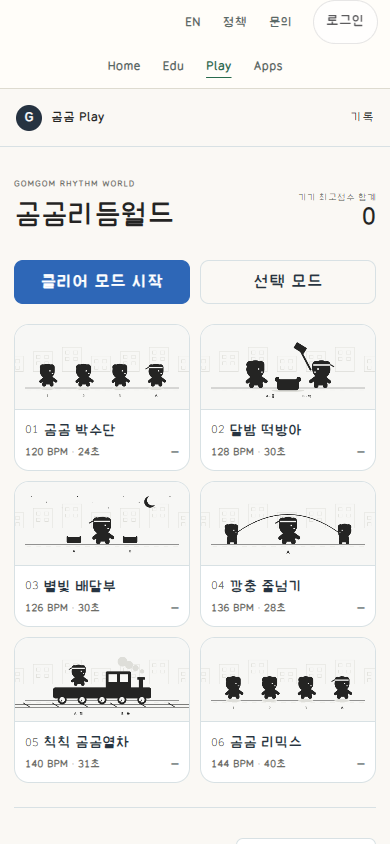 | 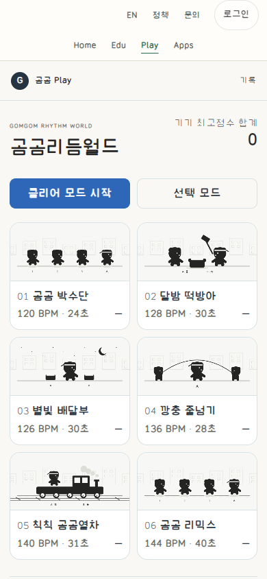 |
| Stage1 paused,390x844 | 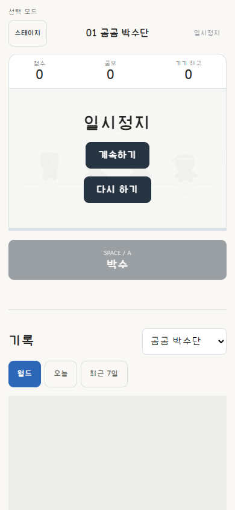 | 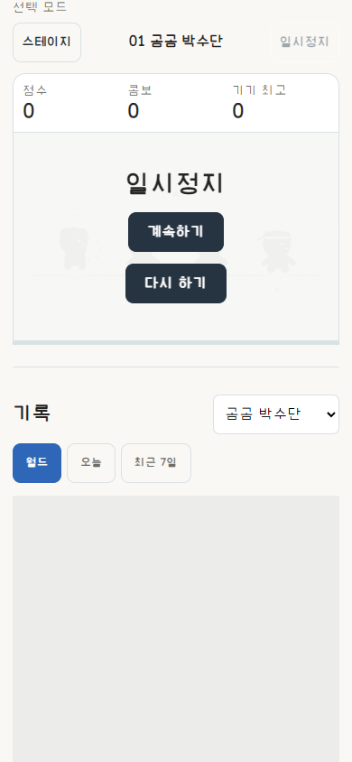 |
| Six-track lobby,1280x720 |  | 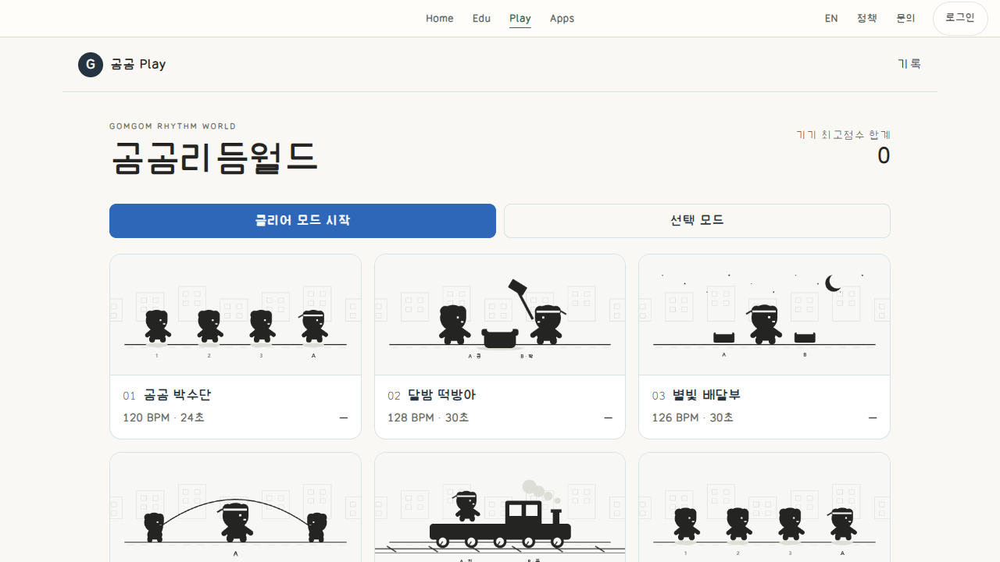 |
| Stage1 paused,1280x720 | 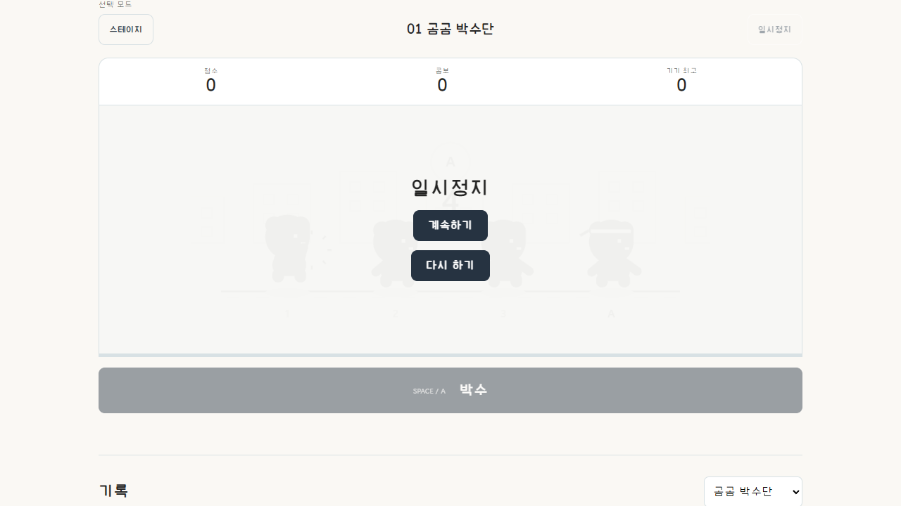 | 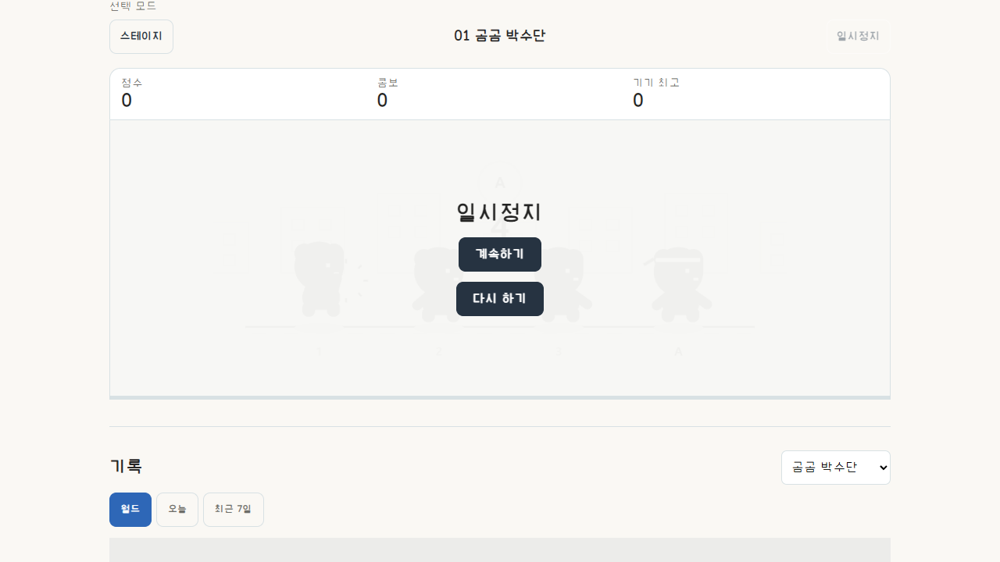 |
| Six-track lobby,844x390 |  | 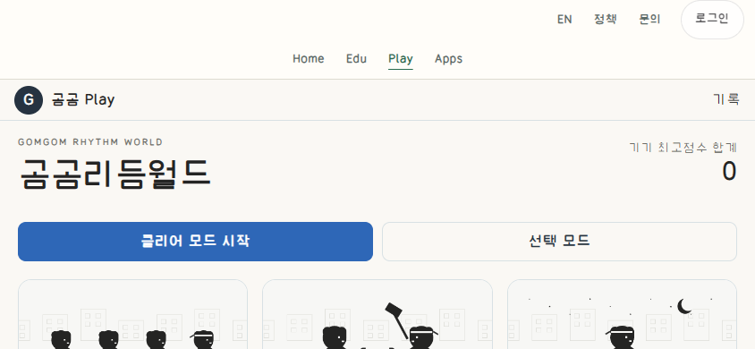 |
| Stage1 paused,844x390 | 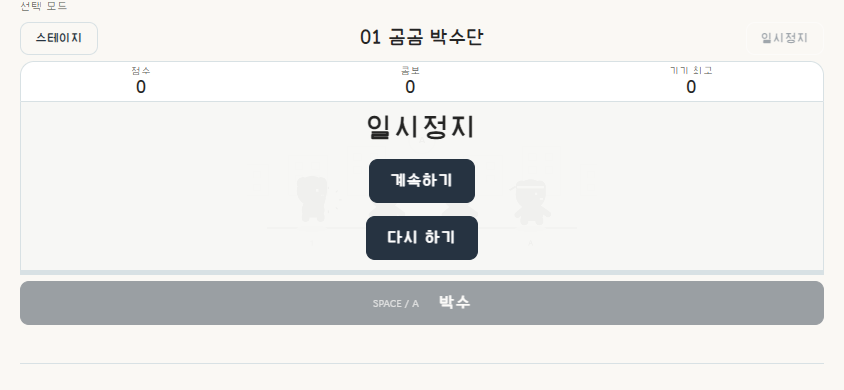 | 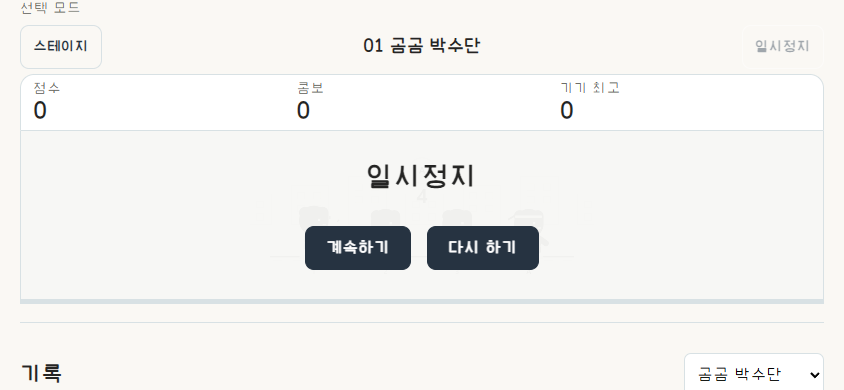 |
| Stage1 natural no-input D/0/MISS13 result,844x390 | 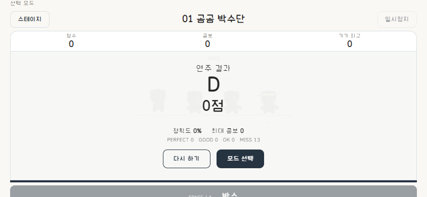 | 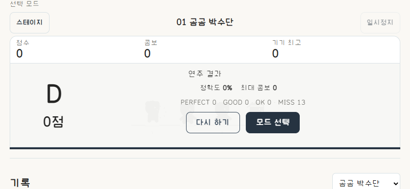 |

Before21185ce9; exact After provider ID and screenshot hashes in manifest.json.
Same6-track catalog, native first-stage entry and early pause/0score/0combo,
same camera/viewport/DPR, loaded fonts, no route/state/clock/storage injection.
The precise musical beat when Pause is pressed can differ slightly, so these
are matched milestones, not pixel-identical animation frames. Native no-input
result uses the same chart/D/0points/13misses. Ad/rank regions are identically
neutral-masked at capture; network requests are not blocked.

## Before -> intent -> actual rendered

- HUD and input binding10px, mobile stage metadata10px ->14CSSpx labels/hints,
  explicit title baselines and wrapped metadata; existing language unchanged.
- Hover translated the whole stage card ->fixed target, shallow inset pressed
  feedback and independent green keyboard focus; no added icon or bevel.
- Pause/result retained grey disabled performance pads ->hide those pads only
  while the real overlay is visible; no input/domain guard is removed.
- Absolute result inside a height-limited theater ->grid-owned natural result
  height. Initial local revision put short-height result commands below390;
  retained screenshot/report, corrected with two-column grade/stat/command
  layout. Actual844x390 commands are44px or higher and inside the viewport.
- Same paper/ink six authored musical scenes, mono bear identity and existing
  command rank; filled main performance action, outline support and quiet data.
  No new art, surrounding header redesign or invented tutorial/state.

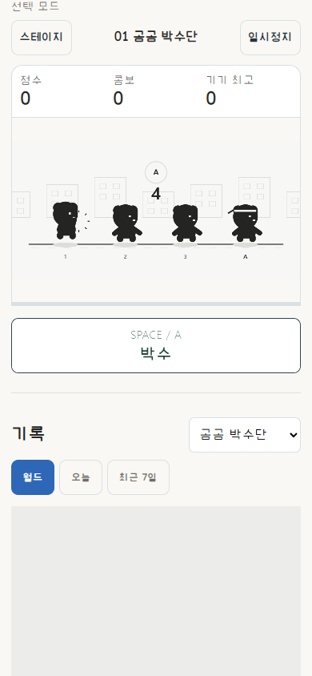

After-only actual pointer-held state, not a matched Before specimen. Outer target
does not move. Release-away restores input feedback via the existing adapter.
The first public revision's shared filled-button background overrode the light
pressed face, leaving dark text on blue. Its original screenshot is retained in
the project evidence, not labeled as a final pass. A Rhythm-only selector and
versioned stylesheet corrected it. Final actual held text contrast is checked
from the rendered child label and button background, not the intended CSS alone.

## Guidance and ownership

Sites MCP47/material5457b898 unchanged, complete same-version common reused.
Selected DNS05/14/18 packet and Implementation roles50b4fe1d read to completion.
Initial unsupported rule_ids returned a default packet; not claimed as selected
guidance, corrected to recipe_ids. Universal button AI instructions/GUIDE read;
fresh Git8f853cf8 unchanged. Unknown generic case ID returned no case; no external
case image was viewed or reused. Draft guidance is not product approval.

Actual unit sizing, fixed input targets, native semantics, scoped presentation
ownership and matched state evidence applied. The2static HTML/CSS overlay changes
layout only:6tracks/chart/timing/audio/input/offset/campaign/records/auth/header,
Worker and18bindings/API/DB/writer preserved; no restart/reset/purge.

## Verification and limits

Local2asset projection is auxiliary, not public release proof. Five actual public
sizes390x844/768x900/1280x720/844x390/320x700 exercised normal stage-card keyboard
entry, pause/native Enter resume, Space input, captured-pointer release-away,
fixed outer target, lobby return, second two-action song/KeyL and real settings
ranges. Short landscape ran natural first song result and native Retry without
state/result injection or record submission. Public SHA/health/provider/Worker
guards and recovery are recorded in the private project deployment ledger.

Premature stage command while immutable snapshot preparation was still live
failed before manifest existed; preparation's original handle was polled to
completion, then stage ran normally. No preparation/deployment restart was used
as a timeout workaround. Original source-index patch write failure and first
local short-height screenshot were retained, then scoped fixes were rechecked.

No all6song perfect-clear, authenticated record persistence, physical school
touch/device/load, assistive-technology approval, external screenshot review,
owner preference or causal task-speed effect is claimed. Those are not inferred
from screenshot dimensions or automated bounds.
