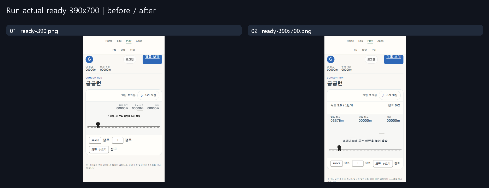
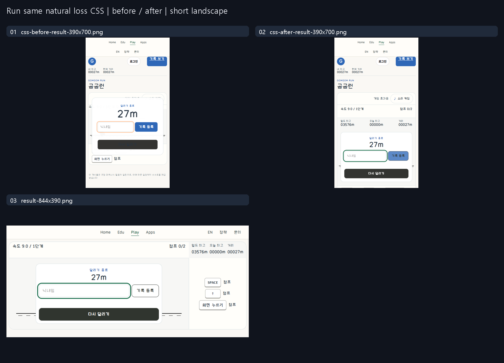

# Run: native HUD and bounded result controls

This is an authorized repair of an existing live product, not a controlled
ordinary/guided model experiment or proof of a guide's causal effect.

## Same viewport / actual state

Both native ready captures are390×700 CSSpx/DPR1/zoom100, separate real contexts,
same initial tick0/level1/speed9/seeded ready scene/score0. No clock freezing,
state setter, synthetic win or injected progress. The original live screenshot
is preserved. Status/ready text no longer scales from960-unit canvas coordinates.

Result pair is one actual native natural-loss tab at390×700; only the scoped
stylesheet is disabled/restored. Both arms contain the new native HUD/HTML. It is
not a reconstruction of the old HTML. Exact game statistics remain identical.
The landscape capture is a separate actual844×390 flow, not the same trial.

## Actual sources read / applied

- Sites47/material5457b898…: full selected DNS14 rule/detail/source packet and
  game_ui_playground_v1/IMPLEMENTATION.md SHA705fd142…; same-version common
  AI_INSTRUCTIONS/IMPLEMENTATION_ROLES reading retained from previous repair.
- Git refresh8f853cf8 unchanged, supplemental source distinct from Sites.
- Research HEADe7b698f: AGENTS, RIGHTS_AND_SCOPE and universal_button_system
  AI_INSTRUCTIONS/GUIDE complete. Outside source links/packets are not a claim
  that third-party source pixels were inspected/copied.
- Adopt: text updates in place from real state; separate information from command;
  control press/focus static meaning and stable hitbox. DNS14 is not HUD layout
  authority. No demo data or fixed rule copied as a product contract.

## Before → intent → rendered

| Axis | Before | Intent / actual result |
| --- | --- | --- |
| Status type | Canvas14units shrinks to~5CSSpx on390 | Native14px speed/level/jumps/pattern; actual native second jump reads2/2, pattern expires from real ticks. |
| Placement | Status inside playfield; floating result bigger than mobile scene | HUD outside scene; grid result expands within game region; short landscape side rail and short desktop height budget. Actual five widths and natural loss/Retry captured. |
| Target/silhouette | Original shared form controls | Native44px minimum/10px contour; actual component/control bounds in observations. Fixed pressed outer coordinates. |
| Face/body | Existing calm runner/form | Deliberate flat filled Retry and outlined Submit; no lower body/icon needed for this brief. Press inset only, no hitbox scale. |
| Type/glyph/layout | Inherited shared labels | Explicit14px/800 label typography, inherited product font, natural labels/no icons; computed font/bounds and actual component captures retained. Font-file licensing/physical device coverage not inferred. |
| Hierarchy | Similar commands in large floating result | Retry primary dark fill; Submit secondary outline, score and status remain information. |
| States/input | Native action handlers | Real rest/hover/held-press/Tab-focus crops; release-away leaves loss unchanged; real Retry then Space double jump. Disabled/pending styles implemented for existing submission states but no authenticated write/pending capture claimed. |

## Verification / retained failures

- Fresh public Play card→Run→Start→first jump→Space second jump→actual pattern→
  natural collision→result→Retry→second jump: all five widths passed; own page
  errors/failed requests0. Third-party ad endpoints blocked in this QA context
  and excluded explicitly; not an ad-delivery check.
- Original baseline observer pressed again before first physics tick; timeout
  retained. Fixed observer waits for real first jump, no gameplay manipulation.
- Local first four widths passed; fifth short desktop clipped. Failure capture
  retained; canvas budget corrected, only affected desktop repeated locally.
- Three VM helper fixtures are auxiliary. Byte parity outside presentation
  preserved rule4 physics/input/seed/art/auth/replay/submit/storage/impact.
- Static3-file release/public SHA/HIT, health200/no-store, unchanged Worker and
  resources verified. No API restart/DB reset/writer/purge/homepage commit.

Full late-game natural completion/authenticated persistence, physical school
devices/50-user load/full accessibility and human usability are not tested.
This is not a measured speed/performance improvement or approved design claim.

## Rights / data boundary

Owner-authorized project-owned screenshots and sanitized observations only.
Record/podium areas use neutral grey privacy masks, not product color. No account
names/raw IDs/tokens/machine paths/font binaries/third-party media/server code
are published. Original local results stay outside this research tree. Public
visibility does not select a new downstream reuse license. Exact20PNG hashes,
viewport/state scope and release identity are in [manifest](manifest.json).
