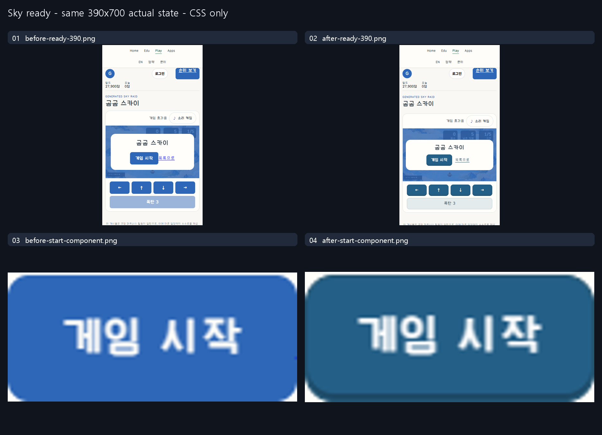

# Sky: actual asset ownership and native entry controls

Existing-product repair, not a matched model experiment or measured usability gain.
The project owner requested the repair, deployment and research-Git captures.
Full-context images and PNG dimensions/hashes are in `manifest.json`.

## Before → intent → rendered

The same390×700 ready canvas/tab, DPR1/zoom100 was captured with only the scoped
presentation stylesheet disabled and enabled. Both arms have the **same repaired
loader**, so this is CSS comparison, not a functional-before/after experiment.
The untouched real public baseline's initial pending screen is separately labeled.
No player state/clock/record setters or forced completion were used.

| Axis | Before | Intent / preservation | Rendered evidence |
|---|---|---|---|
| Target/silhouette | Existing primary and utilities | Stable10px contour/native44px command; game canvas budget includes commands | Before/after context and Start component, public viewport/control bounds |
| Face/body | Existing plain control | Deliberately filled flat command, subtle inset press; no new extruded body requested | Rest/hover/pressed component captures; outer bounds unchanged |
| Typography | Existing shared label style | Explicit15px/750 label, preserve native Korean glyphs and loaded family | Computed runtime values and component captures; fonts not redistributed |
| Glyph | Existing directional arrows | Preserve direction semantics/accessible names, no decorative Start icon | Actual directional input and native bomb action |
| Layout | Status below board; short-height commands below viewport | Loading count/progress inside intro; canvas preserves16:9 and leaves command space | Baseline, pending6/7, retained failing844/1280 and final public rows |
| Roles | Disabled Start, no live retry | Start unavailable until7decoded assets; failure Retry command plus plain list navigation | Deliberately delayed/failed real image diagnostics; native recovery |
| States | Shared primary | Native hover/independent keyboard focus/static press/disabled/pending; actual release-away does not start | Component captures, controlStates and native game flow |

`manifest.json` lists three static deliveries. Only asset-loading ownership,
bounded cancellation/retry/cache, entry state and scoped presentation changed.
Five-stage art, physics, hitboxes, score formula, server validation, account/auth,
records, shared shell, Worker/resources and authoritative data writer were preserved.
No API restart, progress/rank reset or host/zone purge.

## Guides actually read and applied

Sites MCP deployment47/material5457b898470f556ef5cdef250cf4d7fa466069731d9ffd8b32edf378716ac4b7
was reread on resume and unchanged. Common `research/release/AI_INSTRUCTIONS.md`
and `IMPLEMENTATION_ROLES.md` were already completely read for this same material.
Selected DNS18 rule/detail/source packet was followed through pagination to EOF.
The complete game-ui-playground IMPLEMENTATION document (SHA705fd142...) supplied
real state/request ownership, recovery and bounded verification guidance.
Public research `universal_button_system/AI_INSTRUCTIONS.md` and `GUIDE.md` were
also completely read at research head3266be6, separately from Sites material.
They supplied semantic role/family, stable-target press, actual-rendered anatomy
and matched evidence requirements; no authored simulator values became game rules.

## Evidence and limits

Native public entry via Play card, Start, direction and bomb input at five sizes;
actual natural loss and Retry at390×700,844×390 and1280×720 are recorded.
No state/clock injection, mock authentication or forced result. Four VM/image/timer
tests are auxiliary only. Deliberately delayed6/7 and failed image requests use
real assets/native recovery; they are **not organic outages or speed measurements**.
Earlier clipping and harness CSS-read/navigation-timeout failures remain recorded.
Neutral grey record-area masking is capture privacy, not a product color.
Ads were blocked in QA, not tested for serving/click behavior.

Full five-stage completion/authenticated record storage, physical school devices,
50-player load, controller, screen-reader/full accessibility, latency/performance,
human preference and design approval remain unverified. Publication permission
does not select a reuse license. No private identities/tokens/machine paths,
font binaries, external reference pixels, engine/server source or app data added.
