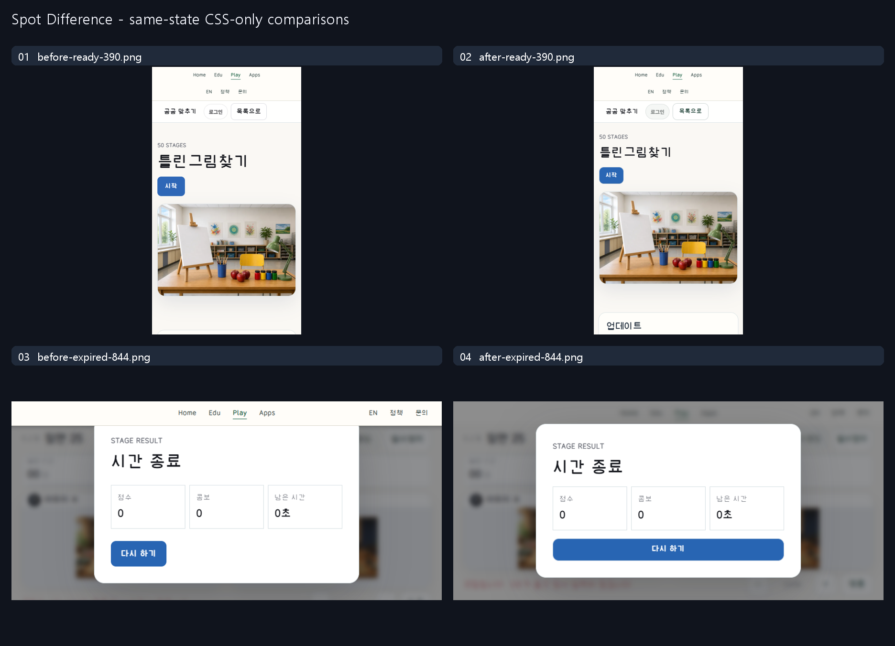

# Spot Difference: expiration recovery and reachable controls

This is a scoped repair to an existing product, not an ordinary-request versus
instruction-guided model experiment. The owner authorized publication of the
project's own before/after captures. No user preference, causal improvement,
full-game completion or school-device performance is established.

## Same-state comparisons

The ready pair uses the same actual tab at390×700 CSS pixels, DPR1, zoom100%.
The result pair uses the same actual expired run at844×390, remaining time0,
score0 and combo0. Only the presentation stylesheet is toggled; the repaired
result/retry logic is identical on both sides of that pair. No clock freeze,
answer/mask injection, forced completion or gameplay-state setter is used.
Original full-frame PNGs and their dimensions/SHA-256 are in [manifest](manifest.json).
The contact sheet fits whole frames; its dark background is an evidence frame,
not a proposed website color. These are not matched functional bug experiments.

## Actual bug and repair

The original public first stage reached expiration after the actual60-second
timer. Its primary action incorrectly said `다음 스테이지` (Next stage).
Native activation requested advancement of an unfinished session; the server
correctly rejected it with409 `previous stage is not completed`. The baseline
failure screenshots and sanitized response observations are retained.

The client now resets its presentation session on expiration, retry and return
home. The failed-stage primary action is `다시 하기` (Retry), without a duplicate
secondary Retry. Completed nonfinal stages still advance and final completion
still offers a new game. Concurrent starts have one pending request owner and
unlock after rejection. The existing Korean network fallback replaces exposed
transport errors. No server legality, private mask, timing, hint, score, identity
or database rule is weakened.

Presentation changes: native44px scoped targets, two-column portrait commands,
flat blue primary and white secondary controls, stable focus/press geometry,
explicit selected/disabled states, viewport-budgeted image panels, and a result
modal above the shared header. Picture art and comparison/zoom behavior remain.
Actual clipped zoom controls at844×390 and1280×720 were separately repaired;
their first failing captures remain in this case rather than being replaced.

## Guidance actually read

The installed Do Not Slop Sites MCP reported deployment47, material
`5457b898470f556ef5cdef250cf4d7fa466069731d9ffd8b32edf378716ac4b7`,
updated2026-10-09T15:49:49.388Z. The optional Git source check was
`8f853cf89e0045c2dceb1381000bee9c1b6a0da0`, unchanged.

Complete common `research/release/AI_INSTRUCTIONS.md` and
`research/release/IMPLEMENTATION_ROLES.md`, and selected DNS-14/DNS-18 rule,
detail and source-record packets were read. Exact document hashes are in the
manifest. Applied decisions were real state ownership/recovery, native control
states, reachable controls and matched evidence. Source/example pixels were not
copied; no external reference raster inspection is claimed. MCP draft proposals
and existing approval/test limits remain reference-only.

## Verification and retained failures

-11 source/VM tests and4 server SQLite fixture tests passed. They are auxiliary
  checks, not native browser completion or authenticated storage proof.
-Projected local observations use only three scoped static resources over the
  real public backend. The first three widths passed in a report that later
  failed on landscape clipping; the corrected landscape passed in a report
  that later failed on desktop clipping. Final affected-desktop report passed.
  Original global FAIL statuses remain in [observations](observations.json).
-An initial blanket44px assertion included the unchanged shared login control;
  the check was narrowed to actual game controls, not a site-wide accessibility
  claim. A blanket ban on409 also caught a legitimate same-coordinate guard;
  the final check targets the unfinished-stage advancement defect specifically.
-Fresh final public Edge execution passed five rows:390×700,390×844,768×900,
  844×390 and1280×720. First entry used the actual Play hub card. Native Start,
  Pause/Continue, zoom/Fit and hint worked; portrait A/B toggle worked. Actual
  expiration and native Retry started a fresh stage1 at portrait and landscape.
  Page errors and observed failed requests were0 in this bounded run.
-Ads were blocked during QA; ad behavior was not tested. No state or time
  injection, mock API, forced clear, login mock or answer-mask inspection was
  used. Successful campaign completion/next, authenticated score persistence,
  physical devices,50-user load, complete keyboard/accessibility and human
  usability/design acceptance remain unrun.

## Delivery and rights

Three static files were activated as Play
`8abdd60f-dc3c-4bf1-974d-25391cd9bdf5`; rollback is
`f0a09a0d-f5f8-4aad-864c-7d7ad355adf9`. Exact public SHA readback,
health200 and fresh provider/unchanged Worker/resources guard passed. No
service restart, record reset, DB/writer mutation or whole-zone purge occurred.

Only original project-owned captures and sanitized observations are included.
No room/account identifiers, secrets, private machine paths, reference media,
font binaries, game engine or private server source are published. Publication
does not select a new reuse license. Earlier cases remain unchanged.
