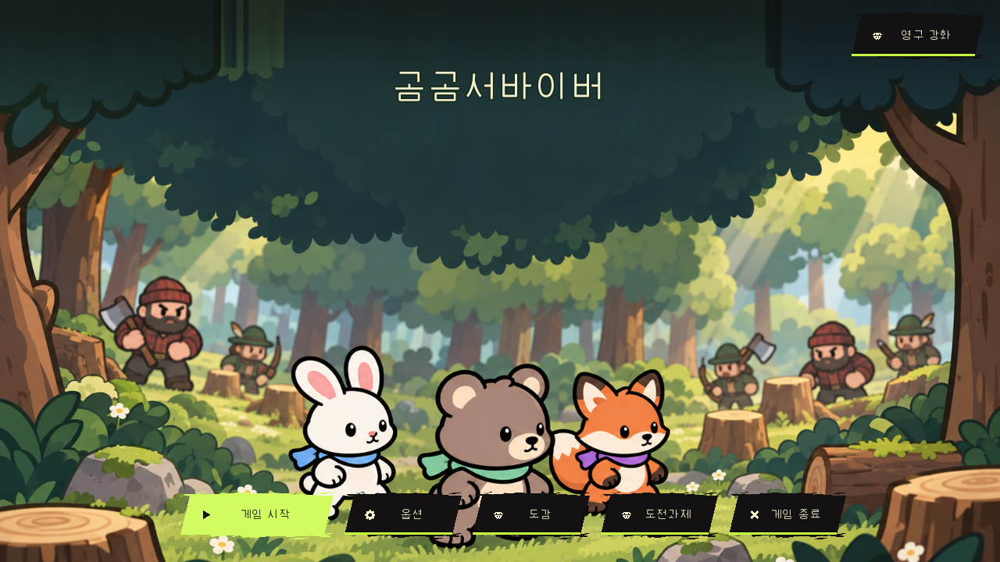
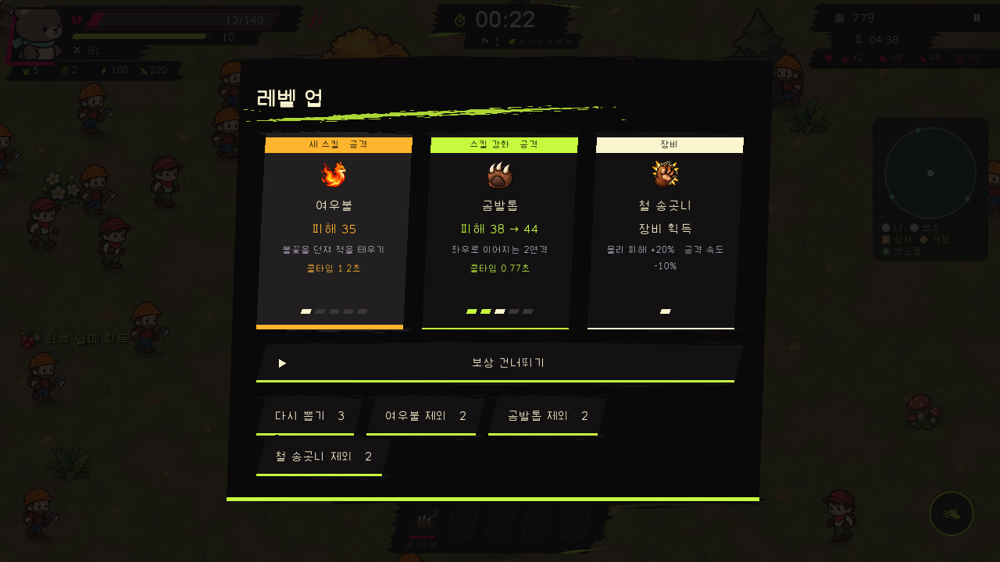
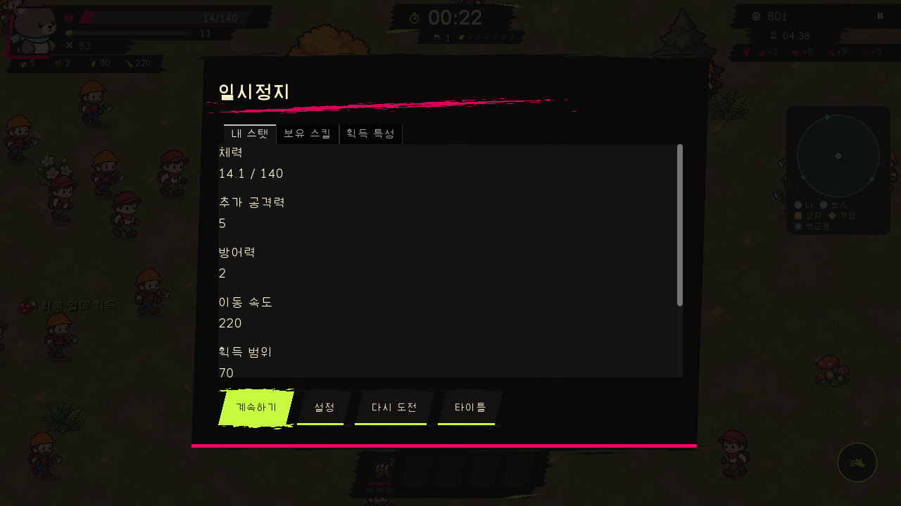
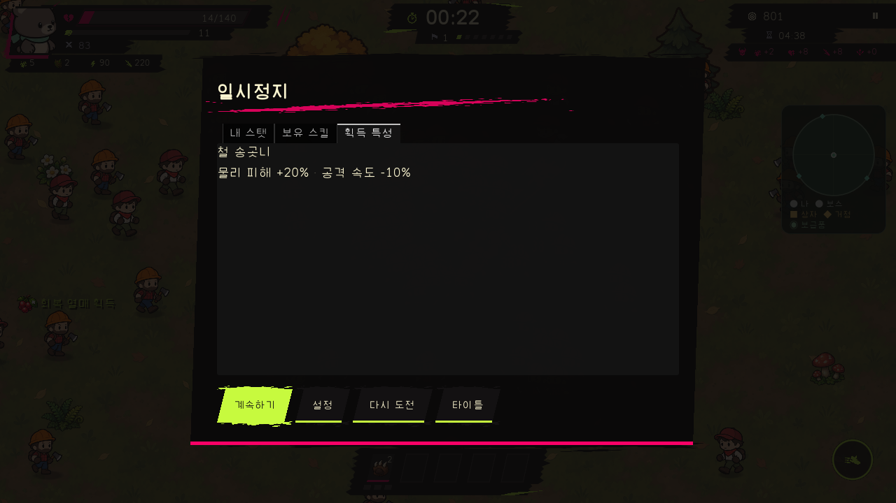
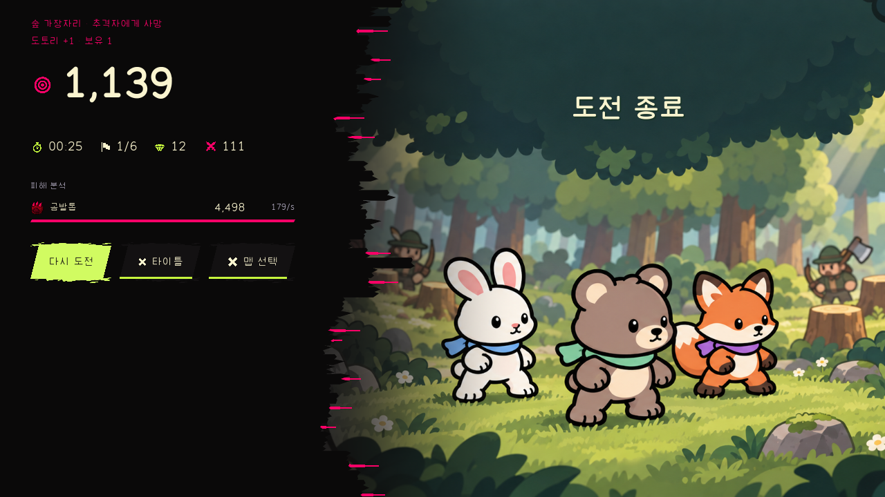

# Survivor content delivery and ordinary public-flow evidence

This is an existing-product content/API delivery, **not a new visual redesign,
ordinary/guided model experiment or measured performance/usability result**.
The owner requested project captures in the research Git. Only six own-product
screens and sanitized aggregate observations are included; no production source,
DB, account/anonymous token, run ID, secret, font binary or third-party reference.
No new reuse license is granted.

## Preserved title and actual new content

| Before: ordinary anonymous title | After: ordinary anonymous title |
| --- | --- |
|  |  |

Both are actual public Edge captures at1280×720 CSS px/DPR1, same title state.
Idle animation phase/pointer can differ; they are not pixel-identical frames.
Title art/layout/control palette were retained, not portrayed as improved.
The initial Before capture preceded complete menu rendering and is excluded from
this matched pair; untouched initial evidence remains in the product workspace.
Before logging observed two unlocated HTTP502 console messages; After's normal
run has page/console/request errors0. This does not establish a speed gain.

These four After-only states are delivery/interaction evidence, not a matched
Before/After layout comparison. Native public card→bear→quick5min→forest→normal
combat/level-up choices and skips→iron_fangs selection→Escape pause/trait→resume
→death25.15seconds/1,139points. No HP/XP/clock/unlock injection, test invulnerability,
mock login or forced completion. One normal client-reported anonymous record was
accepted200/no-store and matched the private DB by digest; it is not balance,
score-authority, participant research or load evidence. Identifiers/raw payloads
are intentionally omitted here.

## Actually read guidance and delivery limits

Sites MCP47/material5457b898 unchanged; complete same-version common/control
instructions and Implementation705fd142 read previously and reused. Git8f853cf8
refresh unchanged. Applied domain ownership, preserved actual values, immutable
minimal allowlist and normal-entry/readback evidence; no example features or
proposal approval labels copied into product contracts.

Existing frozen Web19 plus two Oracle balance modules delivered. Only8 static
bytes changed, all unrelated paths/header/login/Golf retained. The single common
API restart was required and performed in its authorized night period; other game
services/season/progress/ranking not restarted/reset. First Cloudflare management
API504 preserved; one guarded retry delivered the same prepared bytes. Producer
tests/ZIP creation/DB setup not repeated.

Public version584da390; Web ZIP SHA4088e199ae423e68bba9d3e7c34f3214e1bc39b6db91e2c23eb5b598ff9612dc.
Exact captures/dimensions/SHA are in manifest.json. Private operational backup and
rollback evidence remains outside this research tree. Existing fluorescent game
controls are still an unresolved presentation topic; this content update does
not claim their correction. New dual-content parity, natural18-landmark completion,
full campaign/fusions, physical devices, school load, SSO, measured performance,
external review and user visual acceptance remain unverified.
