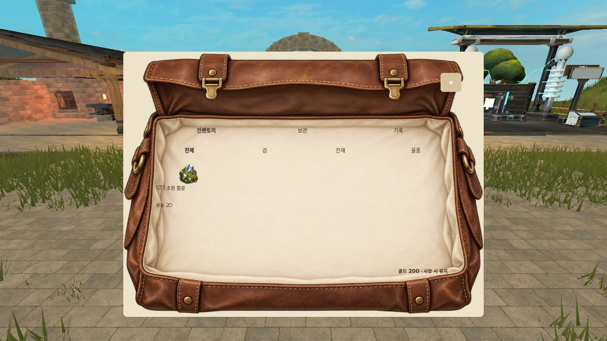
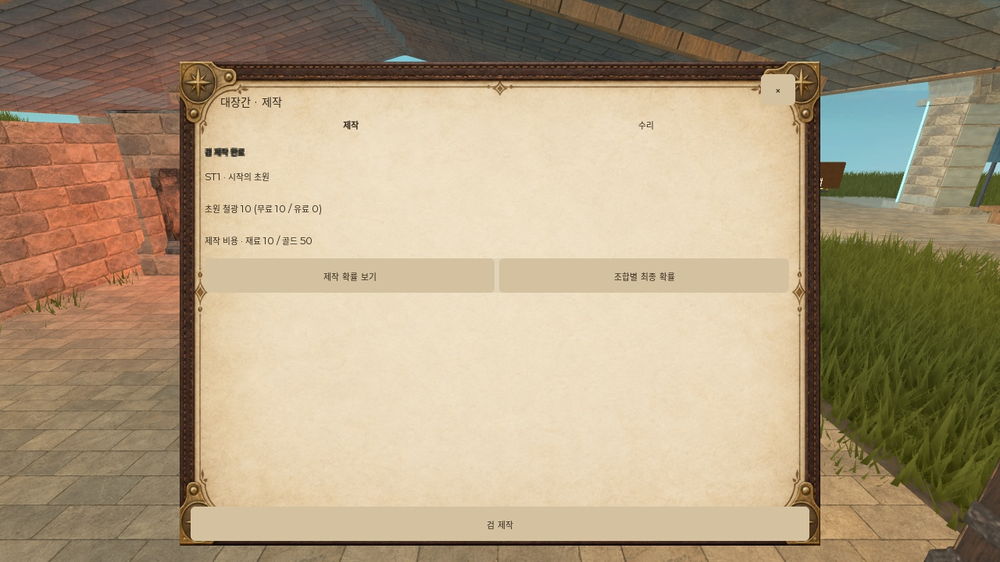

# Sword of Astra — 실제 실행 Before 보존 (2026-10-09)

상태: 개선 전 원본 2장만 확보. **After 미확보 / 동일조건 비교 쌍 미완료.** 개선 효과, 전체 게임 완성, 사용자 승인을 주장하지 않는다. 별도 모델 실험의 일반 요청/가이드 처리군이 아니라 기존 게임의 수정 작업 기록이다.

## 캡처 조건

- Roblox Studio native r045 보존본에 r048 소스 11개 적용 후 실제 Play. PlaceId 0 로컬 검수이며 게시 서버가 아니다.
- Device Simulator HD720 / ActualResolution; 원본 JPEG 1280×720. 이미지 편집·크롭·재인코딩 없음. PC 입력. 화면 안전 영역은 Roblox Core UI inset을 포함한다.
- bag-before.jpg: 시작 마을, 미장착, 골드200/재료20, 인벤토리 탭/전체 분류, 초기 스크롤. B로 실제 열기 후 이미지 IsLoaded=true 확인. 재료 아이콘 표시. 카메라 정확 CFrame/글꼴 실제 로드 시각/캡처 시각은 저장하지 못했다. 이 사실 때문에 임의의 후속 화면을 동일조건으로 간주하지 않는다.
- craft-result-before.jpg: 대장간에서 F로 열고 검 제작 실제 클릭 직후. 제작 탭/초기 스크롤, 재료10/골드150, 결과 문자가 뭉친 화면. 캐릭터 위치 직전 관측 약(-42.22,3.45,-184.86). 제작 검 이름/카메라 CFrame/결과 메시지의 정확 시간은 미기록. 랜덤 제작 결과를 다른 검으로 재촬영하면 상태 불일치로 표기해야 한다.
- 두 Before는 서로 다른 화면·게임 상태다. 서로를 전/후로 비교하지 않는다.

## 자료와 적용 범위

Do Not Slop MCP 공통 제작 지침과 DNS-04(동시 레이어), DNS-05(가방 장식/안전 글자 영역) 조건·예외 확인. DNS-14 포함 대형 guidance 패킷 전체는 미열람이며 완료로 주장하지 않는다.

- 최초 자료 snapshot41/source b77acd509a4548eb8d452860add7c2d00bbdf503.
- menu-placement 원문 ID research/menu-placement/original/research/menu_placement_v1/AI_INSTRUCTIONS.md, 끝까지 읽음. SHA256 246fb4b4ccb134786a8071273f5bc93d379d5f4dce0c4e886f4fe88e3ce18ddf.
- 실제 참고 이미지 ID research/menu-placement/original/research/menu_placement_v1/captures/review-candidate-2/desktop-a-bag.png, SHA256 7a1564f119d159c2cdad8ff13eb9d772038093c3b084644d654e10d957738c4a. 실제 raster 확인. 외부 비공개94원본은 MCP에서 조회하지 않음.
- 최신 get_scope 실제 성공: deployment44 / material_hash3235c0320115fc911717825de1bd163a5e5617cef9c1cc4c0eecbe701dd58511 / updated_at2026-10-09T13:47:09.064Z. 재개마다 최신 scope 확인. 새 자료 버전의 관련 원문/이미지 재열람은 남음.
- 적용 조건: 장식 있는 가방의 실제 안쪽 글자 영역과 살아 있는 게임 화면/HUD의 가림을 따로 확인한다. 가방 장식을 무조건 삭제하거나 모든 화면에 특정 원형/색상을 강제하지 않는다. 원형 공격 조작은 이 게임의 사용자 요구다.

## 수정 후보와 실행 결과

src/client/GameClient.client.luau에서 결과 Notice의 최소 높이를0→24 Roblox offset units, TextStrokeTransparency를1로 변경. 불투명 바탕에서 두꺼운 외곽선이 한글 내부를 채우는 현상을 줄이려는 후보다. 게임 경로는 Git 저장소가 아니므로 게임 변경 커밋 없음. 이번 연구 커밋은 캡처/기록/후보 diff만 보존하며 실행 품질 승인이 아니다.

실제 확인: 가방 열기/아이콘 로딩, 대장간 제작 재료10·골드50 소모, 관문 ST1 출정, 슬라임 접근/Warning, 피격으로 내구75→68/사망. Z/C/X 입력은 사망과 겹쳐 전체 세 모션 검증 미완료. 일부12모델 PendingNative. 저장/재접속/실물 모바일/게시 서버/후보 Notice 수정 실행/동일조건 After는 not_run. 이미지 최초 표시 지연과 텍스트 문제 남음. Play 중지, Device FitToWindow/default 복원, 본인 Studio 정리 후 순환 양도.

## 원본

