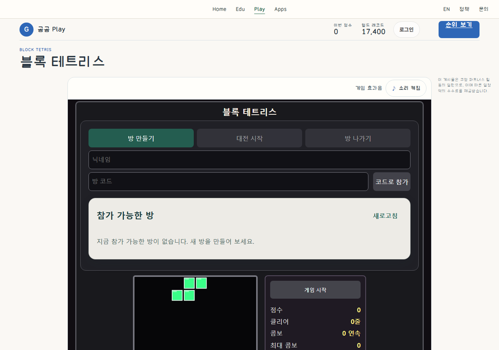
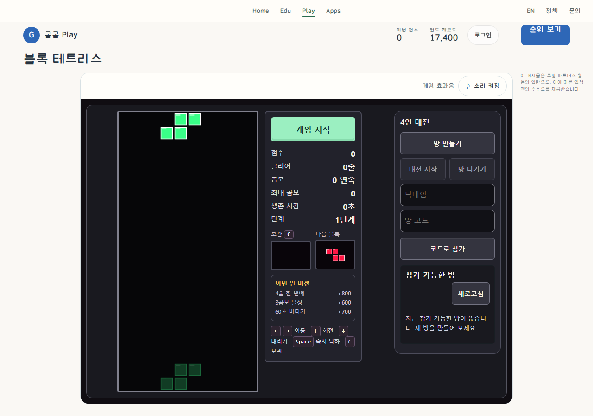

# Tetris: bounded production-layout revision

This is an authored revision of an existing GomGom game, **not** an ordinary-quality versus instruction-treatment experiment. The owner requested implementation with the updated Do Not Slop MCP and explicitly authorized publishing the before/after screenshots to this research repository. Publishing the evidence does not establish user design approval, causal guide effectiveness or measured usability gains.

## Matched ready-state comparison

Both captures are 1280 × 900 CSS pixels, DPR 1, browser zoom 100%. They retain the same actual ready instance: board, held block and next block canvas SHA-256 values, score, timer and public world-record value agree. No seed, forced state or mock game response was injected. The After applies the actual candidate CSS to that instance; independent fresh candidate navigation/input is tested separately.

| Before | After |
|---|---|
|  |  |

These are viewport captures, not full-page images. The former board extends below the frame because room setup comes first. That defect was observed in the supplied production presentation, not constructed to make the After win. Local QA deliberately blocks third-party ads in both arms to avoid real ad impressions; expected failed ad requests are recorded separately. Read-only API requests use actual public endpoints. Authenticated storage, room creation and score registration are not claimed by these local checks.

## Actually read guidance

The installed private Sites MCP supplied deployment versions 43 and 44 during this resumed task. Their material hash was identical: `3235c0320115fc911717825de1bd163a5e5617cef9c1cc4c0eecbe701dd58511`. A deployment-number change alone did not constitute new material.

- Complete common packet plus selected DNS-14 / DNS-18 guidance: `research/release/AI_INSTRUCTIONS.md`, source SHA-256 `40100a98ef0b3ef10eb9e81859c71663d6a1c3b04df3d8d2bdf556c65dafb14f`; both returned pages were read through `complete=true`.
- Complete `research/rule-application/data/CODING_BRIEF.md`, SHA-256 `b057e827d63f9d674a2e6b60edb42fb7951d61649d750bd5766dee96834e416d`; both pages read. Preserve game rules, make solo start and board available before optional room setup, budget the iframe's real height, and test actual entry/input/recovery.
- An actual Lichess entry reference raster delivered by MCP was inspected, SHA-256 `a911f8630dc2d786a8e8168a98e26510fb2a59645959cdf06d8f63d8ab3a4b06`. Its pixels are **not redistributed or copied into the game**.
- Related `get_case` lookup returned `Unknown case ID`; it is not counted as a completed case read. Direct complete guidance and the delivered raster were used instead.
- For this public evidence contribution, the repository's `AGENTS.md`, honest-comparison protocol, rights/verification documents, and universal-button AI instructions/guide were read. This publication does not silently rewrite those rules or the private Site.

## Before → intent → actual rendering ledger

| Axis | Before observation | Intended bounded change | Rendered/input evidence |
|---|---|---|---|
| Task hierarchy | Room form/list precedes solo board and Start | Board + solo Start first; room setup beside it on wide ready view | Matched full-context pair; after room title/code and empty-state text remain readable |
| Target/silhouette | Start separated from first visible task; generic utility emphasis | Stable rectangular native action; scoped 52px desktop / 44px narrow minimum | `final-observations.json` actual bounds; native pressed target remains stationary |
| Surface/body | Generic gray primary and large shared room treatment | Mint primary with shallow inset lower edge; quiet outlined room actions, no invented icon | Rest/hover/pressed component crops; not a claim that every game needs this family |
| Typography | Cascade-generated differing room heading/button sizes | Explicit family/weight/line height, whole room-code field, scoped 16px room heading | Recorded computed Malgun Gothic / Arial fallback, 17px / 800 Start; component and context captures |
| State feedback | Existing native buttons and disabled model | Preserve meaning; independent focus ring and static unavailable state | Native Tab → Start, Enter activation; release-away cancels; actual disabled appearance |
| Active solo | Unused room setup competes with board | Hide it only while the actual source-owned solo state is active | Fresh native solo inputs; joined-room handling is preserved in source, multi-human flow is unrun |
| Small viewport | HUD or touch controls extend outside the initial frame | Compact parent chrome, full board, explicit six-action row; keep missions/previews | Fresh 390×700 and 844×390 captures; physical touch is untested |

No Start label or room-creation meaning changed. No new pause, direct replay, mode, score reset, piece behavior, scoring, physics, room authority or persistence model was introduced.

## Checks and retained repairs

Fresh candidate entry was exercised at 1280×900, 1280×720, 390×700 and 844×390 with native Start, Left, Rotate and hard drop. The 1280×900 run continued via ordinary hard drops until natural game over, then used the existing Retry → ready → Start contract. Browser page errors and horizontal overflow were absent in those bounded flows; this is not a claim of zero failed network requests. Local run/score POST is intentionally disallowed, so persistence is unverified here.

Retained first-pass portrait captures show the initially overlong HUD and second-pass clipping concern. The repairs changed layout/height budgeting and scoped room typography; a final repair corrected disabled-Start cascade precedence. The intermediate captures are unsuccessful retained outputs, not alternative winners. The first-pass CSS bytes were not separately archived at the time; exact source reconstruction is **not** claimed. Final candidate CSS hash is in `manifest.json`.

The first QA invocation hit a harness selector ambiguity because the page contains both game and ad iframes; it was corrected to the real `.tetris-frame`. Two release-preparation assertions also failed before staging: an empty external-script body was counted as an engine difference, then an over-escaped legacy-style matcher failed. Nonempty engine script bytes remained unchanged; the matcher was corrected to the exact known style. A dry run then caught a relative Worker entry path; the existing absolute module path was used instead, without changing Worker bytes. These are preparation/harness repairs, not engine or policy changes.

The earlier release-preparation phone capture still clipped the bottom touch targets. It is retained under the original non-`final-` filenames and was not accepted for release. A further compact-HUD repair kept all information and made the six targets fit; the final QA asserts board and touch bounds against the actual iframe. Final controls occupy 44px height and end at child y=415.34 within the 435px frame. The final source/captures are separately hash-mapped; earlier captures have not been overwritten.

See [final observations](final-observations.json), [final capture/hash inventory](final-manifest.json), [retained earlier observations](observations.json), [retained first-pass phone view](captures/first-pass-390x700-playing.png), and [second-pass phone view](captures/second-pass-390x700-playing.png). Non-ad `ERR_ABORTED` document requests are also preserved in the failed-request count; subsequent actual iframe load and native inputs passed. They are not hidden behind an overall zero-network-error claim.

## Limits and rights

These project-owned rendered screens are explicitly approved for this scoped publication. No account, nickname, room code, secret, private machine path, third-party reference pixels, font binary or full production engine is included. The world-record number is public aggregate data, not a user identifier. No new reuse license is selected.

This packet proves only recorded local presentation/native-input behavior. It does not establish physical-device, screen-reader, controller, 200% zoom, complete accessibility, multiplayer, score storage, school load/performance, public deployment or user visual acceptance. Any subsequent production publication has a separate operational record. Do not treat this single descriptive before/after as a causal instruction-effect experiment.
