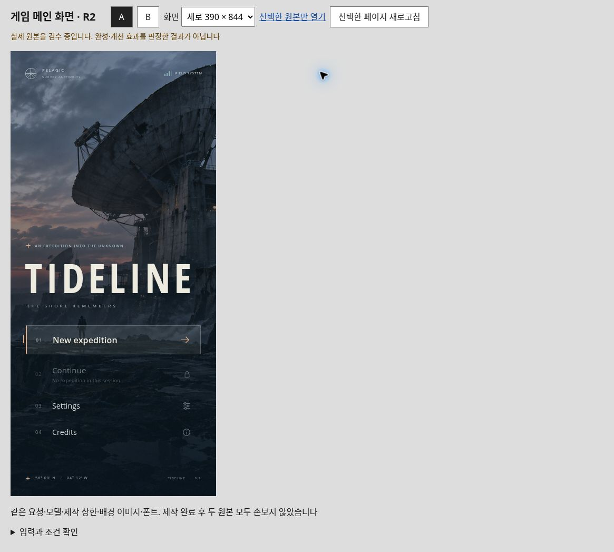
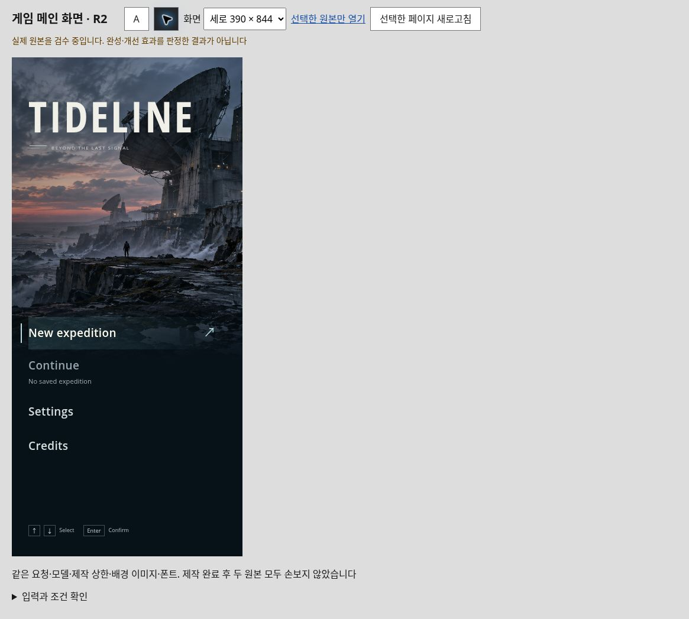

# R2: actual main/title-screen prompt pair

A bounded TIDELINE title-screen and entry-flow experiment, completed 2026-10-09. A (`delta`) is the actual ordinary-quality output; B (`echo`) is the actual whole-screen-guide-and-reference output. Both producer implementations remain unchanged.

**Result: partial improvement.** B improves portrait composition and command readability. A has the more impactful desktop title, clearer filled Start action and radio-looking exclusive choices. B still has checkbox-looking exclusive difficulty controls, external-link-looking diagonal arrows, excessive desktop title/menu separation and a keyboard-only footer at phone width. This pair does not establish an overall winner, user aesthetic approval, measured usability, general guide effectiveness or a complete plugin.

## Actual initial captures

Click a capture for its unedited full-size image. These are CSS-responsive views in cloud Chromium, not physical-phone tests.

| A: ordinary request | B: guide-and-reference addition |
| :---: | :---: |
|  |  |
|  |  |

[Full findings and tested/unrun coverage](RESULTS.md) · [Independent pixel reviews](review/independent-pixel-summary.md) · [Actual entry-flow review](review/desktop-entry-flow-pixel-review.md)

## Inspect or run the originals

[Comparison page](index.html) · [A original](delta/index.html) · [B original](echo/index.html). GitHub displays source rather than executing these HTML files. To run locally, serve this folder with a static HTTP server, then open its `index.html`. Keep `delta/`, `echo/` and `shared/` together. No build or dependency installation is needed.

The comparison page renders matched CSS frames: desktop 1365×768, landscape 844×390 and portrait 390×844. The original private staging browser had an outer frame of 1180×757 at DPR 1; full-page captures preserve the wider desktop frame.

Separate real-browser pointer/keyboard checks covered initially unavailable Continue; setup cancellation without save; Story Start, Return and Continue; volume 70→71 and Reduce motion retained after Escape; Credits Close; and portrait Standard Start for both originals. Node/model tests are separate: A reports 12 state scenarios and B 23 checks. Their counts are not comparative quality scores. Physical phones/touch/controllers, complete keyboard traversal, screen readers, comprehensive contrast/zoom/motion auditing and exhaustive flows remain unrun.

## Exact inputs and retained evidence

- [Common ordinary-quality brief](shared/brief.txt), identical for both runs
- [Additional whole-screen guide](guidance.txt), supplied only to B; its original private input filename is mapped below
- [Fixed method](PROTOCOL.md), [frozen input hashes](input-manifest.json), [all 13 frozen producer-file hashes](output-manifest.json)
- Producer source, source tests, reports and hash records in `delta/` and `echo/`; no hand-retouching after delivery
- Eighteen unedited actual JPG captures in `captures/`, including initial, setup, survey and preserved-settings states
- [Original-art generation provenance](shared/provenance.json) and local Open Sans fonts with their [Apache-2.0 license](shared/fonts/LICENSE.txt) and [copyright notice](shared/fonts/COPYRIGHT.txt)
- [Scoped package manifest](package-manifest.json), which covers only this folder and excludes itself to avoid a circular hash

`guidance.txt` is byte-identical to the frozen `references/whole-title-injection-packet.txt` hash in the input manifest. The manifest also retains hashes of two privately inspected historical publisher/developer screenshots. Those files are intentionally absent from this public package; see [sources and rights](SOURCES_AND_RIGHTS.md) for source links and exact boundaries. No third-party game screenshot, downloaded source HTML or video thumbnail is redistributed.

Fresh GPT-6.1 Sol/xhigh contexts, common original art/font availability and the same 15-minute upper bound were requested. Exact token consumption and computation equality are unknown. A/B mapping was randomized before outputs; the parent knew it, while the independent reviewer initially inspected only the paired screenshots. This is exploratory, tuned after the off-target R1 inventory result, not double-blind or an independent generalization study.

Public source publication was authorized separately after review. It does not approve the designs or select a new repository-wide reuse license.
