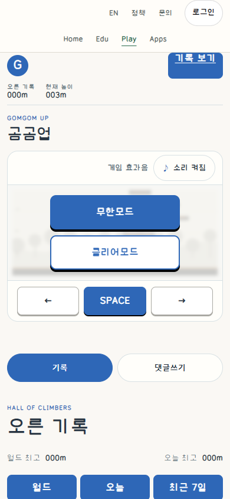
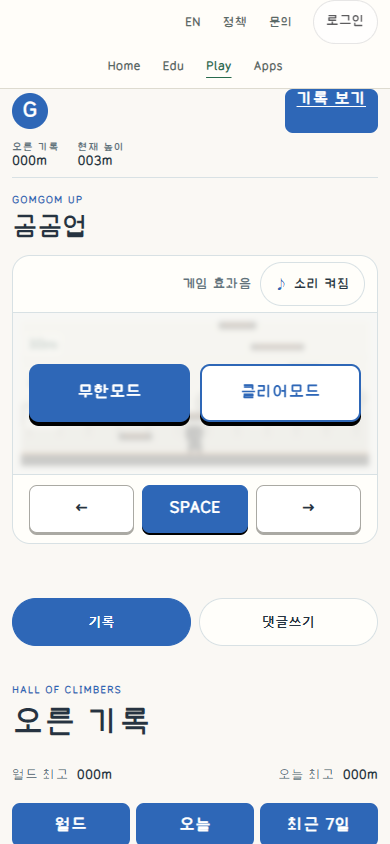
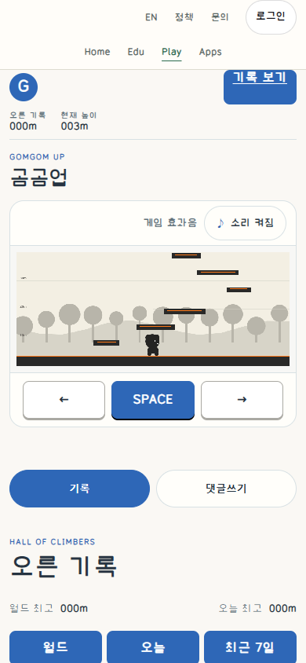
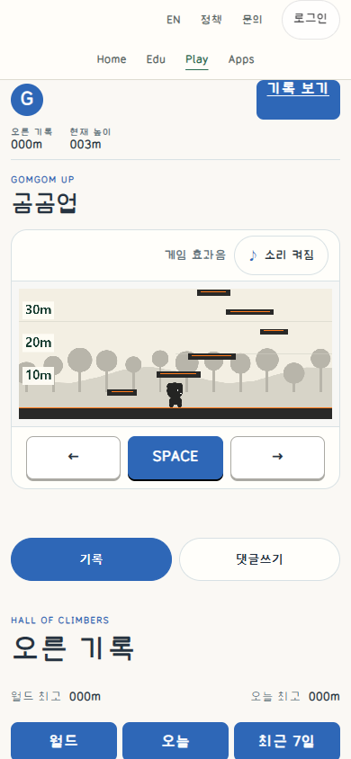
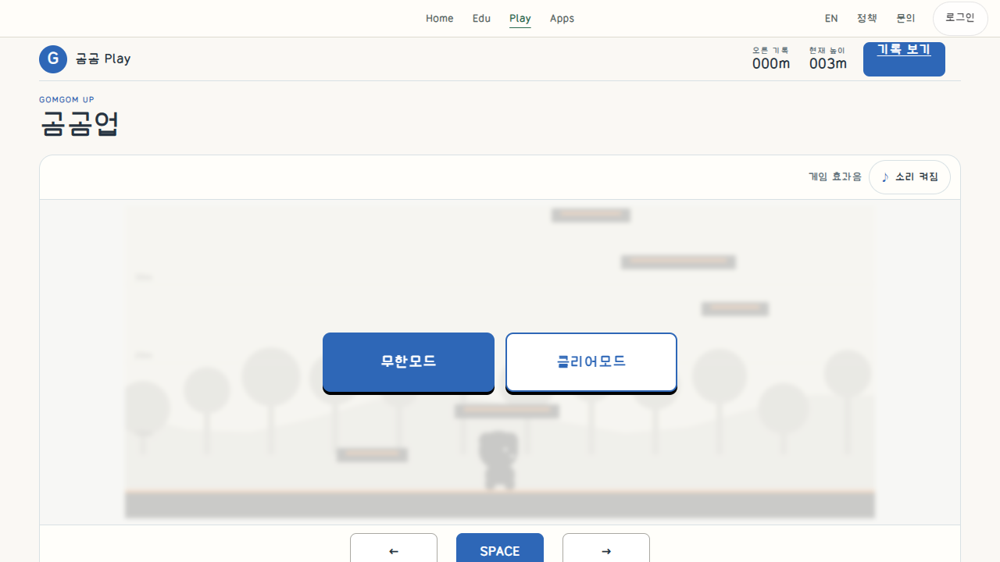
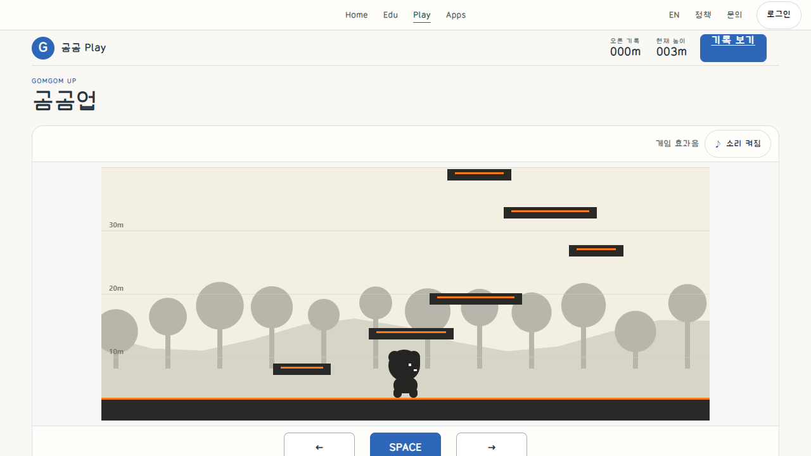
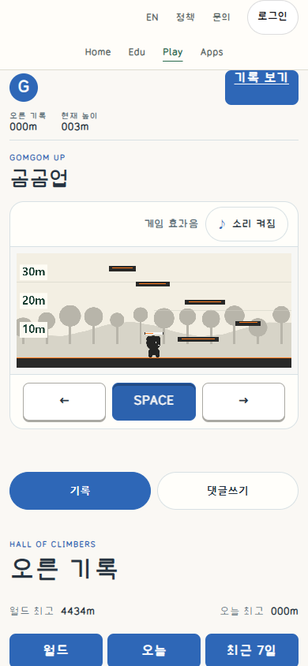
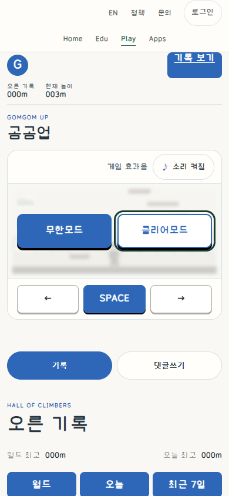

# Up: readable height ink and stable controls

Existing-product correction, not an ordinary/guided model experiment, measured
task-speed benefit, physical-phone test or owner visual acceptance. Publication
of own-product captures was explicitly requested. No production source, secrets,
DB, account/run identifiers, font binaries or external reference art is included;
no new reuse license is selected.

## Matched actual public captures

| State / viewport, CSS px, DPR1 | Before | After |
| --- | --- | --- |
| Mode selection,390x844 |  |  |
| Endless ready,390x844 |  |  |
| Mode selection,1280x720 |  |  |
| Endless ready,1280x720 |  |  |

Before version584da390, After179d37d0. Same normal anonymous entry and mode, initial
world/camera, ready seed1/tick0 and003m displayed score; no state, save, clock or
physics injection. Fonts loaded. Pointer position can differ; these are not
pixel-identical frames. Source screenshots remain unedited; manifest.json records
their actual dimensions, byte sizes and SHA. Earlier local projections are not
passed off as public deployment evidence.

## Before -> intent -> actual render

| Axis | Before | Applied decision and observed After |
| --- | --- | --- |
| Height ink |11world px at348/960 scale, about3.99CSS px | Cached ResizeObserver projection produces14CSS px with quiet light backing and dark ink; scene coordinates and camera stay unchanged. Ready pair shows10/20/30m. |
| Mobile mode layout | Two vertical58px controls extend beyond the116px game panel at320px | Two equal choice columns within the same scene panel; unchanged mode labels/actions; actual320/390 bounds and captures inspected. |
| Touch target / press | Whole control moves down when held | Same stable outer target, shallow inset pressed surface; native held and release-away observed without target movement. No mandatory new icon or body. |
| Focus / rank | Existing filled Endless and outlined Clear | Preserve role hierarchy and loaded typography; independent green focus outline follows native Tab, Enter selects Clear. |
| Preserved meaning | Movement/jump,1000m completion policy, records/auth | Only display/cleanup and scoped CSS/cache links changed; current engine tag, engine bytes, input/events, result policy and data runtimes preserved. |

The last two are After-only interaction states, not matched comparative claims.
Motion/reduced-motion is limited to removal of optional CSS interpolation with
static press/focus retained; no physical-touch or assistive-technology acceptance.

## Guidance actually read

Sites MCP47/material5457b898 unchanged; common production/control guidance already
read in the same version, reused rather than repeated. Implementation705fd142
and selected DNS05/14/18 originals, universal-button AI instructions and relevant
GUIDE family/anatomy/state/native-input/evidence sections read. Git8f853cf8 fresh
and unchanged. Applied actual-unit ink sizing, fixed targets, separate focus,
minimal domain ownership and matched evidence; sample values/features and draft
approval labels did not become product contracts.

## Evidence and limits

Local projection five viewports passed native mode entry/jump/hold/release-away,
fixed target and keyboard reload/Enter checks. Final public five viewports
390x844,768x900,1280x720,844x390,320x700 passed those same normal actions. Page
exceptions0, failed requests0, tracked HTTP errors0; six console404 messages were
retained. A fresh CDP diagnostic identified the browser's favicon.ico404, also
observed Before; no error was blocked or filtered to claim a clean console.

Three public files exactSHA200/HIT, fresh provider100%, unchanged Worker/resources,
no API/service restart or record reset. Static recovery/rollback kept privately.
The first source-parity construction failed on an extra newline and was corrected;
the first sealed local candidate retained narrow-mode clipping and was not
published. Final candidate2 contains the complete bounded correction.

One native jump per viewport observed. Attempts did not reach natural failure in
the bounded interval; no forced result/clear or ranking submission was made.
Full1000m playthrough, result persistence, school load, Android, actual touch,
screen-reader and external visual review remain unverified. The broader homepage
work still has other secondary corrections; this case does not claim all-game
completion or a performance gain.
