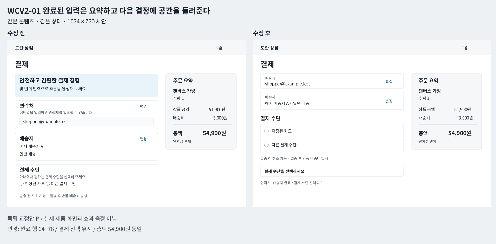
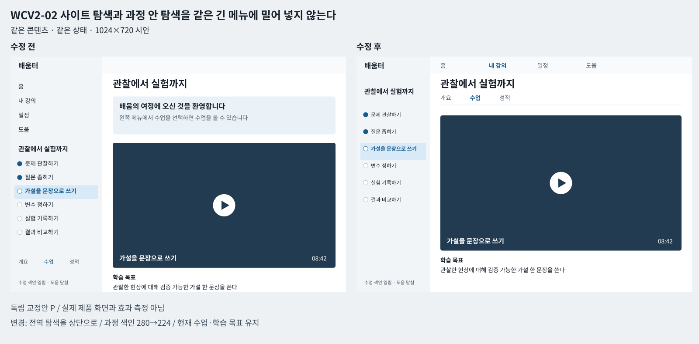
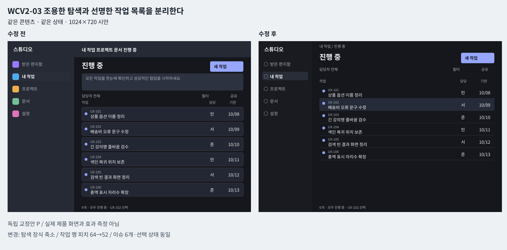
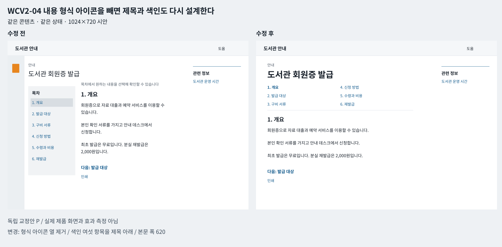
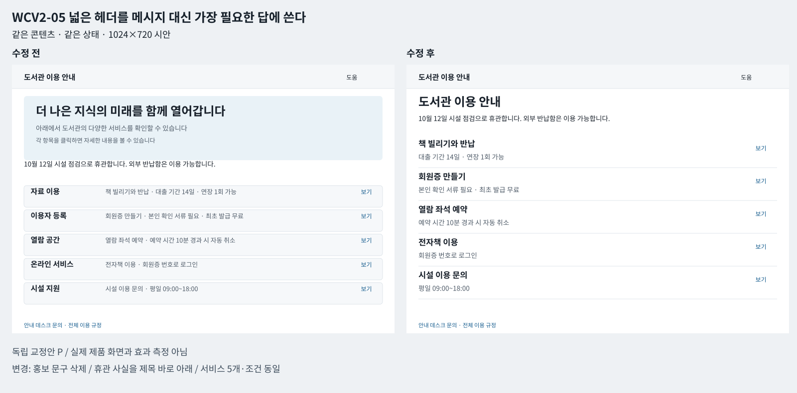
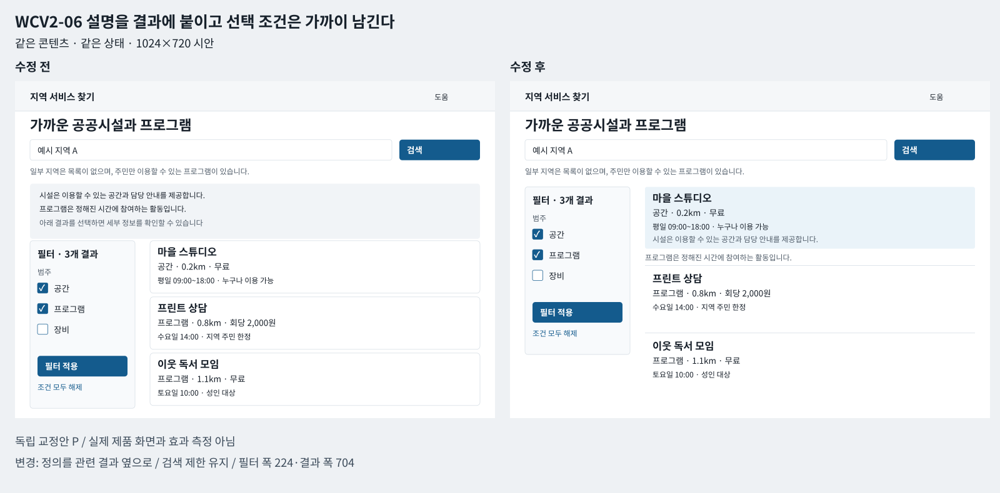

# 웹 앱 구조와 설명문 시각 교정 사례

조사일 2026-10-04 UTC

## 이 자료의 목적

앞선 매뉴얼의 V05–V09를 실제 제작자의 개편 기록과 독립적인 시각 비교판으로 구체화한다. 쇼핑·학습·생산성·정보 검색의 작업 공간, 메뉴 비율, 글자 위계, 설명문 삭제 이후의 배치를 각각 검토한다. 핵심은 지운 문장의 수보다 남은 정보가 어디에서 어떤 판단을 돕는지다.

**원문 사실 D와 원본 이미지 관찰 V, 직접 만든 교정안 P를 구분한다.** 아래 전후 그림은 실제 제품을 복제하거나 원본의 사용성을 증명하는 그림이 아니다. 같은 가상 데이터와 상태로 구성한 교정 예시다. 모든 치수는 1024×720 SVG 시안 좌표의 제안값이다. 원본 앱 CSS 실측값이나 권장 표준이 아니다. 합본은 각 패널을 75%로 줄여 보인다.

## 새 사례를 고른 기준

- 기존 Duolingo 탭 개편과 Wikipedia 목차 근거는 반복하지 않았다. 새 원문은 Shopify·Moodle·Linear·GDS 2013 안내문·GDS 정보 허브·DfE 검색 개편이다.
- 원문에서 변경 이유가 명시되거나 실제 전후 이미지가 있는 경우만 포함했다.
- 원본 전후가 서로 다른 내용을 담는 경우는 통제된 전후 실험으로 부르지 않는다. 대신 가상 예시에 한 fixture와 한 상태를 공유한다.
- 화면의 설명을 줄일 때 자격·가격·위험·오류 복구를 함께 지우지 않는다.
- 그림 파일은 독립 벡터 도해이며 숨겨진 패널, 키보드·모바일 동작을 검증하지 않는다.

## WCV2-01 완료된 입력은 요약하고 다음 결정에 공간을 돌려준다

적용 용도 shopping

**원문에서 확인한 결정 D**

Shopify는 3페이지 결제를 한 페이지로 묶고, 이미 채운 구역을 요약 제목으로 접어 다음 입력에 집중하도록 만들었다고 설명한다. 알려진 구매자의 미리 채운 구역도 접는다. 한 페이지에 필드를 모두 펼치라는 처방과 다르다.

[Shopify One Page Checkout](https://www.shopify.com/uk/blog/one-page-checkout)

**공개 이미지에서 직접 본 것과 한계 V U**

원문에서 완료 구역의 요약·자동 접기 결정을 확인했다. 실제 상점 결제, 카드 입력, 결제 실행, 원본 전후 이미지 실측은 하지 않았다.

**결함 P**

연락처와 배송지가 이미 확정된 구매자에게 환영 히어로, 장점 카드, 전 필드, 입력 사용법을 다시 펼친다. 다음으로 필요한 결제 수단 선택과 총액이 화면 아래로 밀린다.

**정확한 교정 지시 P**

1. 화면 최상단을 작은 상점명과 결제 제목으로 제한하고, 완료된 연락처·배송지는 값이 읽히는 요약 행으로 바꾼다. 요약 옆 변경은 유지한다.
2. 결제 수단은 아직 선택하지 않았으므로 펼쳐 둔다. 모든 구역을 동시에 접거나 새 구매자의 빈 주소 필드를 숨기지 않는다.
3. 주문 요약을 오른쪽 열에 두고 상품·수량·배송비·총액을 묶는다. 가격 약정·환불 제한은 결제 행동 근처에 남긴다.

**문구 삭제와 보존 P**

- 삭제: 안전하고 간편한 결제 경험 / 몇 번의 입력으로 주문을 완성해 보세요 / 이메일을 입력하면 연락처를 입력할 수 있습니다 / 아래에서 원하는 결제 수단을 선택해 주세요
- 보존: 연락처 값 / 배송지·배송 방식 / 상품·수량·배송비·총액 / 일회성 결제 / 취소 및 환불 조건
- 이동: 입력 보조 설명은 오류나 실제 제약이 있는 필드에만 배치

**삭제 뒤 레이아웃 조정 P**

설명만 비워 둔 높이 100의 환영 카드와 각 필드 카드의 고정 최소 높이를 없앤다. 완료 행 64·76, 미완료 결제 영역 176으로 재배치해 주문 요약과 선택지가 같은 상단 작업 영역에 들어오게 한다.

**동일 콘텐츠 상태의 비교 계약 P**

- 두 시안은 같은 가상 데이터와 상태를 참조한다. 정보가 보이는 위치·형태만 바꾸며 주문 금액, 수업, 이슈, 문서 절, 서비스 조건을 바꾸지 않는다.
- 상태: {"buyer": "known", "contact": "complete", "delivery": "complete", "payment": "unselected", "submitted": false}
- 고유 정보 보존 키: product, quantity, subtotal, shipping, total, currency, email, address, delivery_method, payment_options, commitment, refund

**시안의 구체적 시작값 P**

{"unit": "authored_svg_coordinate_px_not_product_css_measurement", "form_width": 616, "summary_width": 304, "column_gap": 32, "body": 18, "body_line": 28, "heading": 32, "field_label": 16, "control_height": 44, "complete_rows": [64, 76], "menu_width": 0}

벡터 원본: [비교판](web_app_v2/visuals/wcv2-01-comparison.svg) · [수정 전](web_app_v2/visuals/wcv2-01-before.svg) · [수정 후](web_app_v2/visuals/wcv2-01-after.svg)

**채택 조건과 반례 P**

재방문자이고 완료 정보가 실제로 검증된 경우에 적용한다. 법적 고지·세금·배송 계산·접근성 문제까지 무조건 접는 규칙으로 확대하지 않는다.

**다음 구현에서 통과해야 할 검수 P**

1. 같은 fixture로 contact·delivery·payment의 완료 상태와 총액이 전후 동일한지 비교한다.
2. 각 변경을 열어 이전 값이 남고, 취소하면 요약으로 돌아오는지 테스트한다.
3. 주소 수정 시 배송비·총액 재계산 상태를 드러내고 결제 행동을 막는지 검수한다.
4. 새 구매자·인식 오류·긴 주소·가격 자리수 확장·320px·200% 글자 확대에서도 필수 정보가 보이는지 확인한다.

기존 연결: V05, V06, V07, V08

## WCV2-02 사이트 탐색과 과정 안 탐색을 같은 긴 메뉴에 밀어 넣지 않는다

적용 용도 learning

**원문에서 확인한 결정 D**

Moodle의 2021 설계 설명은 하나의 메뉴가 모든 길찾기를 맡지 않도록 전역 메뉴를 가로로 나누고, 과정 관련 보조 메뉴를 별도로 둔다고 설명한다. 2022 출시 안내는 My Courses의 별도 페이지, 접을 수 있는 과정 색인과 보조 블록, 현재 위치·완료 표시를 설명한다.

[The Road to Moodle 4.0 – Sneak Peek of our New Nav](https://moodle.com/news/road-moodle-4-0-new-navigation./) [Find your way around Moodle 4.0](https://moodle.com/news/find-your-way-around-moodle-4-0/)

**공개 이미지에서 직접 본 것과 한계 V U**

2022 공식 이미지에서 태블릿의 왼쪽 과정 색인과 데스크톱의 오른쪽 보조 블록을 확인했다. 이는 서로 다른 화면을 합성한 홍보 이미지이며, 원본 CSS 치수·터치 동작·로그인 학습실은 검증하지 않았다. 2021의 자동 열기·닫기 설명은 프로토타입 설명으로 한정한다.

**결함 P**

홈·내 강의·전체 강좌·현재 과정의 단원·성적·도움을 280 폭의 단일 트리에 섞는다. 학습 화면에도 환영 카드와 목록 사용법이 남아 영상 폭과 현재 단원 식별성이 줄어든다.

**정확한 교정 지시 P**

1. 전역 Home·내 강의·일정·도움을 상단 탐색으로 옮기고, 왼쪽 색인은 현재 과정의 6수업과 단원만 담는다.
2. 과정의 개요·수업·성적은 과정 제목 아래 같은 행에 두고, 현재 수업은 제목과 색인 선택 상태 모두에서 확인하게 한다.
3. 보조 블록은 기본 닫힘 상태를 유지하되 발견 가능한 버튼을 남긴다. 주목적이 수업 시청일 때 보조 정보 열이 영구 폭을 가져가지 않게 한다.

**문구 삭제와 보존 P**

- 삭제: 배움의 여정에 오신 것을 환영합니다 / 왼쪽 메뉴에서 수업을 선택하면 수업을 볼 수 있습니다
- 보존: 수업 학습 목표 / 영상 길이 / 완료·진행 상태 / 남은 수업 이름
- 이동: 새 사용자를 위한 안내는 재실행 가능한 도움으로 분리

**삭제 뒤 레이아웃 조정 P**

고정 환영 영역 116를 제거하고 과정 제목·보조 탐색을 96 안에 정렬한다. 과정 색인은 280에서 224로 좁히되 긴 수업명 두 줄과 44 높이 클릭 영역을 확보한다. 중앙 영상은 16:9를 유지하고 아래에 학습 목표를 둔다.

**동일 콘텐츠 상태의 비교 계약 P**

- 두 시안은 같은 가상 데이터와 상태를 참조한다. 정보가 보이는 위치·형태만 바꾸며 주문 금액, 수업, 이슈, 문서 절, 서비스 조건을 바꾸지 않는다.
- 상태: {"global_route": "course", "course_tab": "lessons", "course_index": "open", "support_drawer": "closed", "current_lesson": "가설을 문장으로 쓰기", "video": "paused", "completed_lessons": 2}
- 고유 정보 보존 키: course, lessons, current, duration, objective, global_routes, course_routes

**시안의 구체적 시작값 P**

{"unit": "authored_svg_coordinate_px_not_product_css_measurement", "sidebar_before": 280, "sidebar_after": 224, "sidebar_percent_before": 27.34375, "sidebar_percent_after": 21.875, "body": 18, "body_line": 28, "heading": 30, "global_nav_height": 52, "course_header_height": 96, "nav_hit_height": 44, "video_ratio": "16:9"}

벡터 원본: [비교판](web_app_v2/visuals/wcv2-02-comparison.svg) · [수정 전](web_app_v2/visuals/wcv2-02-before.svg) · [수정 후](web_app_v2/visuals/wcv2-02-after.svg)

**채택 조건과 반례 P**

전역·과정·수업처럼 탐색 범위가 실제로 다른 제품에 적용한다. 경로가 3개뿐인 짧은 입문 과정에는 여러 탐색 줄을 새로 만들 필요가 없다. 영상이 아닌 텍스트 수업에는 영상 폭 규칙을 쓰지 않는다.

**다음 구현에서 통과해야 할 검수 P**

1. 전후 같은 6수업·현재 세 번째 수업·완료 두 개·멈춘 영상·닫힌 보조 블록 상태를 유지한다.
2. 색인 접기·다시 열기·수업 이동·브라우저 뒤로에서 현재 수업·스크롤·포커스를 확인한다.
3. 긴 한국어 제목과 200% 확대 시 행 높이가 늘고 완료 표시가 제목을 덮지 않는지 확인한다.
4. 좁은 화면에서 색인을 별도 서랍으로 전환하되 메뉴를 닫고 본문으로 돌아올 수 있는지 검수한다.

기존 연결: V06, V07, V09

## WCV2-03 조용한 탐색과 선명한 작업 목록을 분리한다

적용 용도 productivity

**원문에서 확인한 결정 D**

Linear의 2026 공개 전후 비교는 비활성 탐색 글자와 작은 아이콘, 추가 세로 패딩을 보여 준다. 저자는 탭을 화면 전체 폭으로 늘이지 않고 작게 만들고, 팀 아이콘의 색 배경과 불필요한 경계선을 줄였다고 설명한다. 핵심 내용의 밀도를 유지하면서 주변 UI의 경쟁을 낮추는 수정이다.

[A calmer interface for a product in motion](https://linear.app/now/behind-the-latest-design-refresh)

**공개 이미지에서 직접 본 것과 한계 V U**

공식 사이드바 전후를 확대해 작은 아이콘·낮아진 비활성 시각 무게·더 큰 그룹 간격을 직접 봤다. 이미지의 글자나 버튼 픽셀을 실제 앱 CSS 토큰으로 환산하지 않았다. 색상 대비·기능 동작·사용자 성공률은 원본에서 실측하지 않았다.

**결함 P**

모든 메뉴 아이콘에 다른 색 배경이 있고, 현재 보기와 비활성 메뉴가 같은 명암이다. 폭을 채운 큰 탭과 작업 목록 설명문이 실제 이슈 6개보다 먼저 읽힌다. 모든 요소를 작게 만들면 조용해질 것이라고 오판한다.

**정확한 교정 지시 P**

1. 내용 영역은 제목·필터·이슈 행의 정렬 축을 유지하고, 전역 위치와 보기 명령을 두 개의 역할이 분명한 헤더로 나눈다.
2. 탐색 아이콘의 장식 배경을 제거하고 시각 크기를 20에서 16으로 줄이되 행의 클릭 영역과 그룹 사이 공간은 지킨다.
3. 선택된 보기·선택 행·우선순위·담당자·기한이 서로 다른 의미를 유지하게 한다. 낮은 대비를 미학으로 삼지 않고 비활성 텍스트도 읽히는 대비를 적용한다.

**문구 삭제와 보존 P**

- 삭제: 모든 작업을 한눈에 확인하고 성공적인 협업을 시작하세요
- 보존: 현재 보기 이름 / 필터 조건 / 이슈 제목·상태·담당자·기한
- 이동: 숨겨진 고급 필터 설명은 해당 필터 도움에 배치

**삭제 뒤 레이아웃 조정 P**

설명 배너 72와 64 피치의 반복 카드를 제거한다. 위치 헤더 40+보기 헤더 56, 열 제목 40, 작업 행 52로 정리하고 내용의 열 정렬을 유지한다. 탐색 행은 36으로 유지해 글자 크기 축소가 손가락/포인터 표적 축소로 이어지지 않게 한다.

**동일 콘텐츠 상태의 비교 계약 P**

- 두 시안은 같은 가상 데이터와 상태를 참조한다. 정보가 보이는 위치·형태만 바꾸며 주문 금액, 수업, 이슈, 문서 절, 서비스 조건을 바꾸지 않는다.
- 상태: {"view": "진행 중", "filter": "담당자 전체", "selected_issue": "UX-102", "sidebar": "open", "sort": "id_ascending"}
- 고유 정보 보존 키: workspace, nav, issues, actions

**시안의 구체적 시작값 P**

{"unit": "authored_svg_coordinate_px_not_product_css_measurement", "sidebar_before": 280, "sidebar_after": 224, "icon_before": 20, "icon_after": 16, "nav_hit_height": 36, "location_header": 40, "view_header": 56, "row_height": 52, "body": 18, "body_line": 26, "heading": 30, "inactive_text": "#A9AEB9", "sidebar_background": "#191B20", "content_text": "#F3F4F6", "content_background": "#15171C"}

벡터 원본: [비교판](web_app_v2/visuals/wcv2-03-comparison.svg) · [수정 전](web_app_v2/visuals/wcv2-03-before.svg) · [수정 후](web_app_v2/visuals/wcv2-03-after.svg)

**채택 조건과 반례 P**

반복해서 쓰는 정보 밀도 높은 도구에 적용한다. 검은 테마·보라 액센트·작은 아이콘을 유명 앱의 정답으로 복제하지 않는다. 낮은 시력·복잡한 상태에서는 주변 탐색도 더 강한 대비가 필요하다.

**다음 구현에서 통과해야 할 검수 P**

1. 같은 6개 이슈·순서·필터·UX-102 선택 상태·명령을 전후 확인한다.
2. 공유·새 작업·필터 위치가 여러 보기에서 일관된지 테스트한다.
3. 축소 화면에서 목록이 주위계인지 확인한 뒤 100%에서 전체 텍스트 대비와 포커스를 별도로 측정한다.
4. 52 높이 행은 시작점이다. 두 줄 제목·다른 언어·200% 확대에서는 잘림 없이 행을 늘린다.

기존 연결: V06, V07, V08, V09

## WCV2-04 내용 형식 아이콘을 빼면 제목과 색인도 다시 설계한다

적용 용도 information

**원문에서 확인한 결정 D**

GDS의 아이콘 제작자는 사용자가 내용 형식 아이콘을 기능으로 오해해 클릭했고, 기억을 돕는다는 직접 증거가 없었다고 설명한다. 아이콘을 제거하는 동시에 굵은 제목과 안내문 탐색을 수정했다. 저자 답변은 왼쪽 안내 색인과 화면 아래로 이어지는 부분을 놓친 관찰도 설명한다.

[Retiring our icons](https://gds.blog.gov.uk/2013/06/18/retiring-our-icons/)

**공개 이미지에서 직접 본 것과 한계 V U**

GDS가 공개한 Types of school의 역사적 전후 이미지에서 왼쪽 형식 아이콘과 세로 안내 색인이 사라지고, 굵은 제목 아래 여섯 안내 항목이 두 열로 재배치된 모습을 확인했다. 원본 전후는 같은 문서이지만 통제된 콘텐츠 동일성 실험은 아니다.

**결함 P**

클릭할 수 없는 문서 형식 아이콘을 버튼 같은 블록에 넣고, 색인은 별도의 연한 열에 둔다. 아이콘을 삭제해도 빈 왼쪽 거터와 작은 제목을 남기면 내용과 길찾기의 문제가 계속된다.

**정확한 교정 지시 P**

1. 정보가 이름으로 충분히 드러나는 형식 아이콘 블록을 제거하고 제목을 본문과 같은 시작선에 놓는다.
2. 6개 절 정도의 짧은 안내라면 제목 바로 아래에 모두 보이는 간결한 두 열 색인을 둔다. 현재 절 표시는 남긴다.
3. 본문은 별도의 읽기 폭을 갖게 하고 관련 링크는 주내용과 경쟁하지 않는 보조 위치로 둔다. 장문 백과·깊은 색인은 지속 목차가 더 적합할 수 있다.

**문구 삭제와 보존 P**

- 삭제: 목차에서 원하는 내용을 선택해 확인할 수 있습니다
- 보존: 문서 제목 / 각 절 이름·현재 절 / 자격·구비 서류·비용 / 다음 절·인쇄
- 이동: 문서 형식은 필요하면 제목 위의 짧은 텍스트 라벨로만 남김

**삭제 뒤 레이아웃 조정 P**

형식 아이콘 열 72와 세로 색인 열 200을 없애고, 제목·상단 색인·본문의 왼쪽 경계를 맞춘다. 본문 폭은 620, 글자 18/30으로 설정한다. 제목이 시작하는 빈 영역을 메우는 그림이나 새 장점 카드를 추가하지 않는다.

**동일 콘텐츠 상태의 비교 계약 P**

- 두 시안은 같은 가상 데이터와 상태를 참조한다. 정보가 보이는 위치·형태만 바꾸며 주문 금액, 수업, 이슈, 문서 절, 서비스 조건을 바꾸지 않는다.
- 상태: {"document": "도서관 회원증 발급", "current_section": "개요", "toc": "all_six_visible", "reader": "top"}
- 고유 정보 보존 키: title, sections, body, next, other_link, actions

**시안의 구체적 시작값 P**

{"unit": "authored_svg_coordinate_px_not_product_css_measurement", "icon_rail_before": 72, "toc_before": 200, "toc_after": "two_columns_3_rows_under_title", "body_width_after": 620, "body": 18, "body_line": 30, "heading_before": 28, "heading_after": 36, "toc_text": 16, "toc_hit_height": 36}

벡터 원본: [비교판](web_app_v2/visuals/wcv2-04-comparison.svg) · [수정 전](web_app_v2/visuals/wcv2-04-before.svg) · [수정 후](web_app_v2/visuals/wcv2-04-after.svg)

**채택 조건과 반례 P**

짧은 안내의 발견성 문제가 있을 때 적용한다. 모든 아이콘·모든 사이드바를 제거하는 규칙으로 만들지 않는다. 익숙한 행동 아이콘·접근성 의미·긴 문서 현재 위치는 별도 가치가 있다.

**다음 구현에서 통과해야 할 검수 P**

1. 같은 6개 절·현재 개요·같은 3문단·다음 절을 전후 유지한다.
2. 첫 화면에서 전체 안내 범위를 발견하고 원하는 절을 찾는지 별도 관찰한다.
3. 모바일에서는 두 열 색인을 한 열로 바꾸고 길어진 제목과 본문이 겹치지 않는지 확인한다.
4. 장문 버전에서도 상단 색인만으로 충분한지 반례를 시험하고 필요하면 지속 목차로 전환한다.

기존 연결: V05, V07, V08, V09

## WCV2-05 넓은 헤더를 메시지 대신 가장 필요한 답에 쓴다

적용 용도 information

**원문에서 확인한 결정 D**

GDS는 코로나 정보 허브를 내용 변경만으로 수정했다. 큰 헤더의 정부 메시지를 사용자가 찾는 답으로 바꾸고, 구체적인 과업 이름으로 제목을 바꾸며, 오래된 링크를 제거하고 우선순위를 다시 매겼다. 게시물은 수정 전후 유용성 응답 평균이 56%에서 62%로 올랐다고 보고하지만 인과 실험을 제시하지 않는다.

[Responding to the changing user needs of the COVID-19 landing page](https://insidegovuk.blog.gov.uk/2023/03/06/responding-to-the-changing-user-needs-of-the-covid-19-landing-page/)

**공개 이미지에서 직접 본 것과 한계 V U**

공식 전후 섹션 이미지에서 포괄적 이름이 검사·예방접종·상황별 행동 등 명확한 이름으로 바뀌고 순서가 달라진 것을 확인했다. 이는 2022 개편 역사 사례이며 현재 보건 안내가 아니다. 아래 시각 예시는 의료 정보를 옮기지 않고 가상의 도서관 서비스 허브로 구성한다.

**결함 P**

기관의 다짐과 일반적 홍보가 큰 헤더를 쓰고, 실제 휴관·대출 반납 정보는 아래에 있다. 제목이 알아보기 어려워 무엇을 펼쳐야 하는지 매번 설명 문단을 읽어야 한다.

**정확한 교정 지시 P**

1. 최상단에 현재 방문 판단을 바꾸는 한 가지 사실과 필요한 행동 링크를 둔다. 출처·유효 날짜가 필요한 정보는 같이 둔다.
2. 막연한 업무군 이름을 이용자의 질문에 답하는 제목으로 바꾸고, 이용 빈도·결과의 중요도에 따라 정렬한다.
3. 이미 제목과 링크가 말하는 설명문은 없애고, 별도의 조건·제약이 있는 경우 한 줄을 남긴다. 실제로 더 이상 유효하지 않은 정보는 콘텐츠 책임자의 확인 후 제거한다.

**문구 삭제와 보존 P**

- 삭제: 더 나은 지식의 미래를 함께 열어갑니다 / 아래에서 도서관의 다양한 서비스를 확인할 수 있습니다 / 각 항목을 클릭하면 자세한 내용을 볼 수 있습니다
- 보존: 휴관 날짜와 반납함 이용 가능 여부 / 각 서비스의 조건 / 문의·대체 경로
- 이동: 이용자의 결정을 바꾸는 운영 상태는 제목 직후로 올림

**삭제 뒤 레이아웃 조정 P**

홍보 헤더 172를 제목·상태 사실·행동 링크가 있는 112 영역으로 줄인다. 5개 서비스는 색이 다른 카드 다섯 개 대신 제목과 고유 조건의 목록으로 놓고, 섹션 사이 간격 24와 약한 구분선으로 묶는다.

**동일 콘텐츠 상태의 비교 계약 P**

- 두 시안은 같은 가상 데이터와 상태를 참조한다. 정보가 보이는 위치·형태만 바꾸며 주문 금액, 수업, 이슈, 문서 절, 서비스 조건을 바꾸지 않는다.
- 상태: {"date": "2026-10-04", "all_sections": "collapsed", "service_status": "scheduled_closure"}
- 고유 정보 보존 키: title, important_fact, services, contact, all_link

**시안의 구체적 시작값 P**

{"unit": "authored_svg_coordinate_px_not_product_css_measurement", "hero_before": 172, "header_after": 112, "body": 18, "body_line": 28, "heading": 32, "section_title": 22, "section_gap": 24, "service_rows": 88, "menu_width": 0}

벡터 원본: [비교판](web_app_v2/visuals/wcv2-05-comparison.svg) · [수정 전](web_app_v2/visuals/wcv2-05-before.svg) · [수정 후](web_app_v2/visuals/wcv2-05-after.svg)

**채택 조건과 반례 P**

정보가 자주 변하고 방문자가 구체적인 답을 찾는 허브에 적용한다. 단순히 짧게 보이려고 자격·운영 제한·위험을 없애지 않는다. 클릭 감소만을 좋은 결과로 판단하지 않는다.

**다음 구현에서 통과해야 할 검수 P**

1. 같은 휴관 사실·5개 서비스·고유 조건·문의·전체 규정을 전후 모두 유지한다.
2. 아무 항목도 펼치지 않은 첫 화면에서 휴관 날짜와 반납 가능 여부를 찾을 수 있는지 확인한다.
3. 서비스별 제목을 가리고 남은 설명만 읽어 중복되는 문장인지 검수한다.
4. 현행 정보의 출처·만료 책임자가 없으면 역사적 예시를 실제 안내로 게시하지 않는다.

기존 연결: V05, V07, V08

## WCV2-06 설명을 결과에 붙이고 선택 조건은 가까이 남긴다

적용 용도 information_and_search

**원문에서 확인한 결정 D**

DfE는 읽히지 않던 결과 상단의 시설·서비스 설명을 짧게 하고 관련 결과 가까이 옮겼다. 우편번호 뒤에 카테고리 라디오 페이지를 거치던 경로를 결과와 복수 선택 체크박스 필터로 바꿨다. 별도의 시작 페이지로 내용을 분배했고, 검색 근처의 지역·수록 범위 제한은 유지했다.

[Iterating how users search in Find](https://design-histories.education.gov.uk/connect-families-to-support/iterating-search-find)

**공개 이미지에서 직접 본 것과 한계 V U**

공식 결과 예시에서 왼쪽 필터와 오른쪽 시설 결과, 비용·연락처·운영 시간과 짧은 시설 설명을 확인했다. 원문은 MVP 프로토타입의 변경 이력이다. 완료율·현재 서비스 동작·실제 메뉴 폭을 측정하지 않았다.

**결함 P**

결과를 보기 전에 시설·프로그램 정의를 두 문단 읽고 단일 카테고리를 정해야 한다. 중요한 지역 제한은 검색 버튼 아래 멀리 있으며 결과 카드마다 같은 사용법을 반복한다.

**정확한 교정 지시 P**

1. 이미 검색어가 입력된 결과 화면에서는 검색 조건·건수·필터를 바로 보여 주고 결과를 위로 올린다. 처음 진입 설명을 모두 없애는 대신 첫 화면과 검색 결과의 역할을 나눈다.
2. 시설의 의미는 시설 결과 옆의 짧은 라벨/한 줄 설명으로, 프로그램의 의미는 프로그램 목록 직전에 둔다. 실제 이용 조건을 가진 문구는 검색이나 해당 결과 가까이 둔다.
3. 복수 선택이 과업에 맞는 범주에는 체크박스를 쓰고, 적용된 범주·해제·검색어 수정이 한 상태로 보존되게 한다.

**문구 삭제와 보존 P**

- 삭제: 아래 결과를 선택하면 세부 정보를 확인할 수 있습니다
- 보존: 지역 주민 한정 여부 / 일부 지역의 목록 미수록 안내 / 서비스명·거리·비용·운영 시간 / 시설·프로그램 차이의 고유 설명
- 이동: 시설 설명을 시설 항목 내부로 / 프로그램 설명을 프로그램 목록 직전으로 / 검색 범위 제한을 검색 조건 바로 아래로

**삭제 뒤 레이아웃 조정 P**

상단 설명 블록 118를 제거하고 같은 설명의 고유 사실은 각 결과 가까이 다시 배치한다. 필터 폭 224, 결과 폭 704, 사이 32를 시작점으로 잡고 세 결과의 정보 열을 같은 기준선에 맞춘다. 검색 제약은 결과 건수 아래 한 줄에 남긴다.

**동일 콘텐츠 상태의 비교 계약 P**

- 두 시안은 같은 가상 데이터와 상태를 참조한다. 정보가 보이는 위치·형태만 바꾸며 주문 금액, 수업, 이슈, 문서 절, 서비스 조건을 바꾸지 않는다.
- 상태: {"query": "예시 지역 A", "selected_categories": ["공간", "프로그램"], "results": 3, "filter_drawer": "open", "sort": "distance"}
- 고유 정보 보존 키: title, query, scope_caveat, facility_definition, program_definition, categories, results

**시안의 구체적 시작값 P**

{"unit": "authored_svg_coordinate_px_not_product_css_measurement", "filter_width": 224, "result_width": 704, "gap": 32, "body": 18, "body_line": 28, "heading": 30, "result_heading": 22, "filter_hit_height": 44, "result_height": 144}

벡터 원본: [비교판](web_app_v2/visuals/wcv2-06-comparison.svg) · [수정 전](web_app_v2/visuals/wcv2-06-before.svg) · [수정 후](web_app_v2/visuals/wcv2-06-after.svg)

**채택 조건과 반례 P**

결과를 본 뒤 여러 범주를 바꾸는 검색에 적용한다. 자격 확인이 필수인 신청·법률·보건 경로의 사전 질문은 임의로 삭제하지 않는다. 설명을 삭제할지 이동할지는 의사결정 정보인지로 나눈다.

**다음 구현에서 통과해야 할 검수 P**

1. 전후 동일한 검색어·복수 필터·정렬·3결과·비용·거리·자격·제한 문구를 확인한다.
2. 상단 설명을 없앤 뒤에도 시설과 프로그램을 구분하고 지역 제한을 이해하는지 검수한다.
3. 필터 변경·0건·검색어 수정·뒤로 복귀에서 선택과 결과 맥락을 유지하는지 테스트한다.
4. 320px에서 필터는 접어도 적용된 조건과 필터 열기 버튼은 결과 위에 남는지 확인한다.

기존 연결: V05, V07, V09

## 네 용도의 다른 정답

- 쇼핑: 다음에 결정할 항목과 총액이 중심이다. 완료 정보는 요약할 수 있지만 사실과 수정 경로는 사라지면 안 된다.
- 학습: 현재 수업과 과정 안 위치가 중심이다. 전역과 과정 탐색의 역할을 나누고, 필요한 학습 목표는 유지한다.
- 생산성: 실제 작업 목록이 중심이다. 주변 탐색의 대비와 장식을 줄여도 행 높이·식별성·포커스는 따로 검수한다.
- 정보: 답을 찾는 질문과 읽기 흐름이 중심이다. 짧은 안내의 상단 색인과 장문의 지속 목차는 조건이 다르다.
- 검색: 결과와 현재 조건이 중심이다. 정의는 맥락 가까이 옮길 수 있지만 자격·범위·비용은 결정 전에 보여야 한다.

## 설명문을 삭제할 때의 구현 계약

1. 문장을 고유 사실, 행동 결과, 오류 복구, 이미 보이는 사용법, 수사적 문구로 분류한다.
2. 삭제 후보를 하나씩 제거하고 사용자가 잃는 결정을 적는다. 고유 사실이 있으면 짧게 쓰거나 맥락 가까이 옮긴다.
3. 문장만 지우지 말고 해당 컴포넌트의 최소 높이·빈 슬롯·거터·자동 간격을 함께 제거한다.
4. 빈 칸을 새로운 소개 카드·배지·장점 열로 채우지 않는다. 가장 필요한 객체가 얻은 공간을 기록한다.
5. 전후 fixture를 하나로 유지한다. 더 짧은 상품명·더 적은 결과·짧은 번역문으로 수정 후만 유리하게 만들지 않는다.
6. 이전 상태·현재 상태·긴 문자열·오류·빈 결과를 각각 같은 데이터로 비교한다.

## 저장소와 플러그인으로 넘길 최소 구조

구조화 JSON의 각 사례는 근거 source IDs, 사실, 이미지 관찰 범위, 결함, 교정, 삭제·보존·이동 목록, canonical fixture, 적용 조건, 제안 토큰, 검수 항목을 가진다. 규칙은 원문 이미지의 픽셀을 자동 적용하는 방식이 아니라 적용 조건에 맞는 교정을 선택하고 결과를 다시 보게 하는 방식으로 작성한다.

필요한 자동 검사: fixture·state 동일성, 총액/개수/순서, 존재해야 할 데이터 키, 선택·필터 값, 문자열 잘림, 최소 클릭 영역, 텍스트 대비. 별도의 사람이 볼 검사: 작업과 시각 중심의 일치, 카드 경계의 이유, 읽기 폭과 밀도, 지운 설명 때문에 판단 정보가 사라졌는지.

현 단계는 원문 조사와 정적 시각 교정안이다. 실제 UI 동작·모바일·키보드·200% 글자 확대·사용자 검수·플러그인 등록은 아직 통과하지 않았다. 이 자료만으로 출시 완료나 사용성 개선을 확정하지 않는다.

## 출처와 날짜

- WCV2-S01: [Shopify One Page Checkout](https://www.shopify.com/uk/blog/one-page-checkout) · Shopify, Xuya Wang · 2023-09-25 · original_product_team_decisions
- WCV2-S02: [The Road to Moodle 4.0 – Sneak Peek of our New Nav](https://moodle.com/news/road-moodle-4-0-new-navigation./) · Moodle · 2021-03-15 · original_prototype_decisions
- WCV2-S03: [Find your way around Moodle 4.0](https://moodle.com/news/find-your-way-around-moodle-4-0/) · Moodle, Mary Cooch tutorial · 2022-05-05 · original_release_explanation
  - 직접 관찰한 공개 이미지: [원본 이미지](https://moodle.com/wp-content/uploads/2022/05/courseindexblog.png)
- WCV2-S04: [A calmer interface for a product in motion](https://linear.app/now/behind-the-latest-design-refresh) · Linear, Charlie Aufmann and Maxime Heckel · 2026-03-12 · original_redesign_with_before_after
  - 직접 관찰한 공개 이미지: [원본 이미지](https://webassets.linear.app/images/ornj730p/production/b6d6be14c96978b10553cfb9205be1065087e793-3904x2720.png?auto=format&dpr=2&q=95)
- WCV2-S05: [Retiring our icons](https://gds.blog.gov.uk/2013/06/18/retiring-our-icons/) · GDS, Guy Moorhouse · 2013-06-18 · original_redesign_with_research_decisions
  - 직접 관찰한 공개 이미지: [원본 이미지](https://gds.blog.gov.uk/wp-content/uploads/sites/60/2016/12/comparison-of-design-versions.jpg)
- WCV2-S06: [Responding to the changing user needs of the COVID-19 landing page](https://insidegovuk.blog.gov.uk/2023/03/06/responding-to-the-changing-user-needs-of-the-covid-19-landing-page/) · GDS, Nathalie Carter and Lina Nilsson · 2023-03-06 · original_content_redesign_with_before_after
  - 직접 관찰한 공개 이미지: [원본 이미지](https://insidegovuk.blog.gov.uk/wp-content/uploads/sites/24/2023/03/Screenshot-1-620x430.jpeg)
- WCV2-S07: [Iterating how users search in Find](https://design-histories.education.gov.uk/connect-families-to-support/iterating-search-find) · Department for Education, family-support service design team · 2022-10-28 · original_prototype_decisions_with_example_screens
  - 직접 관찰한 공개 이미지: [원본 이미지](https://cloud-cube-eu2.s3.eu-west-1.amazonaws.com/pkwmignaq6f6/public/search_results_family_hub_3799947bc3.png)

## 이번 정적 시안에서 실제로 확인한 검수

- 6개 비교판과 12개 개별 패널을 SVG에서 PNG로 렌더링했다. 여섯 비교판 전체를 직접 검토해 의도하지 않은 잘림과 한글 글리프 누락이 없는지 확인했다.
- 각 전후 SVG의 canonical fixture와 state 해시가 일치한다. 선언한 고유 사실 118개가 양쪽의 보이는 SVG 텍스트에 있는지도 정규화 문자열 검사로 확인했다. 이는 숨겨진 상세나 동작 검증이 아니다.
- Inkscape 글자 경계 검사에서 12개 패널의 텍스트가 1024×720 시안 밖으로 나가는 항목은 없었다. 이는 단순 뷰포트 이탈 검사이며 모든 요소끼리의 충돌 검사와 다르다.
- 지정한 글자·배경 7쌍의 대비는 4.5 대 1 이상이었다. 전체 요소의 상태별 대비, 포커스, 모바일 확대 검사는 남았다.
- 결과 검색 시안의 열은 필터 224 + 간격 32 + 결과 704이며 좌우 바깥 여백은 각각 32다. 1024 전체 폭의 합이 맞는 이 시안용 값이며 원본 DfE 화면의 실측값이 아니다.
- 제품별 로그인·원본 CSS 실측·학습 진도 제출·외부 결제·Site 편집 또는 게시·플러그인 설치는 수행하지 않았다.

원래 작성 단계의 정적 검토 설명은 위에 기록했다. 합성 SVG·PNG는 포함하며, 과거 로컬 검토 영수증은 포함하지 않는다.
